# Food & Drink Photography Prompts

Commercial food shots, frozen-motion splashes, recipe infographics, and beverage advertising.

Every image was generated with the exact prompt shown. Click "Open in Pixonara" to see the full-size result and try the prompt directly.

[← Back to main list](../README.md)

## 1. Ultra-clean modern recipe infographic. Showcase briyani in a visually…

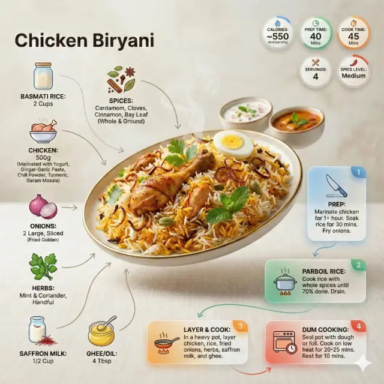

<details>
<summary>Show full prompt</summary>

```text
Ultra-clean modern recipe infographic. Showcase briyani in a visually appealing finished form—sliced, plated, or portioned—floating slightly in perspective or angled view. Arrange ingredients, steps, and tips around the dish in a dynamic editorial layout, not restricted to top-down. Ingredients Section: Include icons or mini illustrations for each ingredient with quantities. Arrange them in clusters, lists, or circular flows connected visually to the dish. Steps Section: Show preparation steps with numbered panels, arrows, or lines, forming a logical flow around the main dish. Include small cooking icons (knife, pan, oven, timer) where helpful. Additional Info (optional): Total calories, prep/cook time, servings, spice level—displayed as clean bubbles or badges near the dish. Visual Style: Editorial infographic meets lifestyle food photography. Vibrant, natural food colors, subtle drop shadows, clean vector icons, modern typography, soft gradients or glassmorphism for step panels. Accent colors can highlight key info (calories, prep time). Composition Guidelines: Finished meal as hero visual (perspective or angled) Ingredients and steps flow dynamically around the dish Clear visual hierarchy: dish > steps > ingredients > optional stats Enough negative space to keep design airy and readable Lighting & Background: Soft, natural studio lighting, minimal textured or gradient background for premium editorial feel. Output: 1080×1080, ultra-crisp, social-feed optimized, no watermark.
```

</details>

[Open in Pixonara →](https://pixonara.com/prompt/318)

## 2. Ultra-clean modern recipe infographic. Showcase Noodles in a visually…

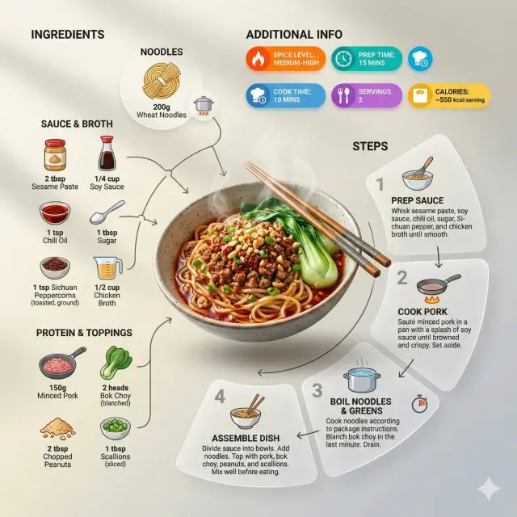

<details>
<summary>Show full prompt</summary>

```text
Ultra-clean modern recipe infographic. Showcase Noodles  in a visually appealing finished form—sliced, plated, or portioned—floating slightly in perspective or angled view. Arrange ingredients, steps, and tips around the dish in a dynamic editorial layout, not restricted to top-down. Ingredients Section: Include icons or mini illustrations for each ingredient with quantities. Arrange them in clusters, lists, or circular flows connected visually to the dish. Steps Section: Show preparation steps with numbered panels, arrows, or lines, forming a logical flow around the main dish. Include small cooking icons (knife, pan, oven, timer) where helpful. Additional Info (optional): Total calories, prep/cook time, servings, spice level—displayed as clean bubbles or badges near the dish. Visual Style: Editorial infographic meets lifestyle food photography. Vibrant, natural food colors, subtle drop shadows, clean vector icons, modern typography, soft gradients or glassmorphism for step panels. Accent colors can highlight key info (calories, prep time). Composition Guidelines: Finished meal as hero visual (perspective or angled) Ingredients and steps flow dynamically around the dish Clear visual hierarchy: dish > steps > ingredients > optional stats Enough negative space to keep design airy and readable Lighting & Background: Soft, natural studio lighting, minimal textured or gradient background for premium editorial feel. Output: 1080×1080, ultra-crisp, social-feed optimized, no watermark.”
```

</details>

[Open in Pixonara →](https://pixonara.com/prompt/320)

## 3. Ultra-realistic food photography of a prepared creamy white sauce…

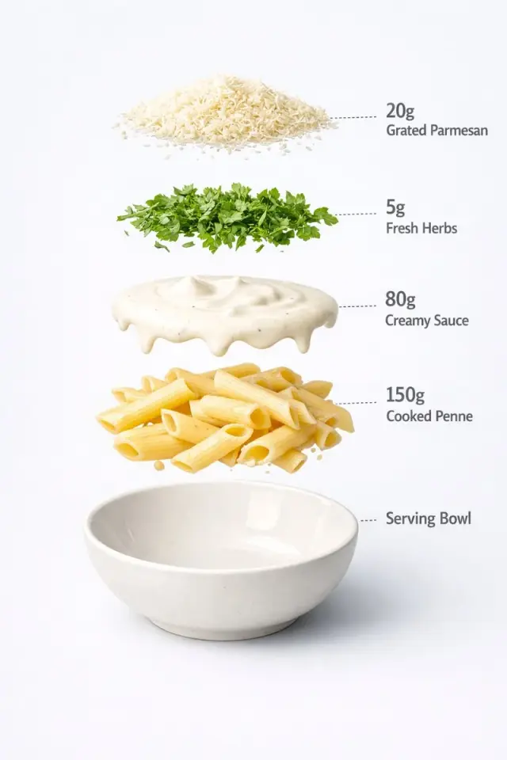

```text
Ultra-realistic food photography of a prepared creamy white sauce penne pasta served in a minimal ceramic bowl. Perfectly cooked penne coated evenly in rich, glossy cream sauce, topped with freshly grated parmesan cheese and finely chopped green herbs. Clean white studio background, soft diffused lighting, gentle shadows under the bowl, natural highlights on the sauce, realistic texture and thickness. Centered composition, shallow depth of field, premium restaurant-style presentation, high-detail food styling, 8K quality, sharp focus, no text, no labels, no hands, no props, no watermark.
```

[Open in Pixonara →](https://pixonara.com/prompt/430)

## 4. Ultra-clean modern recipe infographic. Showcase Pizza in a visually…

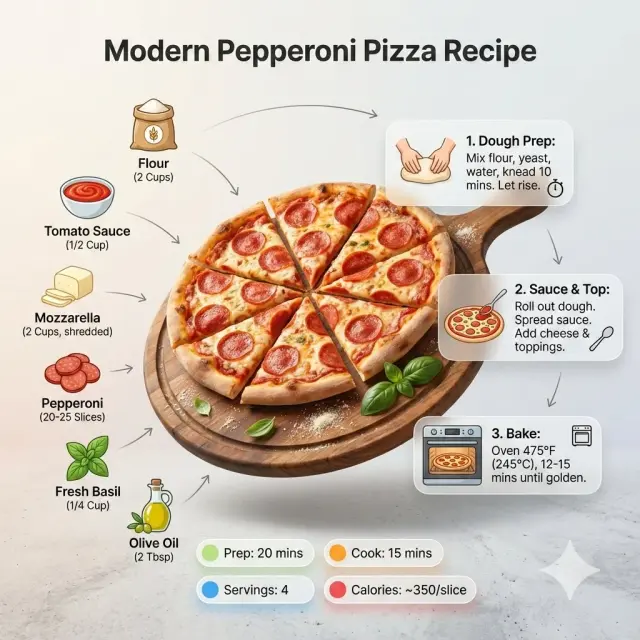

<details>
<summary>Show full prompt</summary>

```text
Ultra-clean modern recipe infographic. Showcase Pizza  in a visually appealing finished form—sliced, plated, or portioned—floating slightly in perspective or angled view. Arrange ingredients, steps, and tips around the dish in a dynamic editorial layout, not restricted to top-down. Ingredients Section: Include icons or mini illustrations for each ingredient with quantities. Arrange them in clusters, lists, or circular flows connected visually to the dish. Steps Section: Show preparation steps with numbered panels, arrows, or lines, forming a logical flow around the main dish. Include small cooking icons (knife, pan, oven, timer) where helpful. Additional Info (optional): Total calories, prep/cook time, servings, spice level—displayed as clean bubbles or badges near the dish. Visual Style: Editorial infographic meets lifestyle food photography. Vibrant, natural food colors, subtle drop shadows, clean vector icons, modern typography, soft gradients or glassmorphism for step panels. Accent colors can highlight key info (calories, prep time). Composition Guidelines: Finished meal as hero visual (perspective or angled) Ingredients and steps flow dynamically around the dish Clear visual hierarchy: dish > steps > ingredients > optional stats Enough negative space to keep design airy and readable Lighting & Background: Soft, natural studio lighting, minimal textured or gradient background for premium editorial feel. Output: 1080×1080, ultra-crisp, social-feed optimized, no watermark.”
```

</details>

[Open in Pixonara →](https://pixonara.com/prompt/469)

## 5. Macro food photography of a crispy martabak telur tearing…

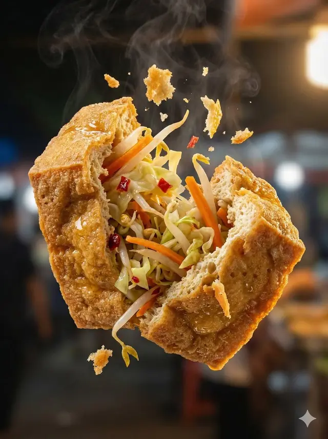

```text
"Macro food photography of a crispy martabak telur tearing open mid-air, thin golden wrapper shattering with a crack, hot filling of minced beef, scallions, and egg bursting outward. Flecks of fried onion and pepper suspended in motion, steam visible, glossy oil sheen catching the light. Warm Indonesian street-stall lighting, tungsten + charcoal warmth, dramatic rim light, ultra high texture detail (bubbled wrapper, layered interior).Editorial food shot, shallow depth of field, bokeh of night market signage, Nikon Z9 look, 105mm macro, fast shutter freeze, hyper-real crumbs. --ar 3:4"
```

[Open in Pixonara →](https://pixonara.com/prompt/497)

## 6. A hyper-realistic, cinematic close-up of a freshly baked pepperoni…

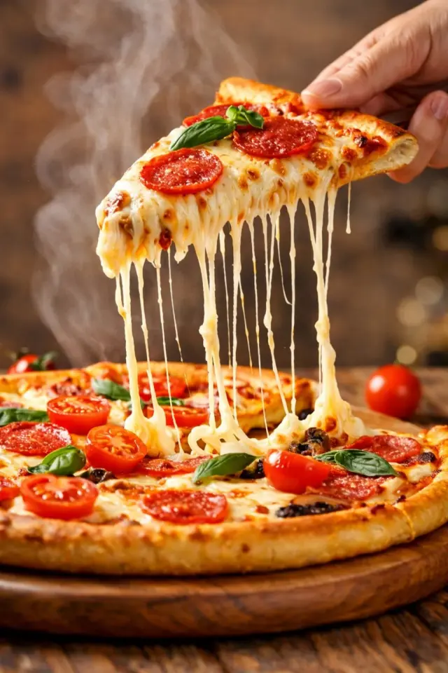

```text
A hyper-realistic, cinematic close-up of a freshly baked pepperoni pizza slice being lifted from the pie, with long, dramatic cheese pulls stretching down in silky strands.
Golden, slightly charred crust with visible texture, bubbling mozzarella, glossy pepperoni slices, fresh basil leaves on top, and juicy cherry tomatoes scattered across the pizza.
Soft steam rising from the hot slice, creating a warm, mouth-watering atmosphere.
Shot on a DSLR, 50mm lens, shallow depth of field, sharp focus on the cheese stretch, background softly blurred.
Warm studio lighting with natural highlights, rich colors, realistic shadows, premium food-advertisement look.
```

[Open in Pixonara →](https://pixonara.com/prompt/522)

## 7. A hyper-realistic Indonesian food infographic poster with dramatic floating…

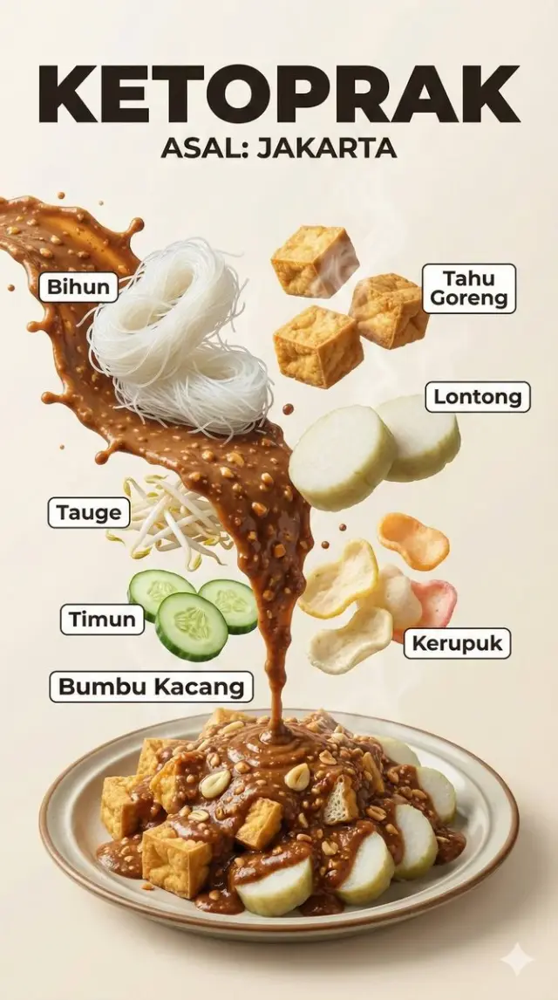

```text
A hyper-realistic Indonesian food infographic poster with dramatic floating ingredients. Vertical composition, bold title text at the top showing the dish name and origin (ASAL). Ingredients levitating in mid-air with clean white label lines and Indonesian text. Cinematic food photography style, ultra-detailed textures, glossy sauces, charred meat, fresh vegetables, steam and smoke effects. Strong contrast lighting, editorial layout, modern typography, professional food magazine look, motion-frozen splashes, realistic shadows, studio lighting, shallow depth of field, 8K ultra-realistic, DSLR quality.
```

[Open in Pixonara →](https://pixonara.com/prompt/617)

## 8. Ultra-realistic smoothie explosion, banana slices, strawberry pieces, blueberry …

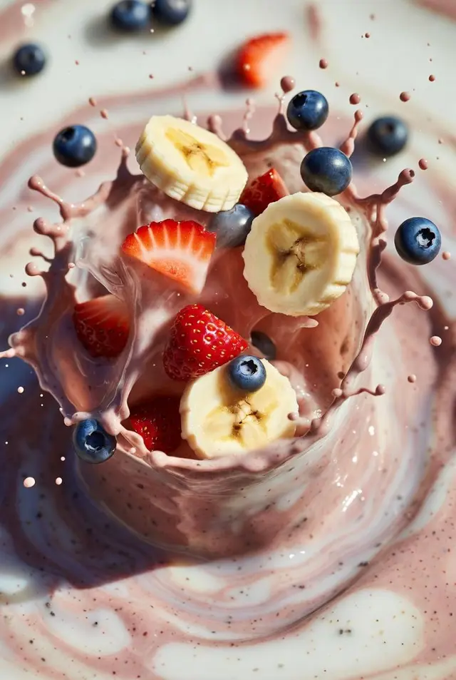

```text
Ultra-realistic smoothie explosion, banana slices, strawberry pieces, blueberry splash, chia seeds, liquid swirl frozen mid-air, bright studio lighting, glossy liquid texture, premium health drink ad style, shallow depth, ultra sharp, frozen motion, cinematic 8K realism --ar 2:3 --v 6 --style raw
```

[Open in Pixonara →](https://pixonara.com/prompt/633)

## 9. Ultra-clean modern recipe infographic. Showcase chowmin in a visually…

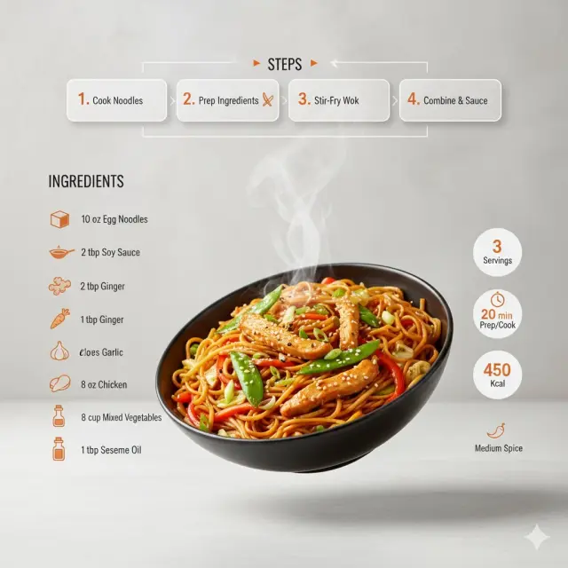

<details>
<summary>Show full prompt</summary>

```text
Ultra-clean modern recipe infographic. Showcase chowmin in a visually appealing finished form sliced, plated, or portioned floating slightly in perspective or angled view. Arrange ingredients, steps, and tips around the dish in a dynamic editorial layout, not restricted to top-down. Ingredients Section: Include icons or mini illustrations for each ingredient with quantities. Arrange them in clusters, lists, or circular flows connected visually to the dish. Steps Section: Show preparation steps with numbered panels, arrows, or lines, forming a logical flow around the main dish. Include small cooking icons (knife, pan, oven, timer) where helpful. Additional Info (optional): Total calories, prep/cook time, servings, spice level—displayed as clean bubbles or badges near the dish. Visual Style: Editorial infographic meets lifestyle food photography. Vibrant, natural food colors, subtle drop shadows, clean vector icons, modern typography, soft gradients or glassmorphism for step panels. Accent colors can highlight key info (calories, prep time). Composition Guidelines: Finished meal as hero visual (perspective or angled) Ingredients and steps flow dynamically around the dish Clear visual hierarchy: dish > steps > ingredients > optional stats Enough negative space to keep design airy and readable Lighting & Background: Soft, natural studio lighting, minimal textured or gradient background for premium editorial feel. Output: 1080×1080, ultra-crisp, social-feed optimized, no watermark.
```

</details>

[Open in Pixonara →](https://pixonara.com/prompt/654)

## 10. two hands pulling apart a grilled cheese sandwich, strands…

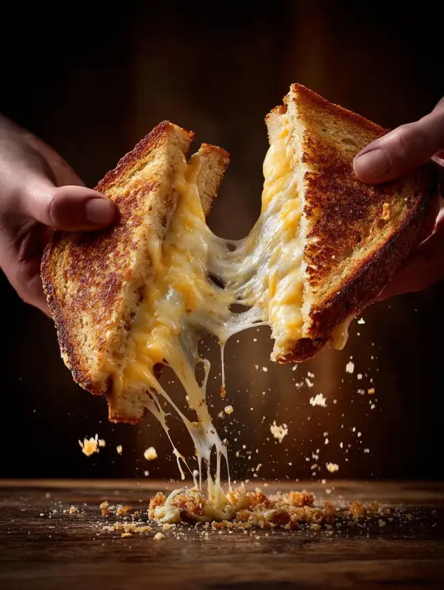

```text
two hands pulling apart a grilled cheese sandwich, strands of melted cheddar stretching dramatically between the halves, toasted bread edges crisp and golden, crumbs falling mid-air, warm cozy light, cinematic food action photography
```

[Open in Pixonara →](https://pixonara.com/prompt/656)

## 11. Ultra-clean modern recipe infographic. Showcase Roast chicken in a…

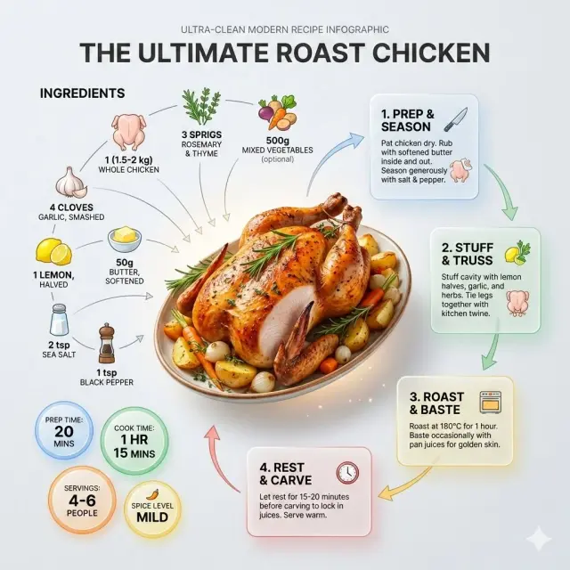

<details>
<summary>Show full prompt</summary>

```text
Ultra-clean modern recipe infographic. Showcase Roast chicken in a visually appealing finished form—sliced, plated, or portioned—floating slightly in perspective or angled view. Arrange ingredients, steps, and tips around the dish in a dynamic editorial layout, not restricted to top-down. Ingredients Section: Include icons or mini illustrations for each ingredient with quantities. Arrange them in clusters, lists, or circular flows connected visually to the dish. Steps Section: Show preparation steps with numbered panels, arrows, or lines, forming a logical flow around the main dish. Include small cooking icons (knife, pan, oven, timer) where helpful. Additional Info (optional): Total calories, prep/cook time, servings, spice level—displayed as clean bubbles or badges near the dish. Visual Style: Editorial infographic meets lifestyle food photography. Vibrant, natural food colors, subtle drop shadows, clean vector icons, modern typography, soft gradients or glassmorphism for step panels. Accent colors can highlight key info (calories, prep time). Composition Guidelines: Finished meal as hero visual (perspective or angled) Ingredients and steps flow dynamically around the dish Clear visual hierarchy: dish > steps > ingredients > optional stats Enough negative space to keep design airy and readable Lighting & Background: Soft, natural studio lighting, minimal textured or gradient background for premium editorial feel. Output: 1080×1080, ultra-crisp, social-feed optimized, no watermark.”
```

</details>

[Open in Pixonara →](https://pixonara.com/prompt/666)

## 12. Ultra-realistic cinematic food photography of a traditional Indonesian dish,…

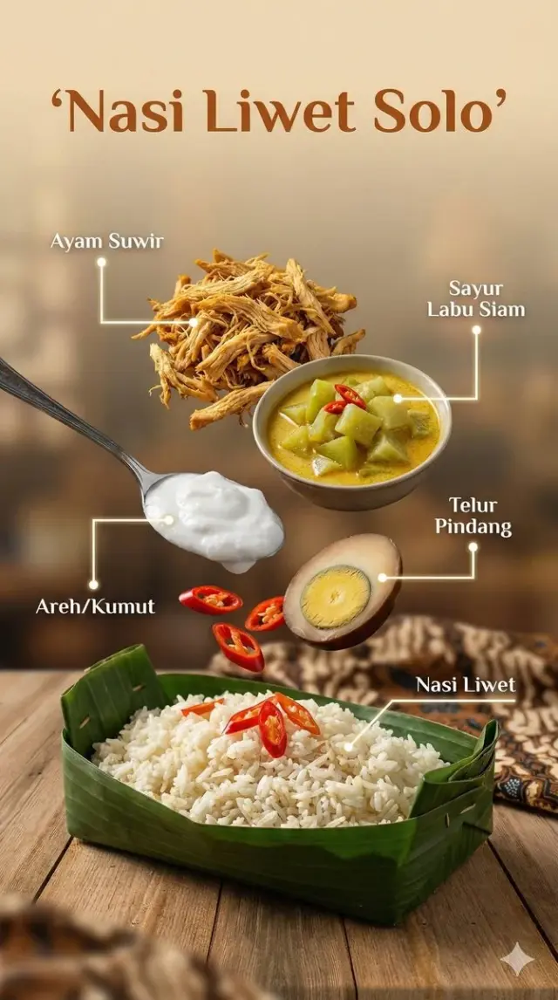

<details>
<summary>Show full prompt</summary>

```text
Ultra-realistic cinematic food photography of a traditional Indonesian dish, presented as a floating ingredients composition. Main dish placed at the bottom in a rustic ceramic bowl or banana leaf plate. Key ingredients suspended in mid-air above the dish, perfectly separated and labeled with clean minimalist typography and thin pointer lines. Dynamic splashes of sauce and spices frozen in motion, high-speed food photography. Natural tropical setting with banana leaves, palm trees, warm sunlight, shallow depth of field. Hyper-detailed textures, glossy sauces, steam and smoke effects, editorial food poster style, premium commercial quality, 8K resolution, soft cinematic lighting, realistic shadows, depth and realism.
```

</details>

[Open in Pixonara →](https://pixonara.com/prompt/668)

## 13. Ultra-realistic premium food photography of a layered chocolate cake…

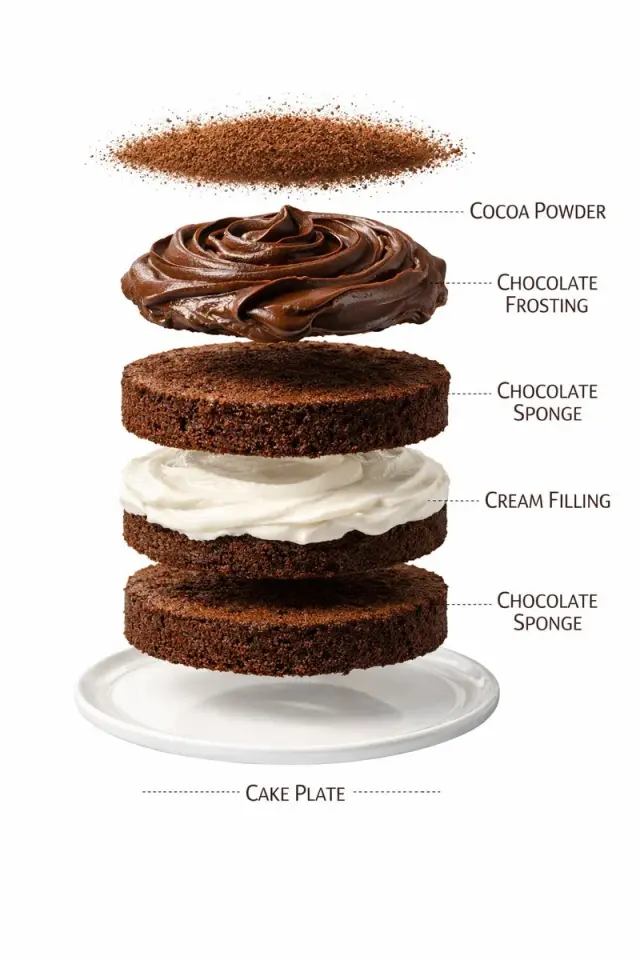

<details>
<summary>Show full prompt</summary>

```text
Ultra-realistic premium food photography of a layered chocolate cake on a white plate, centered composition, three thick moist chocolate sponge layers with a smooth white cream filling in the middle, topped with glossy rich chocolate ganache frosting, decorated with fresh raspberries, dark chocolate curls, shards, and small gold sugar pearls, clean minimal light grey studio background, soft diffused professional lighting, gentle natural shadows, ultra-sharp texture detail showing porous sponge and creamy layers, high-end bakery advertising style, shallow depth of field, macro food photography look, photorealistic, 8K resolution, elegant dessert presentation, no text, no watermark
Negative prompt:
blurry, low resolution, cartoon style, CGI look, artificial textures, messy composition, oversaturated colors, harsh shadows, noise, watermark, text, extra objects, distorted cake shape.
```

</details>

[Open in Pixonara →](https://pixonara.com/prompt/719)

## 14. A hyper-realistic, cinematic close-up of a sizzling gourmet cheeseburger.…

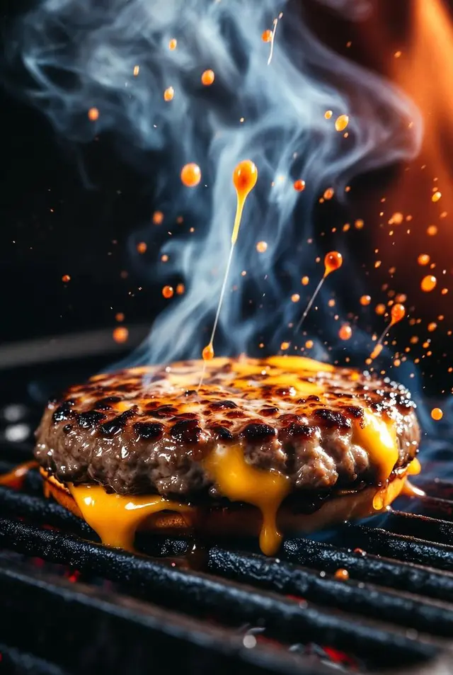

```text
A hyper-realistic, cinematic close-up of a sizzling gourmet cheeseburger. The thick, juicy beef patty features a heavy, glossy char and is blanketed in vibrant orange cheddar cheese that melts and oozes down the sides in thick, viscous streams over a toasted brioche bun. The atmosphere is dramatic and smoky, with thick wisps of white and blue steam swirling upwards, surrounded by floating bright orange sparks, glowing embers, and frozen droplets of grease suspended in the air. The lighting is high-contrast and dramatic against a deep black background, emphasizing the glistening textures. Shot with a macro lens, shallow depth of field, and 8k resolution commercial food photography style.
```

[Open in Pixonara →](https://pixonara.com/prompt/731)

## 15. Grape Can – Vine Glow

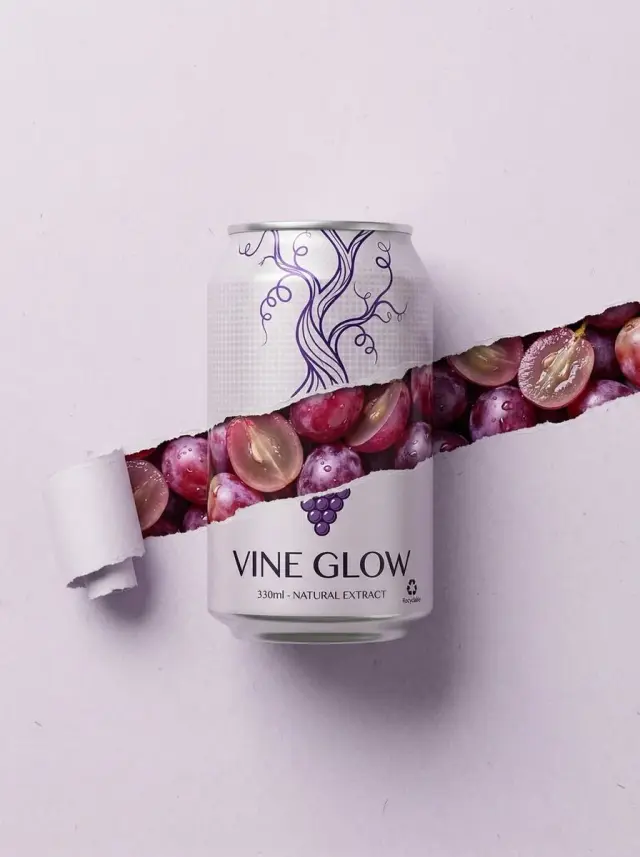

```text
Grape Can – “Vine Glow”

Minimalist product photography of a 330ml aluminum can labeled “VINE GLOW – Natural Extract”, centered on a clean light grey background. The can features elegant purple vine line art. A realistic horizontal torn paper effect cuts across the middle of the can and background, revealing fresh red and purple grapes inside with water droplets and glossy texture. Soft studio lighting, high detail, sharp focus, commercial advertising style, modern packaging design, symmetrical composition, ultra-realistic, 8k resolution.
```

[Open in Pixonara →](https://pixonara.com/prompt/746)

## 16. Professional studio food photography series featuring deconstructed dishes in…

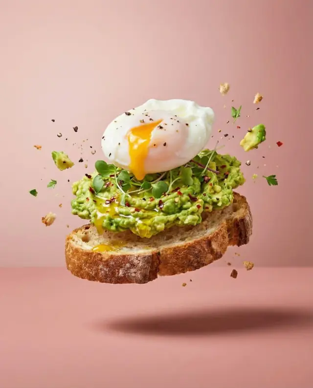

<details>
<summary>Show full prompt</summary>

```text
Professional studio food photography series featuring deconstructed dishes in high-speed levitation. Against a seamless dusty pink background with soft, diffused studio lighting, ingredients float and explode dynamically. Subjects include a hovering stack of tiramisu components (gelato, ladyfingers, mascarpone, coffee beans), borscht ingredients (beets, rye bread, herbs) suspended above a ceramic bowl of soup on a wooden board, and sourdough toast with mashed avocado and a runny poached egg separating in mid-air. Capture fine details like flying crumbs, spice particles, herbs, and liquid droplets with sharp focus and a shallow depth of field. A soft shadow is cast beneath the main floating elements.
```

</details>

[Open in Pixonara →](https://pixonara.com/prompt/749)

## 17. Ultra-realistic high-speed food photography of a crispy golden fried…

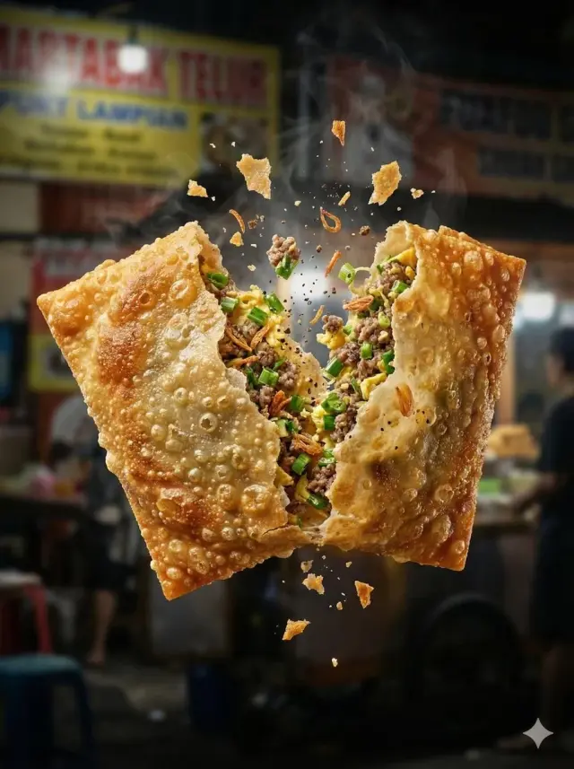

```text
Ultra-realistic high-speed food photography of a crispy golden fried snack breaking apart mid-air, creamy savory filling stretching between the halves, visible chunks of chicken, peas, carrots, minced meat, noodles, or egg inside. Crumbs and flakes flying in slow motion, hot steam rising, dramatic food explosion effect. Shot in a vibrant night street market environment with warm bokeh lights, blurred food stalls in the background. Shallow depth of field, 85mm lens, f/1.8, ultra-sharp focus on texture, crunchy coating detail, dynamic motion capture, commercial food photography, cinematic lighting, HDR, 8K resolution, hyper-detailed, masterpiece quality.
```

[Open in Pixonara →](https://pixonara.com/prompt/764)

## 18. Ultra-clean modern recipe infographic. Showcase Vanilla Ice Cream Scoops…

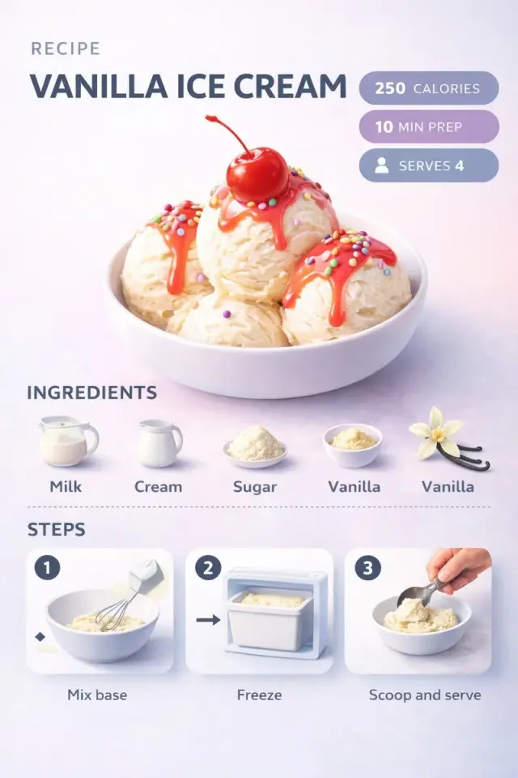

```text
Ultra-clean modern recipe infographic. Showcase Vanilla Ice Cream Scoops with syrup and toppings in angled perspective.

Ingredients Section: Icons for milk, cream, sugar, vanilla.

Steps Section: Mixing base, freezing, scooping shown with numbered panels.

Additional Info: Calories, prep time, servings displayed in badges.

Visual Style: Dessert infographic with pastel colors, soft gradients, modern typography.

Composition Guidelines: Ice cream scoops as hero visual with ingredients and steps around it.

Lighting & Background: Soft dessert-style lighting with minimal background.

Output: 1080×1080, ultra-crisp, social-feed optimized, no watermark.
```

[Open in Pixonara →](https://pixonara.com/prompt/823)

## 19. - Ultra-cinematic beverage advertising shot of a sparkling lime…

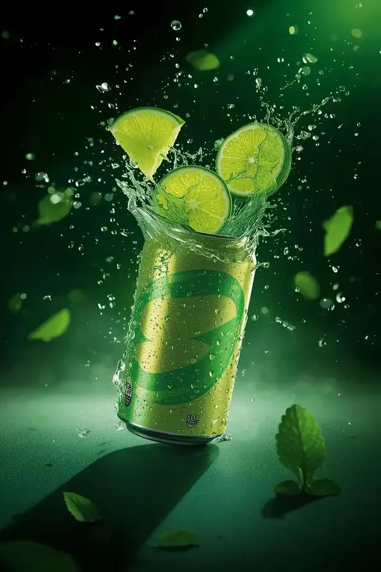

```text
- Ultra-cinematic beverage advertising shot of a sparkling lime soda can, captured from a low three-quarter angle with the camera positioned slightly below the product for a heroic, powerful perspective; the can appears partially torn open as vivid lime wedges explode outward in slow motion, frozen mid-air with high-energy splashes of neon-green liquid and micro droplets; intense backlighting makes the citrus flesh glow translucently while sharp rim light outlines
```

[Open in Pixonara →](https://pixonara.com/prompt/115)

## 20. - Ultra-realistic prepared pepperoni pizza slice, fully assembled, gooey…

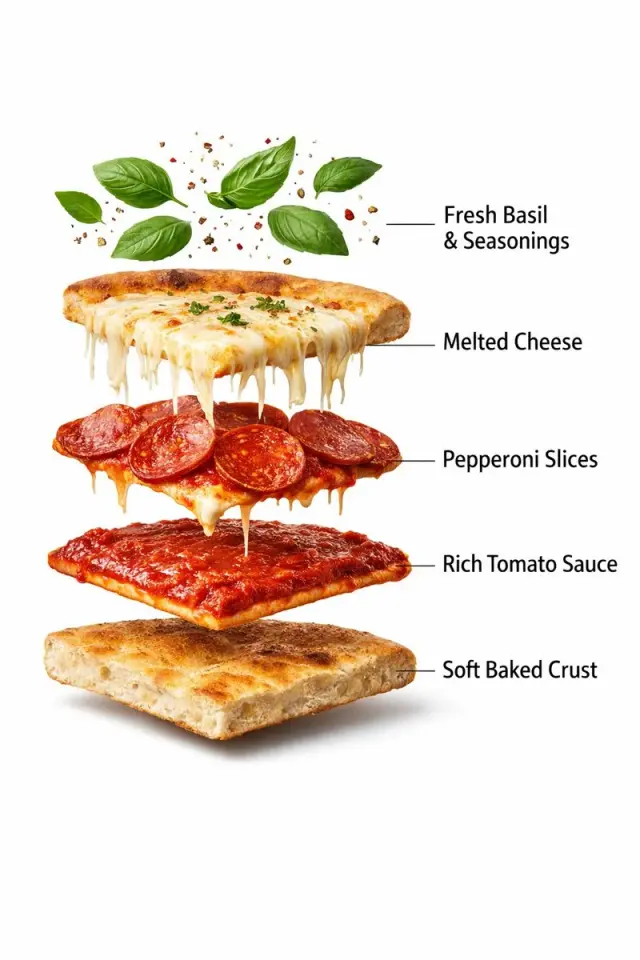

```text
- Ultra-realistic prepared pepperoni pizza slice, fully assembled, gooey melted mozzarella cheese stretching and dripping over the edges, crispy pepperoni slices on top, rich tomato sauce beneath, thick golden baked crust, fresh basil leaves and light seasoning floating subtly above, clean pure white background, professional commercial food photography lighting, soft natural shadows under the slice, sharp focus, extreme texture detail, glossy cheese, crunchy crust surface, studio shot, minimal composition, no text, no labels, no hands, premium food advertisement style, 8K resolution, ultra-detailed, hyper-realistic.
```

[Open in Pixonara →](https://pixonara.com/prompt/853)

## 21. Ultra-luxury food commercial of a stack of thick, fluffy…

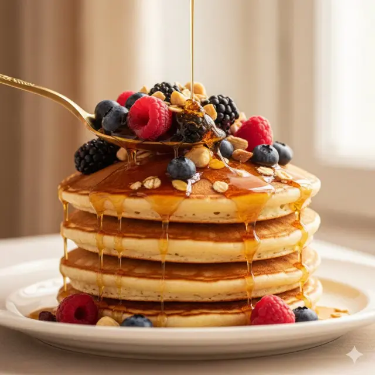

<details>
<summary>Show full prompt</summary>

```text
Ultra-luxury food commercial of a stack of thick, fluffy American pancakes with perfectly golden-brown edges. Pure maple syrup cascades slowly down the sides in glossy, slow-motion streams, highlighting every drip. Pancakes topped with fresh mixed berries (blueberries, raspberries, blackberries), scattered roasted hazelnuts and almonds, and crunchy oat flakes. Cinematic close-up shots with rich warm morning light, soft beige bokeh background, hyper-detailed textures emphasizing fluffiness and glossiness. Luxury golden ornate spoon takes a delicate bite, with syrup stretching realistically. Smooth camera moves circling and slightly top-down over the stack, emphasizing elegance and indulgence. Minimalistic, high-end plating, cinematic depth of field, extremely appetizing, mouthwatering, trending food photography aesthetic, ultra-realistic 8K detail, professional ad-style video. Include subtle background soft music or ambient café sounds for premium feel.
```

</details>

[Open in Pixonara →](https://pixonara.com/prompt/879)

## 22. Motion settles into a striking hero shot: can centered,…

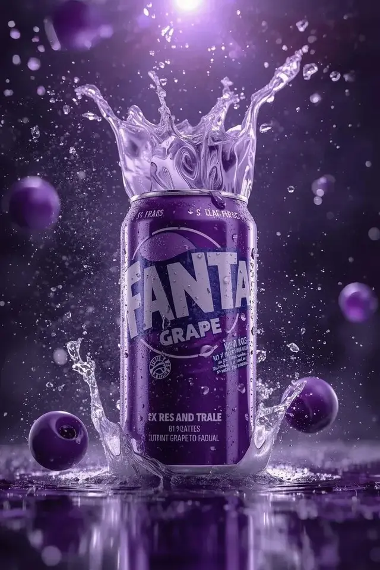

```text
Motion settles into a striking hero shot: can centered, purple liquid frozen in sculptural form, berries suspended mid-air. No text, no logos, no transitions—pure visual impact.
Style & Mood:
Ultra-premium soda advertisement, dark luxury aesthetic, cinematic slow motion, high-contrast lighting, glossy reflections, dramatic yet elegant energy.
Camera & Technical Direction:
Locked-off camera, high-speed macro cinematography, realistic fluid dynamics, controlled splash physics, volumetric lighting, shallow depth of field, hyper-detailed droplets.
```

[Open in Pixonara →](https://pixonara.com/prompt/893)

## 23. Top-down premium food photography of a glass jar of…

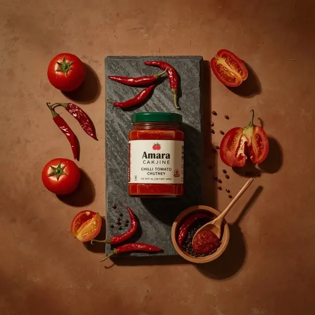

```text
Top-down premium food photography of a glass jar of chili tomato chutney placed on a dark stone slab, surrounded by fresh red tomatoes, sliced tomatoes, red chili peppers, black peppercorns, and a small wooden bowl with chutney and spoon. Warm earthy background, soft directional lighting, rich shadows, high contrast, minimal styling, commercial product shoot, ultra-detailed, 4K.
```

[Open in Pixonara →](https://pixonara.com/prompt/957)

## 24. Ultra-realistic product ad of a premium fruit drink bottle,…

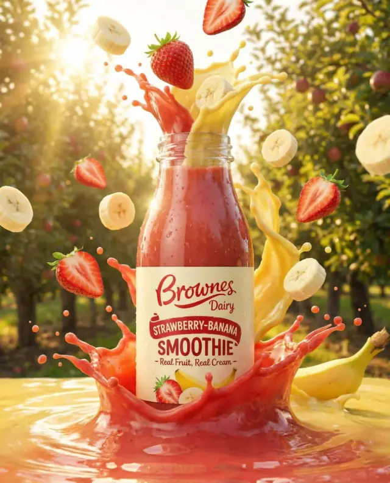

```text
Ultra-realistic product ad of a premium fruit drink bottle, dynamic liquid splash frozen mid-air, fresh fruits (orange, kiwi, strawberry, mango, passionfruit) exploding around the bottle, cinematic golden sunlight, outdoor orchard/beach setting, shallow depth of field, vibrant colors, glossy reflections, high-speed photography style, hyper-detailed liquid physics, clean branding label, 8K, commercial advertising, perfect composition.
```

[Open in Pixonara →](https://pixonara.com/prompt/960)

## 25. Premium banana milk drink bottle surrounded by swirling milk…

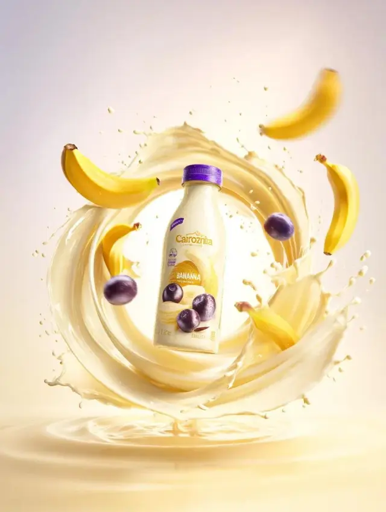

```text
Premium banana milk drink bottle surrounded by swirling milk splash, floating bananas and berries, dynamic liquid motion, creamy textures, bright yellow background, high-speed splash photography, glossy product lighting, ultra-realistic, commercial food ad style, sharp focus, 8K.
```

[Open in Pixonara →](https://pixonara.com/prompt/973)

## 26. Nano Banana pro on Gemini app.

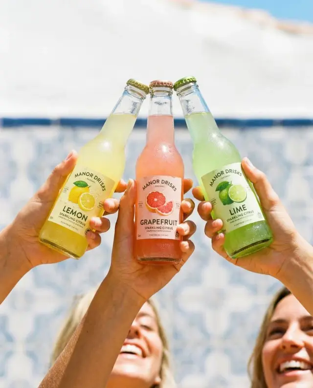

<details>
<summary>Show full prompt</summary>

```text
Nano Banana pro on Gemini app.

Prompt:
Three hands holding colorful glass soda bottles (lemon, grapefruit, lime) clinking together, bright sunny outdoor setting, soft beach/pool background blur, natural light, condensation on bottles, lifestyle photography, vibrant colors, shallow depth of field, candid joyful mood, commercial beverage ad, ultra-realistic, 8K.
IMAGE 2
Three hands holding minimalist glass bottles labeled almond milk, pistachio milk, chocolate oat milk, clean neutral background, soft studio lighting, modern branding, centered composition, smooth shadows, aesthetic product photography, high detail, muted tones, premium look, 8K.
IMAGE 3
Three hands holding iced coffee bottles (latte, mocha, oat milk), warm golden hour sunlight, cafe interior background, soft shadows of leaves on wall, cozy atmosphere, realistic reflections, lifestyle product shot, cinematic warm tones, shallow depth of field, 8K.
IMAGE 4
Three hands holding glowing sports drink bottles stacked vertically, neon blue and red lighting, futuristic tunnel background, motion blur streaks, cyberpunk aesthetic, dramatic lighting, high contrast, dynamic composition, glossy bottles, ultra-realistic, 8K.
```

</details>

[Open in Pixonara →](https://pixonara.com/prompt/993)

## 27. A minimalist, ultra-realistic product shot of a premium ice…

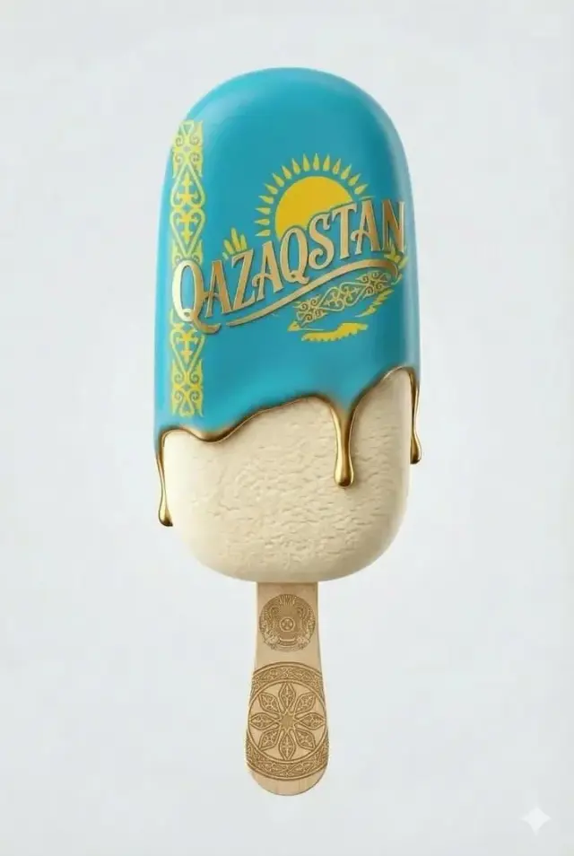

```text
A minimalist, ultra-realistic product shot of a premium ice cream bar inspired by Kazakhstan. The popsicle is coated in glossy turquoise icing with elegant gold ornamental patterns and the word “QAZAQSTAN” embossed in metallic gold, featuring a golden sun-and-eagle motif. The lower half reveals creamy vanilla ice cream with smooth texture and subtle melting drips. Wooden stick engraved with traditional Kazakh patterns. Clean white studio background, soft diffused lighting, sharp focus, luxury food branding aesthetic, high-detail textures, modern cultural fusion design, 8K quality.
```

[Open in Pixonara →](https://pixonara.com/prompt/998)

## 28. Create step-by-step recipe infographic for creamy garlic mushroom pasta,…

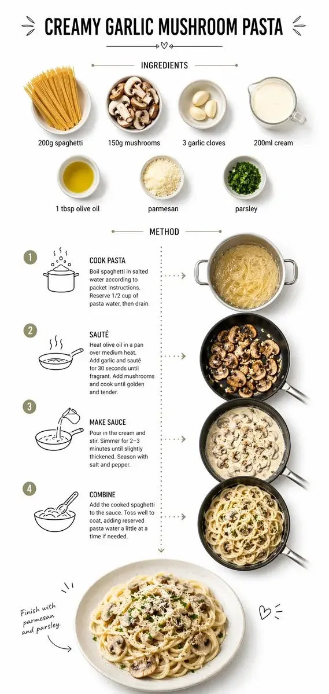

```text
Create step-by-step recipe infographic for creamy garlic mushroom pasta, top-down view, minimal style on white background, ingredient photos labeled: "200g spaghetti", "150g mushrooms", "3 garlic cloves", "200ml cream", "1 tbsp olive oil", "parmesan", "parsley", dotted lines showing process steps with icons (boiling pot, sauté pan, mixing), final plated pasta shot at the bottom
```

[Open in Pixonara →](https://pixonara.com/prompt/174)

## 29. A high-speed studio photograph of a cluster of fresh…

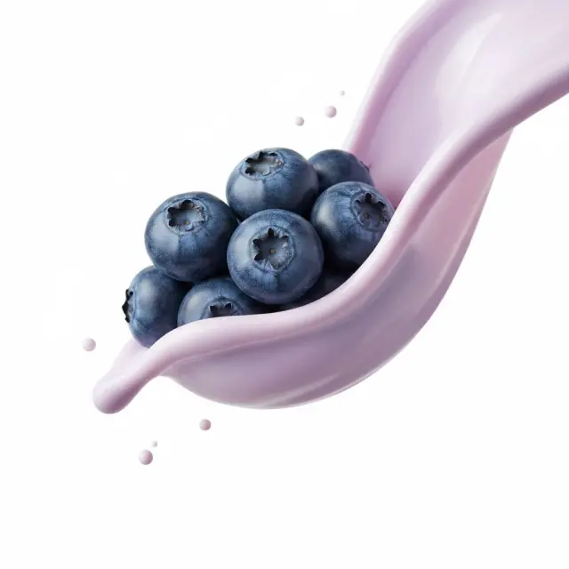

```text
A high-speed studio photograph of a cluster of fresh blueberries suspended midair, softly wrapped by a gentle flow of pale blueberry yogurt, smooth and restrained liquid motion, minimal splash, thick and creamy texture, elegant curved yogurt flow hugging the berries, very few small droplets, calm fluid dynamics, photorealistic macro food photography, ultra-realistic texture, professional studio lighting, soft diffuse highlights, pure white background, isolated object, clean cutout, no CGI, no 3D render, no illustration
```

[Open in Pixonara →](https://pixonara.com/prompt/1060)

## 30. A hyper-realistic image of a sliced kiwi splashing in…

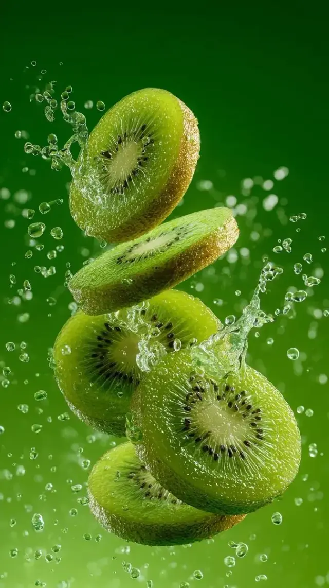

```text
A hyper-realistic image of a sliced kiwi splashing in a spray of water with droplets suspended in the air. Fresh kiwi slices, dynamically arranged in a floating composition, create a smooth green background. The smooth green gradient creates a fresh, bright, and juicy aesthetic. Studio lighting, soft shadows, high detail, macro photography of objects, an emphasis on texture and reflections. Ultra-realistic rendering, 8K, sharp focus, rich green tones. --ar 9:16 --raw
```

[Open in Pixonara →](https://pixonara.com/prompt/1055)

## 31. Advertising-style food photography of a stack of pancakes arranged…

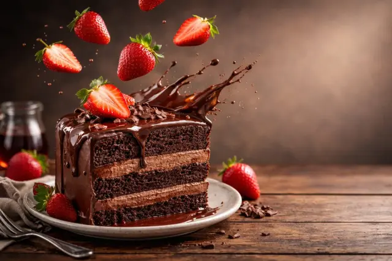

```text
Advertising-style food photography of a stack of pancakes arranged on a rustic table, with maple syrup droplets floating above in mid-air and a splash of syrup frozen in motion. High-resolution photo manipulation with selective soft focus, clean negative space for text, dramatic lighting, and crisp detail. --ar 3:2 --v 7
```

[Open in Pixonara →](https://pixonara.com/prompt/177)

## 32. Luxury cinematic food photography of traditional Indonesian Seruit Lampung…

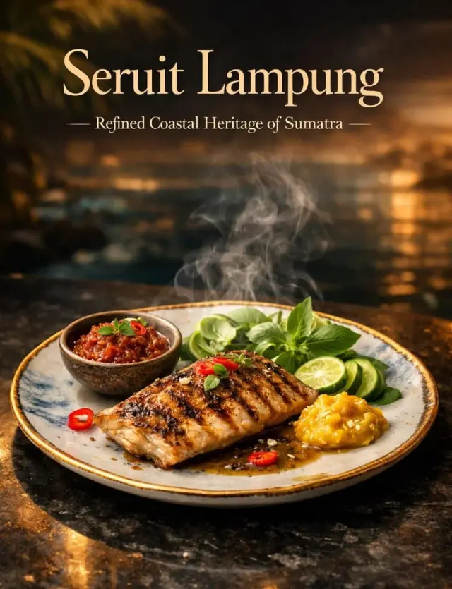

```text
Luxury cinematic food photography of traditional Indonesian “Seruit Lampung” — beautifully grilled fish fillet glazed with chili sambal, garnished with red chili slices, fresh basil, and lime wedges. Served on an elegant ceramic plate with a small bowl of sambal and a side of golden mashed condiment. Visible steam rising from the hot dish. Background shows a refined coastal sunset ambiance with soft bokeh reflections on water, warm golden-hour lighting. Shot on a polished marble table surface. Fine-dining restaurant atmosphere, shallow depth of field, dramatic food styling, ultra-realistic, 85mm lens, f/2.0, rich contrast, 8K resolution. Elegant editorial food magazine style.
```

[Open in Pixonara →](https://pixonara.com/prompt/1078)

## 33. Ultra-cinematic product photography of a premium protein bar wrapped…

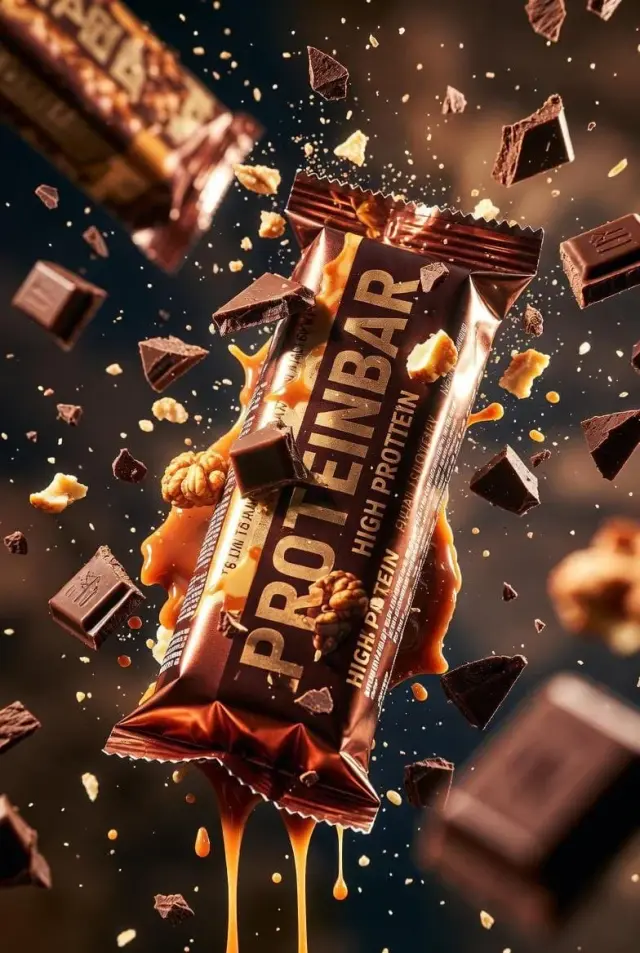

```text
Ultra-cinematic product photography of a premium protein bar wrapped in metallic packaging, floating at a dynamic angle; explosive chocolate chunks, caramel drips, and nut fragments frozen mid-air; high-speed splash and crumble effect, dramatic studio lighting with sharp highlights; rich brown and gold palette, ultra-detailed textures, shallow depth of field, photorealistic, 8K, fitness luxury advertising.
```

[Open in Pixonara →](https://pixonara.com/prompt/1083)

## 34. Ultra-realistic cinematic food photography of a traditional Indonesian dish,…

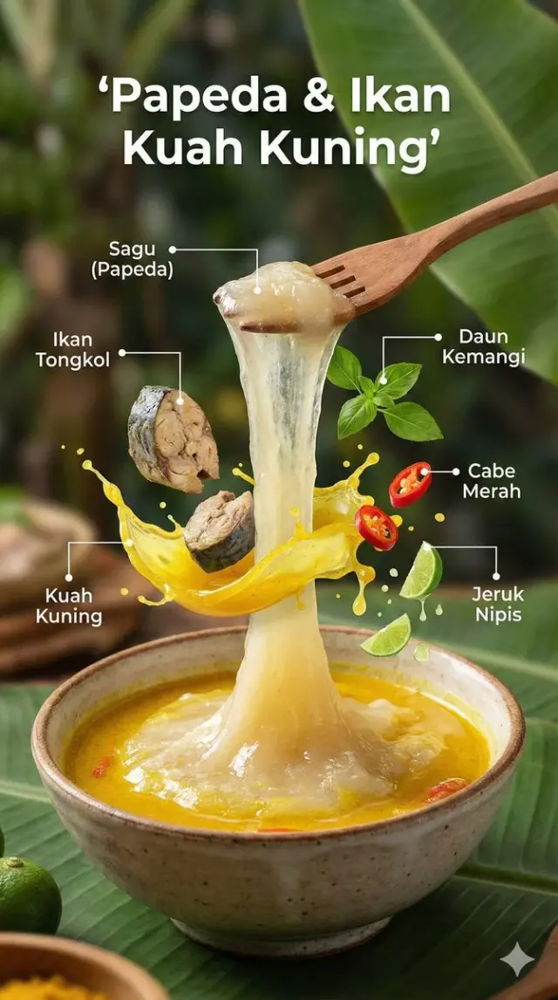

<details>
<summary>Show full prompt</summary>

```text
Ultra-realistic cinematic food photography of a traditional Indonesian dish, presented as a floating ingredients infographic. The finished dish sits at the bottom in a ceramic bowl on a wooden surface. Above it, key ingredients float in mid-air in a clean vertical layout, each clearly separated and visually balanced. Thin minimalist pointer lines connect ingredients to elegant readable labels. Natural textures, hyper-detailed food surfaces, glossy sauces, steam rising gently, high-speed splash effects frozen in motion. Soft studio lighting mixed with natural daylight, shallow depth of field, premium editorial food poster style, commercial advertising quality, ultra-sharp focus, 8K resolution, realistic shadows, clean background.
```

</details>

[Open in Pixonara →](https://pixonara.com/prompt/1091)

## 35. Ultra-premium cinematic food photography, 8K UHD, 3:4 aspect ratio.

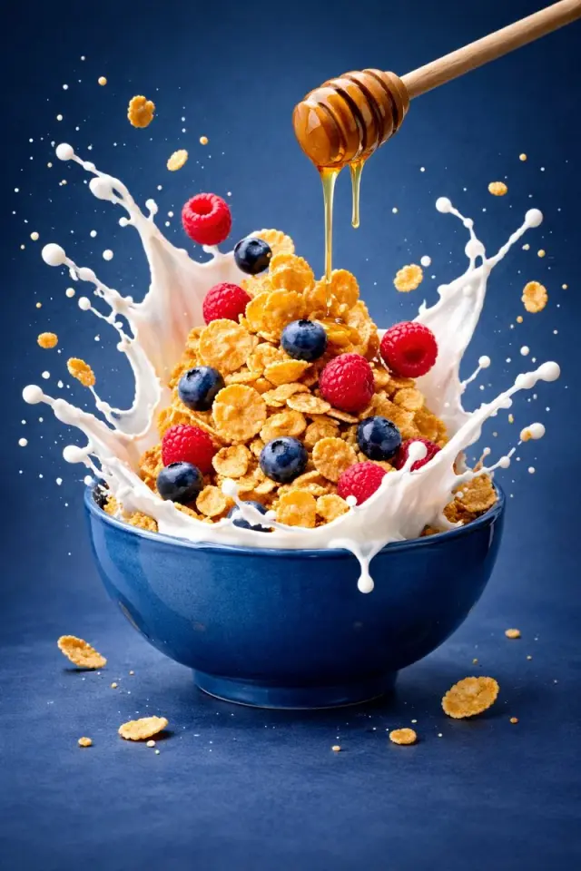

<details>
<summary>Show full prompt</summary>

```text
Ultra-premium cinematic food photography, 8K UHD, 3:4 aspect ratio.
A high-end studio composition featuring a single floating bowl as the hero subject, captured in a high-speed moment with ingredients suspended mid-air. The image conveys controlled energy, freshness, and indulgence.
Lighting is soft, directional, and studio-grade, sculpting textures with clean highlights and natural shadows. Depth of field is shallow-to-medium, isolating the subject while maintaining dimensional realism.
Colors are rich yet natural, with balanced contrast and refined saturation. No artificial glow or exaggerated effects.
The background is a seamless solid or smooth gradient, carefully chosen to complement the ingredients and enhance visual separation.
The bowl is centered, weightless, and dominant. Liquids form elegant arcs and droplets; solid ingredients float naturally with believable physics. Textures are hyper-realistic — creamy bases show organic swirls, crunchy elements appear crisp, herbs look fresh and vibrant.
Shot with a luxury commercial food advertising aesthetic — modern, clean, minimal, bold, and premium.
```

</details>

[Open in Pixonara →](https://pixonara.com/prompt/191)

## 36. Ultra-cinematic vertical composition of coffee elements suspended in mid-air…

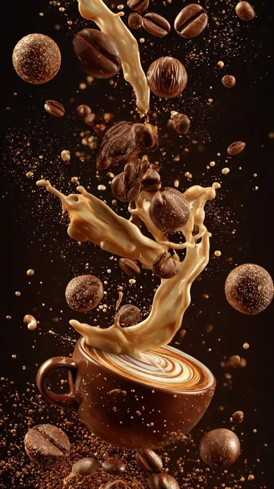

```text
Ultra-cinematic vertical composition of coffee elements suspended in mid-air cascading roasted coffee beans, chocolate bonbons, swirling latte art in a mid-air coffee cup, splashes of milk and espresso frozen in motion, fine coffee grounds dusting through the air captured with rich brown and cream color tones.
Hyper-detailed textures with glossy liquid surfaces, crema bubbles, and matte bean textures, lit with dramatic high-contrast studio lighting against a deep, velvety black background. Cinematic depth of field, splash photography aesthetic, premium café advertising style. Shot with a virtual Nikon D850, 105mm macro lens, aperture f/4.0, crisp editorial clarity.
```

[Open in Pixonara →](https://pixonara.com/prompt/1150)

## 37. Ultra-cinematic product photography of a purple energy drink can…

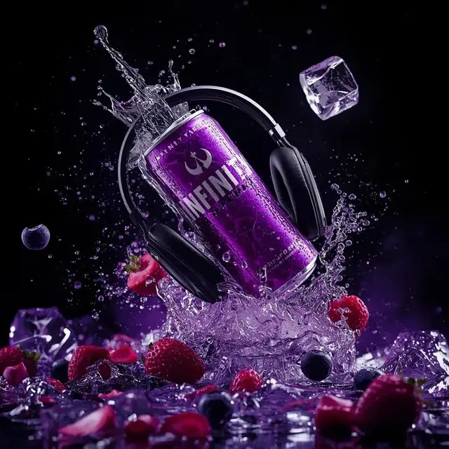

<details>
<summary>Show full prompt</summary>

```text
Ultra-cinematic product photography of a purple energy drink can labeled “INFINITY ENERGY DRINK – NIGHT KING” in bold white typography, floating mid-air at a dynamic three-quarter angle, wrapped with sleek black over-ear headphones; explosive liquid arcs and splashes frozen in time around the can, crystal-clear ice cubes and glossy berries (raspberries, blueberries, strawberries) suspended in motion, tiny droplets and mist filling the scene; dramatic high-contrast studio lighting with a powerful top key light, sharp rim lights tracing the can edges, and deep shadows for a dark, premium mood; monochromatic purple color palette with luminous highlights and metallic reflections, subtle neon glow accents; shallow depth of field isolating the can as the hero subject, hyper-detailed condensation on the aluminum surface, macro texture on fruit and water; volumetric light rays, floating particles, high-speed splash photography aesthetic, photorealistic, ultra-detailed, 8K, luxury advertising style, sharp focus, no watermark.
```

</details>

[Open in Pixonara →](https://pixonara.com/prompt/1146)

## 38. Ultra-realistic cinematic food photography of a bowl of rich…

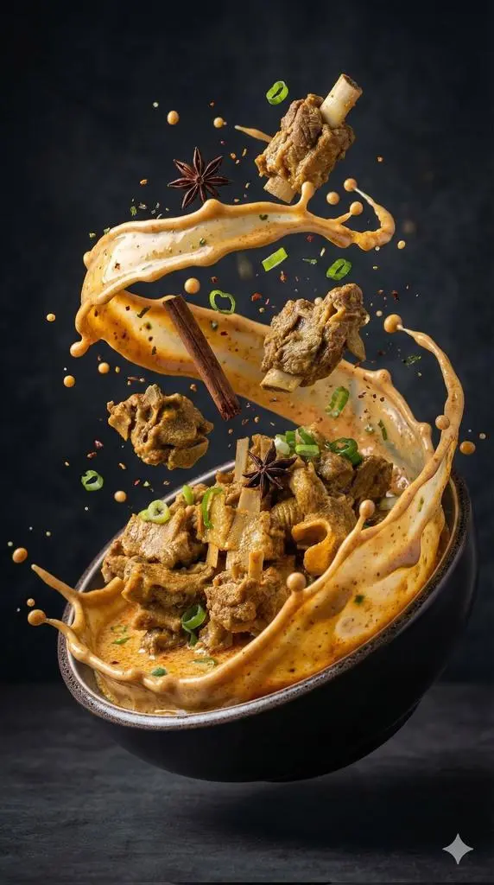

```text
Ultra-realistic cinematic food photography of a bowl of rich spicy meat soup exploding upward in a dynamic splash, tender bone-in meat pieces floating mid-air with creamy curry broth forming swirling liquid ribbons, star anise, cinnamon sticks, green onions, and spices suspended in motion, dramatic dark studio background, high-speed splash capture, macro texture detail on meat and broth, steam rising, shallow depth of field, vibrant warm colors, gourmet food advertising style, hyper-detailed liquid physics, 8K, perfect composition.
```

[Open in Pixonara →](https://pixonara.com/prompt/1232)

## 39. Hyper-realistic product advertisement of a protein shake can with…

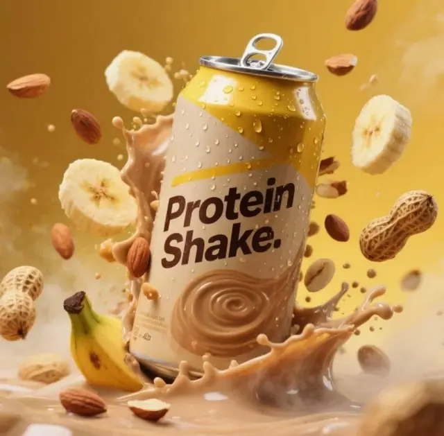

```text
Hyper-realistic product advertisement of a protein shake can with yellow and cream design, surrounded by floating banana slices, almonds, and peanuts, dynamic milk splash bursting around the can, glossy condensation droplets on surface, vibrant warm yellow background, high-speed splash photography, ultra-detailed textures, commercial food photography style, dramatic lighting, 8K.
```

[Open in Pixonara →](https://pixonara.com/prompt/1259)

## 40. A high-quality, professional product photograph of a grilled chicken…

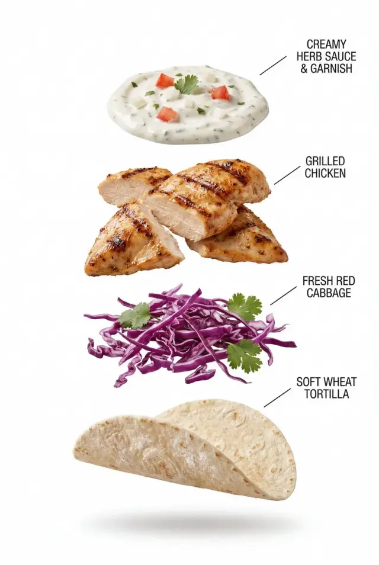

```text
A high-quality, professional product photograph of a grilled chicken taco filled with juicy grilled chicken pieces with visible char marks, fresh shredded red cabbage, and creamy white sauce topped with small diced tomatoes, onions, and parsley garnish, all placed inside a soft wheat taco tortilla. The taco looks fresh, flavorful, and well-filled with visible textures and vibrant ingredients. Minimalist style, shot against a pure solid white background with soft, natural shadows. 8K resolution, ultra-sharp focus, clean and modern food photography aesthetic.
```

[Open in Pixonara →](https://pixonara.com/prompt/1270)

## 41. Macro food photography of a crispy martabak telur tearing…


```text
Macro food photography of a crispy martabak telur tearing open mid-air, thin golden wrapper shattering with a crack, hot filling of minced beef, scallions, and egg bursting outward. Flecks of fried onion and pepper suspended in motion, steam visible, glossy oil sheen catching the light. Warm Indonesian street-stall lighting, tungsten + charcoal warmth, dramatic rim light, ultra high texture detail (bubbled wrapper, layered interior).Editorial food shot, shallow depth of field, bokeh of night market signage, Nikon Z9 look, 105mm macro, fast shutter freeze, hyper-real crumbs. --ar 3:4"
```

[Open in Pixonara →](https://pixonara.com/prompt/1365)

## 42. Epic 8K cinematic fantasy food scene: a colossal crispy…

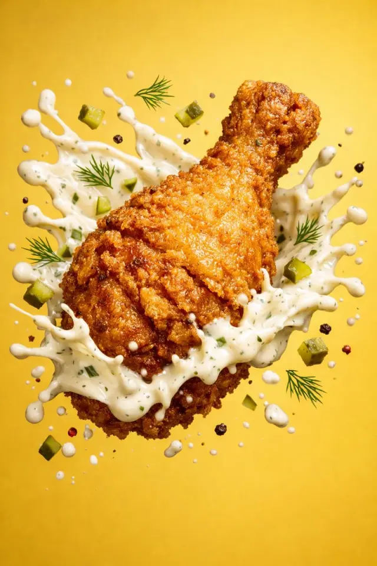

```text
Epic 8K cinematic fantasy food scene: a colossal crispy fried chicken leg rising like a legendary artifact through a tidal explosion of molten creamy sauce. Sauce behaves like liquid clouds, forming waves and splashes in mid-air. Pickle chunks, herb leaves, and seasoning particles float like asteroids in a food universe. Extreme macro texture on the crust—cracks, bubbles, and crunch visible. Powerful dramatic lighting with deep shadows and glowing highlights. Vibrant golden-yellow background with cinematic depth and atmospheric particles. Hyper-realistic yet mythic, bold surreal advertising masterpiece.
```

[Open in Pixonara →](https://pixonara.com/prompt/268)
