# Poster & Campaign Design Prompts

Fashion editorials, campaign posters, magazine covers, and advertising layouts.

Every image was generated with the exact prompt shown. Click "Open in Pixonara" to see the full-size result and try the prompt directly.

[← Back to main list](../README.md)

## 1. A refined fashion editorial image with a 3:4 aspect…

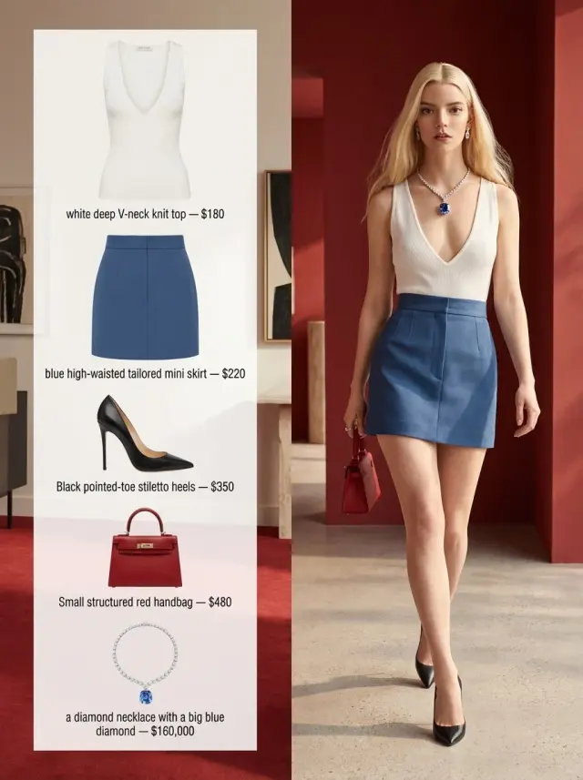

<details>
<summary>Show full prompt</summary>

```text
A refined fashion editorial image with a 3:4 aspect ratio, split into two clear sections.

Right side:
A fashionable, confident, sensual woman standing and walking casually in a modern architectural space with red luxurious walls and soft natural light. She wears a top with a deep V neckline, a 90-60-90 figure, tucked into a high-waisted blue tailored short skirt, On her feet are sleek black stiletto heels, elegant and minimal. She carries a small structured red handbag in one hand and she is wearing a luxurious diamond necklace with a blue diamond on it.

Her hair is open emphasizing her facial structure. She wears subtle statement earrings. The look is refined, modern, and effortlessly chic. Natural daylight, soft shadows, realistic skin texture. Casual fashion photography style with an editorial, high-end feel. alive color palette, warm tones, shallow depth of field, cinematic realism.

Style & Mood:
Modern elegance, quiet luxury, confident, minimal, editorial casual.

Photography Details:
Eye-level angle, candid stance, 35mm lens, natural lighting, high detail, photorealistic.

Left side:
A clean, minimalist product breakdown layout on a neutral background. The individual fashion items worn by the woman are displayed separately, neatly arranged with subtle shadows. Each item includes a small, elegant price label in refined sans-serif typography:

– white deep V-neck knit top — $180
– blue high-waisted tailored mini skirt — $220
– Black pointed-toe stiletto heels — $350
– Small structured red handbag — $480
– a diamond necklace with a big blue diamond — $160000

The left side feels like a luxury fashion catalog or e-commerce lookbook, with a red carpet, luxurious walls, art pieces on wall

Overall Style & Mood:
Quiet luxury, modern elegance, editorial fashion, high-end retail aesthetic.

Lighting & Quality:
Soft natural light, studio-clean clarity on product side, photorealistic, ultra-high resolution, professional fashion photography.

Negative Prompt:
Cluttered layout, oversized text, flashy logos, mannequins, people on left side, harsh lighting, low resolution, cartoon style.
```

</details>

[Open in Pixonara →](https://pixonara.com/prompt/334)

## 2. Create a complete visual worldbuilding set for a futuristic…

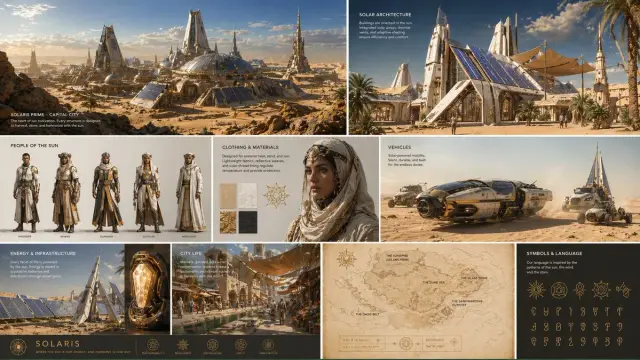

```text
Create a complete visual worldbuilding set for a futuristic desert civilization powered by solar technology, multiple images including architecture, characters, clothing, vehicles, and maps, cohesive design language, cinematic realism, ultra detailed.
```

[Open in Pixonara →](https://pixonara.com/prompt/8)

## 3. Graphic design smart prompt

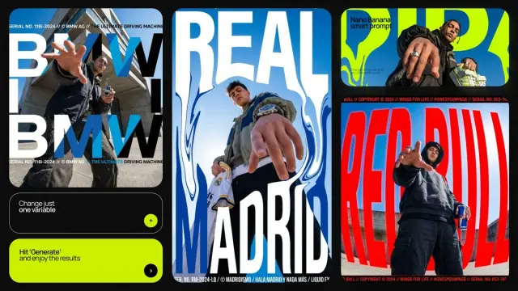

```text
Graphic design smart prompt

Generate ad posters in Nano Banana

This prompt generates:
• POV low-angle photo (pointing at viewer)
• Oversized text + brand tagline
• Serial numbers, copyright lines, technical callouts
• Brand-appropriate color blocking and texture

Use case: 
• social media posting,
• influencer collab visuals,
• pitch decks. 

Prompt 👇
```

[Open in Pixonara →](https://pixonara.com/prompt/358)

## 4. 武则天同款皇后内衣广告大片，明黄底色龙纹刺绣，大红丝绸飘带衬托

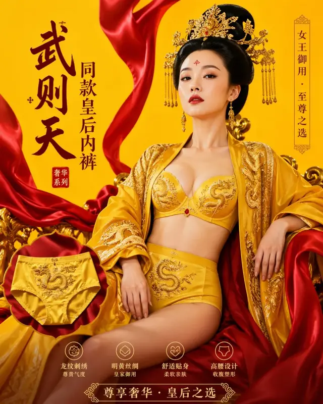

```text
武则天同款皇后内衣广告大片，明黄底色龙纹刺绣，大红丝绸飘带衬托
```

[Open in Pixonara →](https://pixonara.com/prompt/10)

## 5. 生成一张适合小红书发布的 3:4 竖版九宫格海报，整体为 3列 × 3行 排版，九个宫格边界清晰，方便后期直接切割成 9 张单图发布。整体风格干净、高级、统一，…

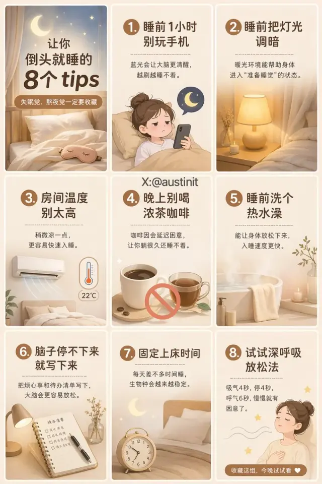

<details>
<summary>Show full prompt</summary>

```text
生成一张适合小红书发布的 3:4 竖版九宫格海报，整体为 3列 × 3行 排版，九个宫格边界清晰，方便后期直接切割成 9 张单图发布。整体风格干净、高级、统一，适合女性向健康生活方式内容，具有小红书爆款封面气质。画面要求 信息排版清晰、文字大、可读性强、留白舒服、配色温柔治愈。

整体视觉风格：
奶油白、浅米色、淡燕麦色、浅焦糖色为主色调，搭配少量深棕色文字，ins风、治愈感、睡眠疗愈主题，简约排版，轻拟物插画点缀，可加入枕头、月亮、星星、热牛奶、香薰、书本、眼罩、窗帘、床铺等元素。整体像专业新媒体设计图，字体工整，适合做知识科普类小红书九宫格。
排版要求：

整张图必须是标准九宫格构图，切分后每一格都能独立成图

每个宫格内容完整居中，不要把标题或正文压在分割线附近
每个格子之间保留明显间隔或细边框，保证裁切后不影响阅读
所有文字使用中文，清晰易读，不要乱码，不要英文
每个宫格都像独立的小红书图文卡片，但视觉风格保持统一
画面精致、真实、自然，不要廉价营销感，不要过度花哨
九宫格具体内容：

第1格（封面）
大标题：让你倒头就睡的8个 tips
副标题：失眠党、熬夜党一定要收藏
封面视觉最吸睛，适合做首图，加入柔软床铺、月亮、枕头、眼罩等治愈睡眠元素，标题突出，排版高级。

第2格
标题：1. 睡前1小时别玩手机
正文：蓝光会让大脑更清醒，越刷越睡不着。
配图元素：手机、月亮、困倦表情的小插画
第3格
标题：2. 睡前把灯光调暗
正文：暖光环境能帮助身体进入“准备睡觉”的状态。
配图元素：床头灯、暖黄色灯光、窗帘
第4格
标题：3. 房间温度别太高
正文：稍微凉一点，更容易快速入睡。
配图元素：空调、温度计、被子
第5格
标题：4. 晚上别喝浓茶咖啡
正文：咖啡因会延迟困意，让你躺很久还睡不着。
配图元素：咖啡杯、茶杯、禁止符号

第6格
标题：5. 睡前洗个热水澡
正文：能让身体放松下来，入睡速度更快。
配图元素：浴室蒸汽、毛巾、热水
第7格
标题：6. 脑子停不下来就写下来
正文：把烦心事和待办清单写下，大脑会更容易放松。
配图元素：笔记本、钢笔、小台灯
第8格
标题：7. 固定上床时间
正文：每天差不多时间睡，生物钟会越来越稳定。
配图元素：时钟、月亮、床
第9格
标题：8. 试试深呼吸放松法
正文：吸气4秒，停4秒，呼气6秒，慢慢就有困意了。
底部小字：收藏这组，今晚试试看
配图元素：呼吸线条、闭眼人物、星星

画质要求：
高清，高级排版，杂志感，真实可发布，新媒体运营审美，小红书爆款图文风格，文字布局规整，适合直接切图。
```

</details>

[Open in Pixonara →](https://pixonara.com/prompt/17)

## 6. Cute Y2K style affordable cosmetics advertising image designed for…

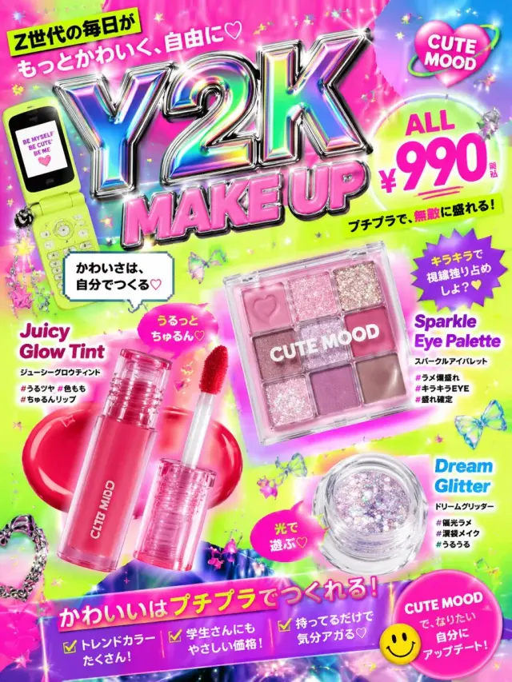

```text
Cute Y2K style affordable cosmetics advertising image designed for Gen Z. Using vibrant color schemes, including neon colors. Aspect ratio is 3:4.
```

[Open in Pixonara →](https://pixonara.com/prompt/18)

## 7. 画像生成: 商品広告写真, 夏にぴったりの季節商品, 炭酸飲料, 名称=夏柑SODA, 形状=ペットボトル500ml, 2025年に飲料広告として高CTAだった…

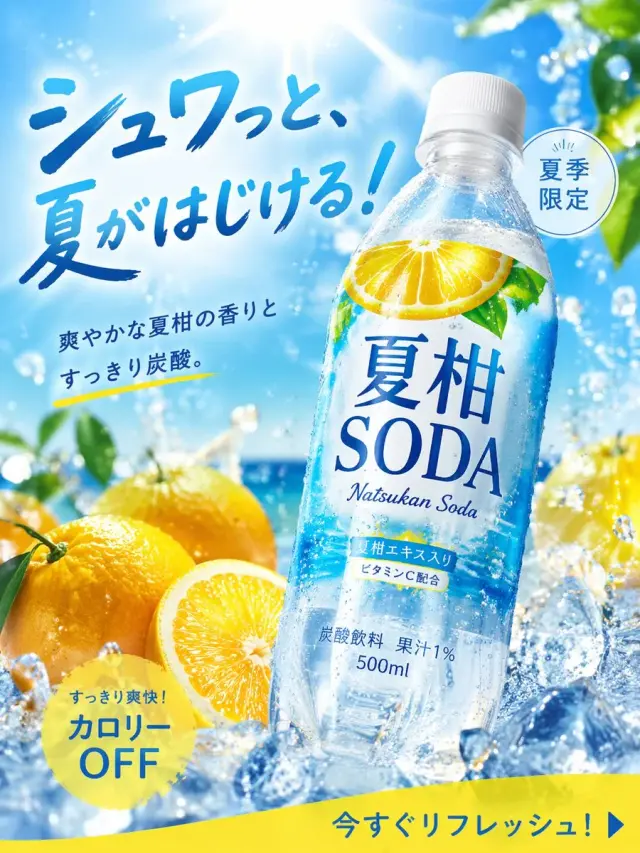

```text
画像生成: 商品広告写真, 夏にぴったりの季節商品, 炭酸飲料, 名称="夏柑SODA", 形状=ペットボトル500ml, 2025年に飲料広告として高CTAだったデザインをリサーチしてから画像仕様をデザインして生成, アスペクト比=3:4
```

[Open in Pixonara →](https://pixonara.com/prompt/21)

## 8. 赵飞燕同款掌中舞香膏广告，错金缠枝莲铜瓶，冷艳诡谲深宫氛围感，竖屏9:16

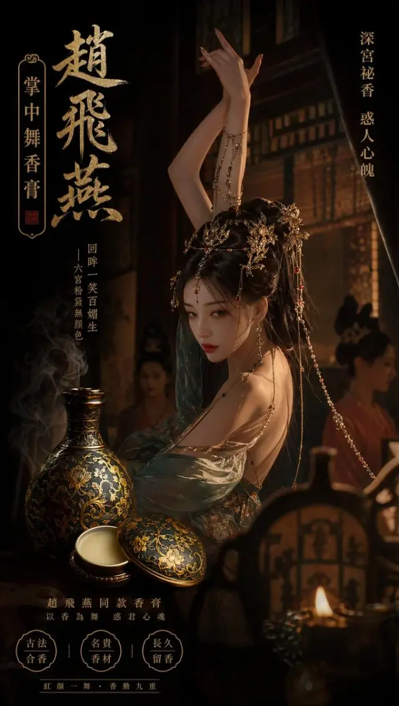

```text
赵飞燕同款掌中舞香膏广告，错金缠枝莲铜瓶，冷艳诡谲深宫氛围感，竖屏9:16
```

[Open in Pixonara →](https://pixonara.com/prompt/32)

## 9. A hyper-realistic studio photograph of a male athlete mid-air…

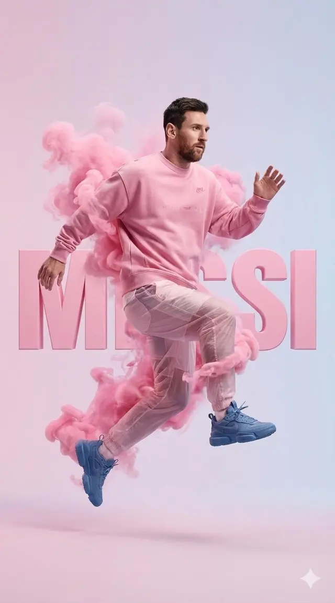

```text
A hyper-realistic studio photograph of a male athlete mid-air as if running or jumping, wearing a pastel pink sweatshirt and light pink jogger pants, with soft blue sneakers. Pink powder smoke is exploding and swirling around his body, especially behind him and around his legs, creating a dynamic motion effect. Clean minimal background with a soft gradient from light gray to pale pink. Cinematic lighting, ultra-sharp focus, shallow depth of field, fashion advertising style, high detail, 8k, soft shadows, professional studio photography.
```

[Open in Pixonara →](https://pixonara.com/prompt/500)

## 10. Minimalist fashion studio photoshoot featuring stylish people sitting confidentl…

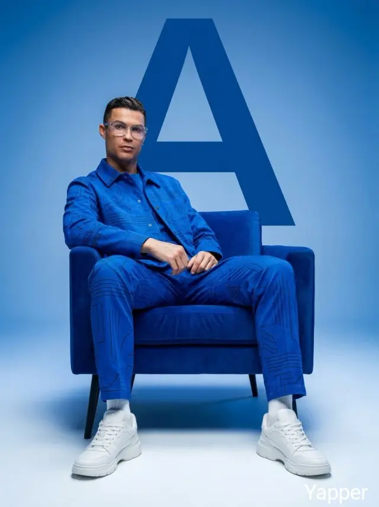

```text
Minimalist fashion studio photoshoot featuring stylish people sitting confidently on a modern chair, monochromatic aesthetic, subjects wearing bold cobalt-blue outfits (tailored suit or modern streetwear set) with white sneakers and clear glasses, relaxed powerful pose with legs apart and hands resting naturally, clean blue studio background with a large geometric letter “A” behind them, soft professional studio lighting, fashion editorial composition, modern luxury brand campaign style, ultra-realistic, sharp focus, high detail, 8K.
```

[Open in Pixonara →](https://pixonara.com/prompt/529)

## 11. Avant-garde sports fashion advertisement, oversized tennis racket positioned lik…

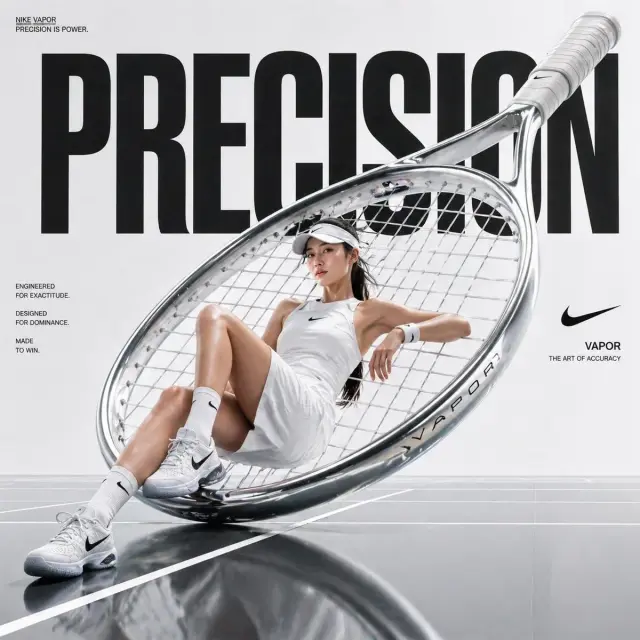

```text
Avant-garde sports fashion advertisement, oversized tennis racket positioned like monumental sculpture, female athlete seated casually on the strings as if a suspended lounge, giant word “PRECISION” in bold typography behind, crisp white studio backdrop, reflective court-like floor, luxury sportswear editorial aesthetic, cinematic lighting, ultra-clean composition, 1:1
```

[Open in Pixonara →](https://pixonara.com/prompt/43)

## 12. A cinematic side-profile portrait of a rugged man with…

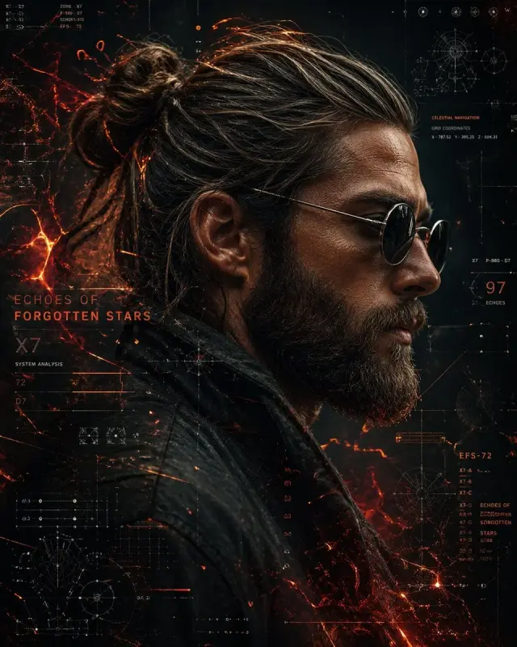

```text
A cinematic side-profile portrait of a rugged man with a tied-back bun and full beard, wearing round dark sunglasses and a textured leather jacket. His skin is detailed and slightly weathered. The background is a futuristic sci-fi interface filled with glowing orange and red data streams, star maps, celestial navigation diagrams, grids, and holographic UI elements. Fiery particle effects and ember-like energy swirl around him, creating a cosmic, high-tech atmosphere. Dark color palette with strong contrast, dramatic lighting, ultra-detailed, sharp focus, 8K, cyberpunk aesthetic, cinematic composition, depth of field.
```

[Open in Pixonara →](https://pixonara.com/prompt/66)

## 13. Ultra-cinematic product photography of a matte black luxury soda…

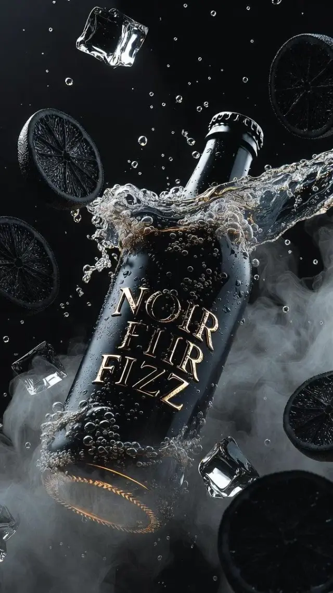

```text
Ultra-cinematic product photography of a matte black luxury soda bottle labeled “NOIR FIZZ”, floating mid-air at a sharp diagonal angle; carbonated bubbles and liquid soda waves frozen in motion, shattered ice cubes and glossy black citrus slices suspended; dramatic low-key lighting with strong rim lights, metallic highlights, deep shadows; black and gold color palette, volumetric mist, macro textures, hyper-realistic glass, 8K, premium commercial ad style.
```

[Open in Pixonara →](https://pixonara.com/prompt/82)

## 14. A stylized, retro-futuristic music poster in a synthwave aesthetic.…

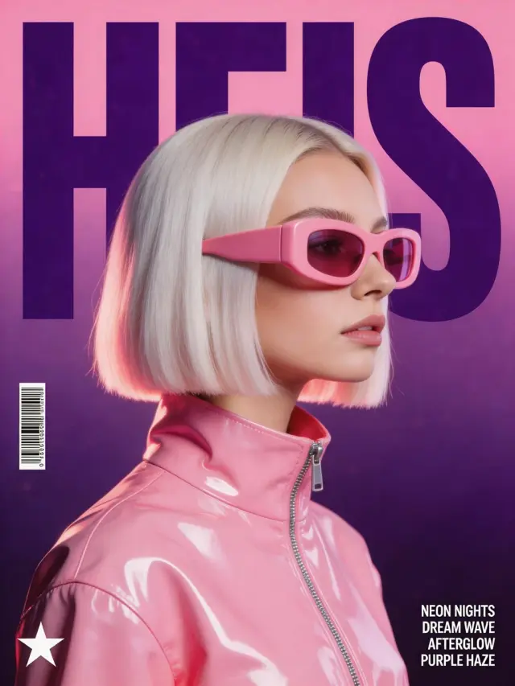

<details>
<summary>Show full prompt</summary>

```text
A stylized, retro-futuristic music poster in a synthwave aesthetic. The central focus is a woman in profile with a platinum blonde bob haircut, wearing oversized, chunky pink opaque visor sunglasses and a high-collar, extremely glossy pink vinyl jacket with visible zipper detail. Behind her, the word "HEIS" is written in massive, dark purple, condensed block typography, partially hidden by her head. The background is a clean gradient shifting from soft magenta to deep purple, overlaid with a subtle film grain texture. Lighting: Soft studio lighting with high-specular highlights on the glossy jacket and rim lighting on the hair. Color Palette: Dominant shades of bubblegum pink, deep violet, and lavender. Graphics: A small barcode on the left, a minimalist star logo in the bottom-left corner, and four lines of small sans-serif song lyrics in the bottom-right corner. Atmosphere: High-fashion, electronic dance music vibe, clean and polished composition.
```

</details>

[Open in Pixonara →](https://pixonara.com/prompt/822)

## 15. A luxury high-fashion magazine cover. Magazine name at the…

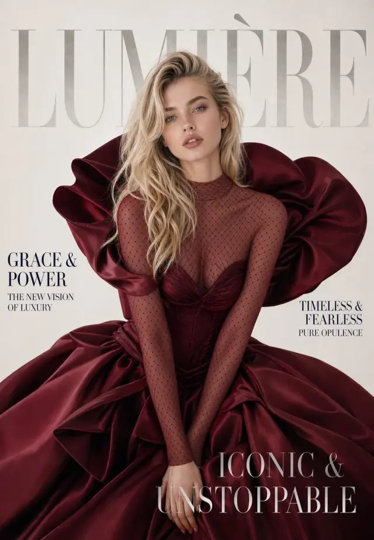

<details>
<summary>Show full prompt</summary>

```text
A luxury high-fashion magazine cover. Magazine name at the very top in massive elegant serif font reads "LUMIÈRE" — the letters are large, slightly transparent/ghost-style overlapping the model's head just like ELLE magazine, in soft platinum silver color blending into the background.
Character: A young beautiful white woman, early 20s, soft feminine features, big blue eyes, naturally full lips, flawless porcelain skin, subtle makeup — rosy cheeks, nude lips, defined brows. Her hair is platinum blonde, long and wavy, loosely flowing over one shoulder. She looks directly into the camera with a soft yet powerful gaze. Slight tilt of the head, naturally elegant posture.
Outfit: She is wearing a dramatic deep burgundy wine-red ballgown — structured corset top with off-shoulder neckline, voluminous layered satin skirt billowing around her dramatically. Behind her shoulders, large sculptural fabric rises like rose petals — same architectural drama as reference. She leans slightly forward, both hands resting gently on her knees.
Background: Pure soft warm white/ivory background — completely clean, minimal, high-end studio editorial. Soft diffused light, no harsh shadows.
Typography — placed EXACTLY like ELLE magazine reference:
Top: "LUMIÈRE" massive serif, platinum/silver, overlapping model's head slightly
Left mid: "GRACE & POWER" bold serif, then smaller below "THE NEW VISION OF LUXURY"
Right mid: "TIMELESS & FEARLESS" bold, then "PURE OPULENCE" smaller below
Bottom right large: "ICONIC & UNSTOPPABLE" elegant large serif
All text in deep charcoal/dark navy. Font style: classic high fashion serif — same weight, spacing, and elegance as ELLE. Text naturally integrated into the composition, NOT floating randomly.
Ultra photorealistic, 8K, real magazine cover quality, perfect typography placement, vertical 9:13 format.
```

</details>

[Open in Pixonara →](https://pixonara.com/prompt/133)

## 16. Ultra-realistic beauty advertisement, close-up of a young woman with…

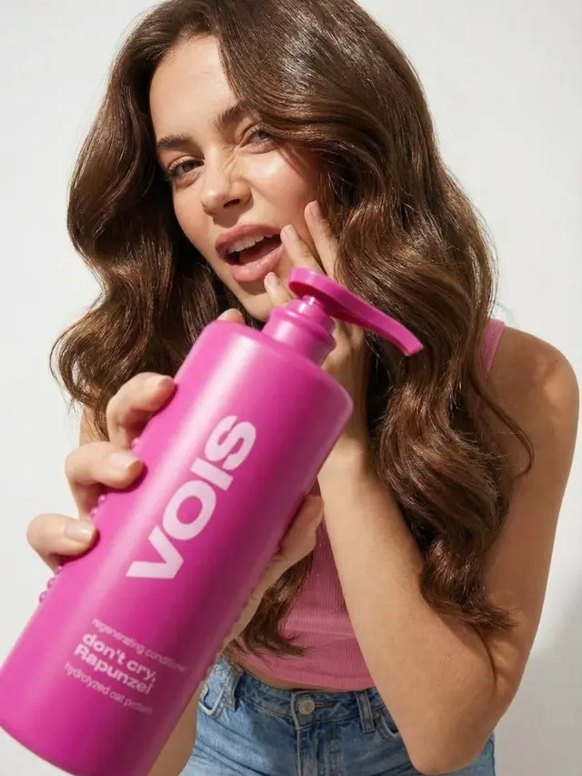

```text
Ultra-realistic beauty advertisement, close-up of a young woman with long wavy brown hair, soft glowing skin, wearing a pink sleeveless top, holding a large pink conditioner bottle labeled “VOIS” toward the camera, playful facial expression, natural makeup, bright studio lighting, clean white background, shallow depth of field, high-end cosmetic campaign, 85mm lens, sharp focus, glossy product texture, vibrant pink tones
```

[Open in Pixonara →](https://pixonara.com/prompt/921)

## 17. 武则天同款皇后香水广告，龙纹金瓶，暗黑宫廷氛围感大片

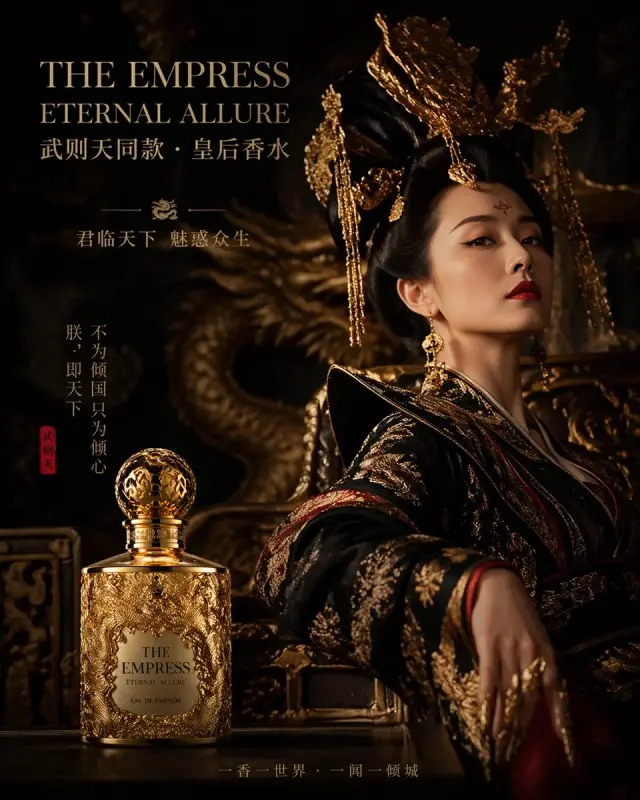

```text
武则天同款皇后香水广告，龙纹金瓶，暗黑宫廷氛围感大片
```

[Open in Pixonara →](https://pixonara.com/prompt/144)

## 18. A high-definition, professional fashion editorial photograph of a sophisticated…

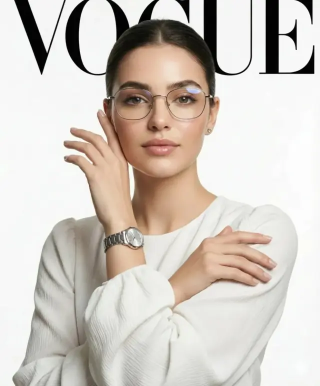

<details>
<summary>Show full prompt</summary>

```text
A high-definition, professional fashion editorial photograph of a sophisticated woman with a sleek, center-parted bun. She is wearing elegant, thin-rimmed silver glasses and a minimalist white long-sleeved silk blouse. She is posed gracefully with her hands near her face and chest, showcasing a luxury silver watch. The background is a clean, bright white with bold, high-contrast black serif typography reading 'VOGUE' at the top. Studio lighting, soft skin texture, sharp focus on the eyes, 8k resolution, shot on a 85mm lens for a flattering portrait compression."
​Tips for Customizing the Result:
​The Model: If you want a different look, change "sophisticated woman" to specific features like "freckles," "dark curly hair," or "minimalist makeup."
​The Brand: You can swap "VOGUE" for any other magazine title or leave it blank for a clean fashion portrait.
​The Jewelry: Adjust the metal (e.g., "gold watch," "rose gold frames") to change the color palette of the image.
```

</details>

[Open in Pixonara →](https://pixonara.com/prompt/931)

## 19. A creative romantic digital photo collage featuring a young…

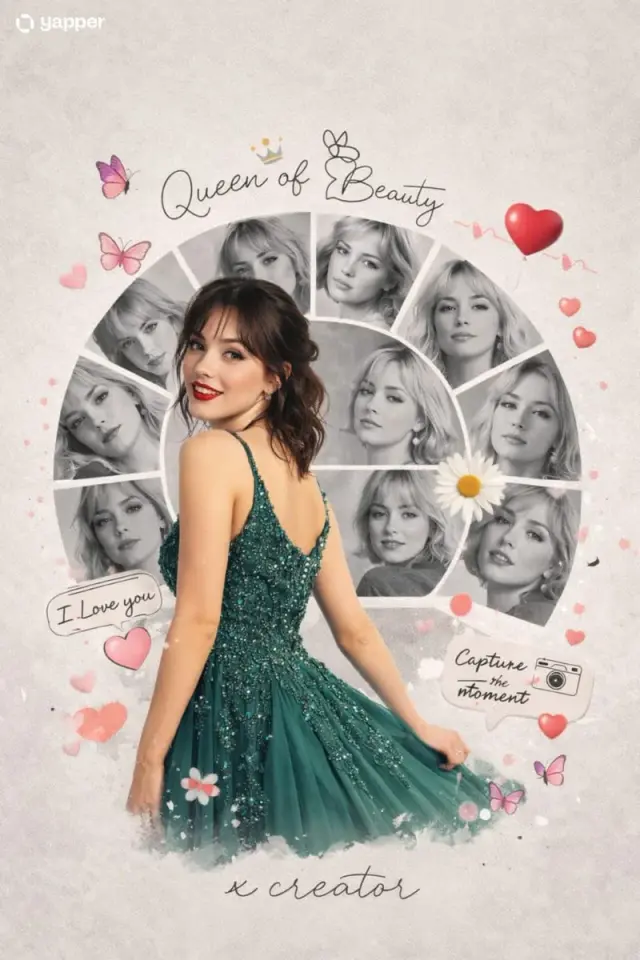

<details>
<summary>Show full prompt</summary>

```text
A creative romantic digital photo collage featuring a young handsome woman in a peacock green frock. The main subject is a full-body cutout placed slightly left, turned back and smiling over her shoulder, wearing a peacock green embellished rich frock. Behind and around her is a semi-circular collage of multiple black-and-white portrait shots of the same woman, each in different expressions and poses, arranged in curved segments. The background is a soft light grey textured surface with a minimal aesthetic.Decorative elements include pink butterflies, a floral daisy near the center, red heart balloons, and cute love-themed stickers Handwritten-style text elements like “Queen of Beauty,” “I Love you,” and “Capture the moment” are scattered around. A small heartbeat line with a heart icon is included. At the bottom, the name “x creator” appears in elegant cursive typography. Soft shadows, smooth cutout blending, high-end Photoshop manipulation, romantic mood, pastel tones.
```

</details>

[Open in Pixonara →](https://pixonara.com/prompt/1019)

## 20. Editorial photography, a woman wearing a structured deep teal…

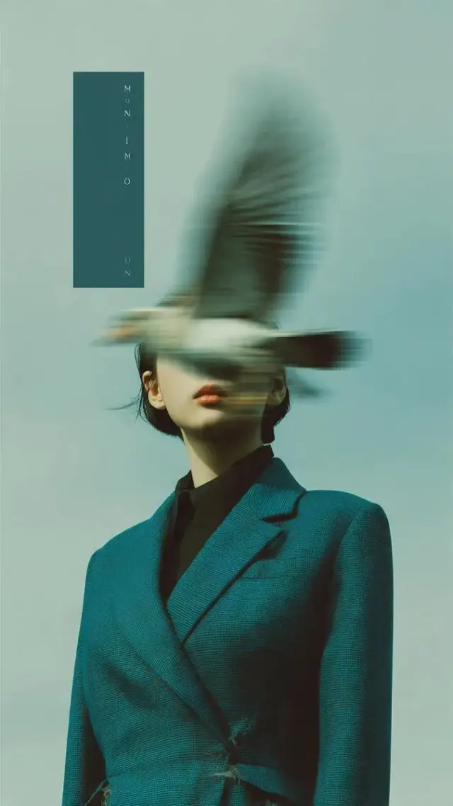

```text
Editorial photography, a woman wearing a structured deep teal blazer standing against a pale blue sky. A bird in heavy motion blur is flying across her face, obscuring her features, surrealist style. High-grain paper texture, cinematic soft lighting, minimalist composition. Magazine cover aesthetic with a clean white vertical sidebar on the left containing bold black typography. Muted cool tones, artistic blur, 35mm film aesthetic, avant-garde fashion vibe
```

[Open in Pixonara →](https://pixonara.com/prompt/1029)

## 21. Hip-hop fashion model standing full-frame, clothing distorted into stretched…

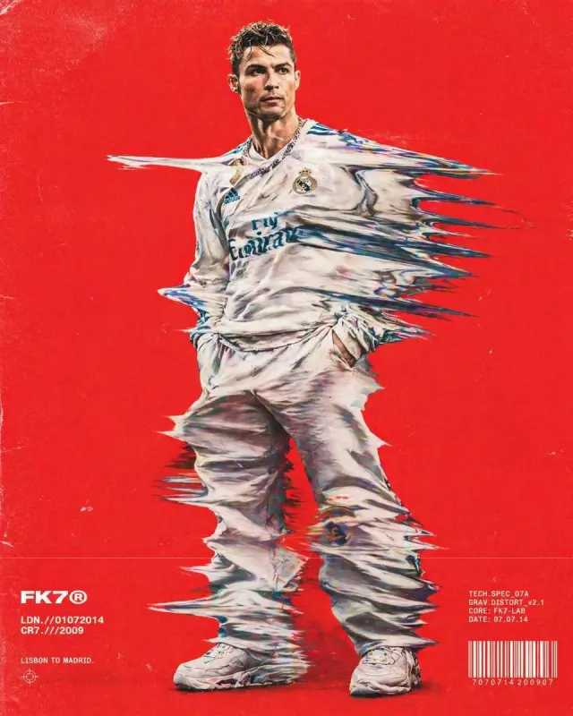

```text
Hip-hop fashion model standing full-frame, clothing distorted into stretched streaks like motion drag, bold red background, retro film grain, barcode + tiny technical text in bottom area, modern fashion-magazine layout, expressive weirdness, cool attitude , 4K high detail. --ar 4:5 --raw
```

[Open in Pixonara →](https://pixonara.com/prompt/169)

## 22. A retro-inspired studio photoshoot featuring a young woman styled…

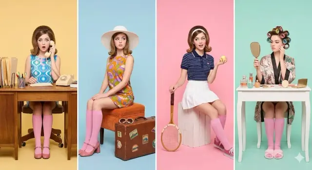

<details>
<summary>Show full prompt</summary>

```text
A retro-inspired studio photoshoot featuring a young woman styled in four different personas, arranged in a horizontal split-panel composition. Each panel has a bold pastel background in contrasting colors (yellow, blue, pink, mint). The same woman appears in each panel wearing vintage 1960s fashion with bright patterns, pink knee-high socks, and expressive makeup.
Panel 1 (Office theme): She sits behind a desk with office props like folders, a rotary phone, and stationery, wearing a patterned dress and looking surprised while holding the phone.
Panel 2 (Travel theme): She wears a wide-brim hat and colorful outfit, sitting with a vintage suitcase and travel accessories, posing elegantly.
Panel 3 (Sports theme): She wears a sporty retro outfit, holding a tennis racket and ball, sitting casually with playful energy.
Panel 4 (Home theme): She wears a robe with hair rollers, holding a hand mirror, sitting at a vanity table with beauty items.
Each panel is cleanly divided, perfectly symmetrical, with consistent lighting and camera angle. Bright, soft studio lighting, high fashion editorial style, ultra-sharp, vibrant colors, minimal shadows, no text, no logos, no labels, no watermarks.
Style: vintage pop art, Wes Anderson symmetry, fashion editorial photography, pastel color blocking, high resolution, 8k, clean composition.
```

</details>

[Open in Pixonara →](https://pixonara.com/prompt/1077)

## 23. 新中式极简风格高端城市海报，9:16竖版构图，以广州为核心主题，画面中心为抽象几何化的广州塔，造型简洁但具有辨识度，

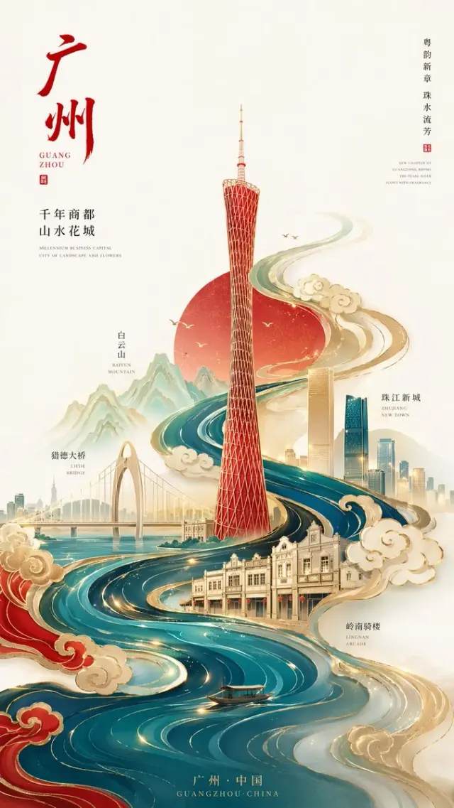

```text
新中式极简风格高端城市海报，9:16竖版构图，以广州为核心主题，画面中心为抽象几何化的广州塔，造型简洁但具有辨识度，

整体采用S型流动构图，从下方向上延展，珠江水系被设计为流动的水波纹与传统祥云纹样融合，环绕整个画面形成视觉动线，

广州地标建筑以“留白+线描+局部色块”的方式点缀其中：珠江新城双塔、猎德大桥、白云山轮廓、岭南骑楼，
传统与现代建筑自然融合，层次递进，远近虚实分明，

风格控制：极简 + 高级 + 东方意境，不杂乱不过度写实，

色彩方案（重点）：
高饱和但克制 ，中国红、青蓝、鎏金为主色，
辅以少量暖金高光点缀，形成强烈视觉冲击但不俗艳，

背景：大面积纯净留白或淡宣纸肌理，增强呼吸感与高级感，

细节：祥云与水纹具有轻微浮雕/烫金质感，
局部加入微光粒子或流动光线，增强现代感，

光影：柔和渐变光+局部高光，突出恢弘大气氛围，

整体风格：国潮高级插画 / 品牌海报级质感 / 8K / 超清细节
```

[Open in Pixonara →](https://pixonara.com/prompt/182)

## 24. A bold fashion editorial poster featuring a young woman…

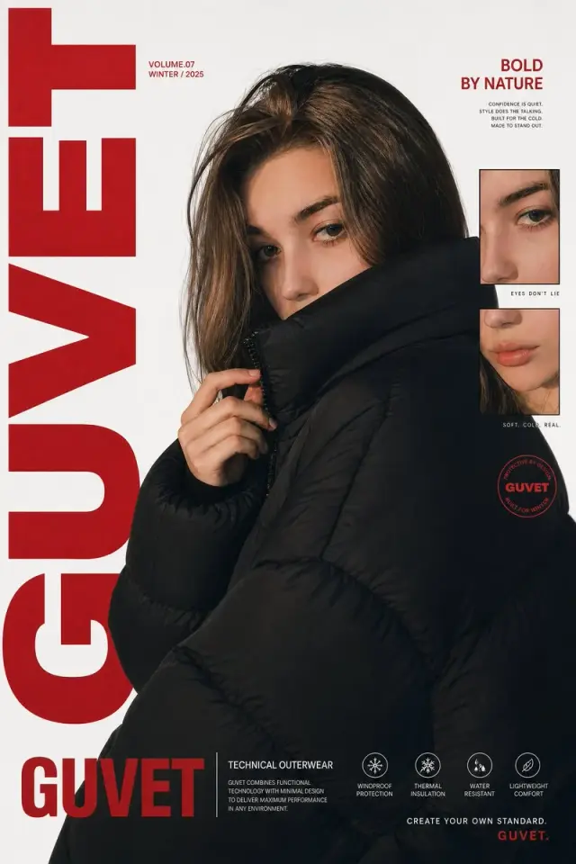

<details>
<summary>Show full prompt</summary>

```text
A bold fashion editorial poster featuring a young woman model in a close-up half-body portrait, wrapped in an oversized black puffer jacket with a high padded collar partially covering the lower face, styled in a minimal, sleek, modern luxury streetwear aesthetic. The model turns her upper body slightly away from the camera while looking back over her shoulder toward the viewer, creating a tense and magnetic pose, with one hand raised delicately near the jacket zipper and collar, fingers lightly touching the fabric as if adjusting it, giving a controlled, elegant, and intentional gesture that contrasts softly with the heavy oversized jacket, while her shoulders are slightly hunched into the coat to create a protective, stylish, and intimate silhouette. Her facial expression is calm, serious, and subtly mysterious with direct eye contact, slightly parted lips, relaxed brows, and a smooth yet intense gaze, conveying a quiet, emotionally reserved, high-fashion attitude that feels soft, cold, elegant, and untouchable. The overall mood is moody, minimalist, premium, and polished with a quiet luxury winter editorial feel. The outfit consists of an oversized matte black down puffer jacket with dramatic volume, a high collar, and a clean zipper line, with no additional accessories, maintaining a monochrome modern Korean magazine vibe. The poster design features a clean graphic magazine cover style with a white background, oversized red vertical typography behind the subject spelling “GUVET” or similar bold letterforms, a sharp editorial layout, red and black color scheme, modern sans-serif text, small microtext blocks, inset cropped detail frames showing close-up facial features, and subtle fashion publication branding elements at the bottom. The lighting is soft studio lighting with clean skin texture, crisp contrast, smooth shadows, high detail on the eyes and lips, refined print-magazine finishing, ultra sharp focus, and a luxury commercial fashion poster aesthetic in high resolution with a premium composition.
```

</details>

[Open in Pixonara →](https://pixonara.com/prompt/189)

## 25. Ultra-dynamic motocross racing scene featuring a professional dirt bike…

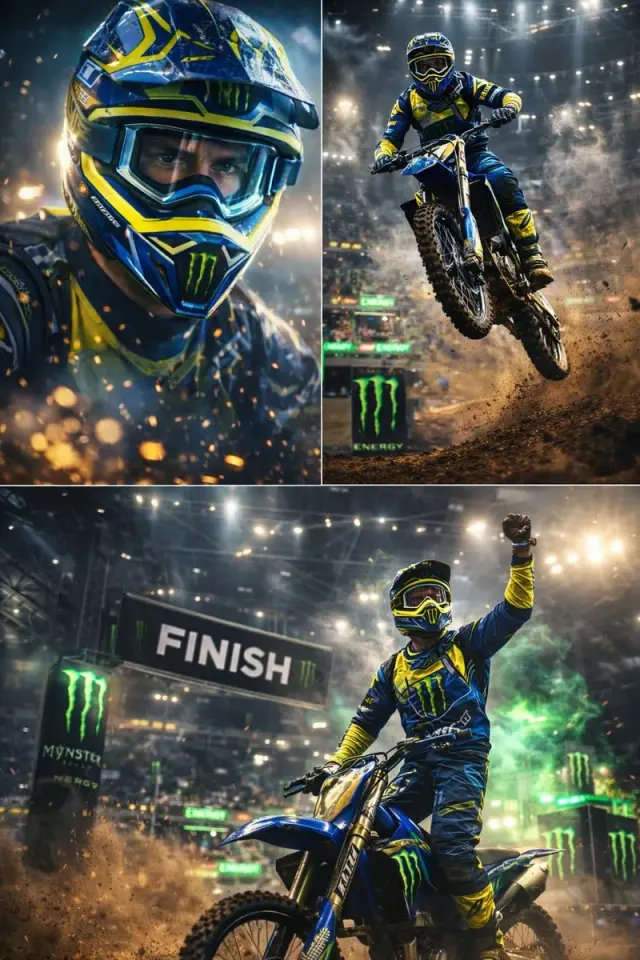

<details>
<summary>Show full prompt</summary>

```text
Ultra-dynamic motocross racing scene featuring a professional dirt bike rider performing extreme stunts inside a massive indoor stadium. The composition blends realism and cinematic energy — showing the rider in multiple perspectives: a close-up portrait with a blue and yellow helmet, a mid-action jump on a dirt track, and a victory pose near the finish line. The background features dramatic smoke, spotlights,and structural beams of the stadium, with flashes of neon green accents cutting through the atmosphere. The dirt track is rugged, filled with motion blur, dust particles, and intense lighting contrast. Energy drink branding and banners add authenticity to the motorsport environment. The overall tone is high-octane, gritty, and heroic — perfect for a motorsport poster or promotional artwork.
```

</details>

[Open in Pixonara →](https://pixonara.com/prompt/198)

## 26. 5 panel colorful portrait collage, fashion models, monochrome backgrounds…

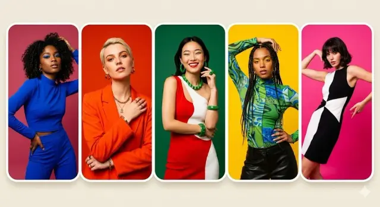

```text
5 panel colorful portrait collage, fashion models, monochrome backgrounds (pink, red, green, yellow), vibrant studio lighting, modern editorial style, rounded grid layout, high contrast, minimal shadows
```

[Open in Pixonara →](https://pixonara.com/prompt/1195)

## 27. Avant-garde fashion advertisement, oversized futuristic sunglasses positioned li…

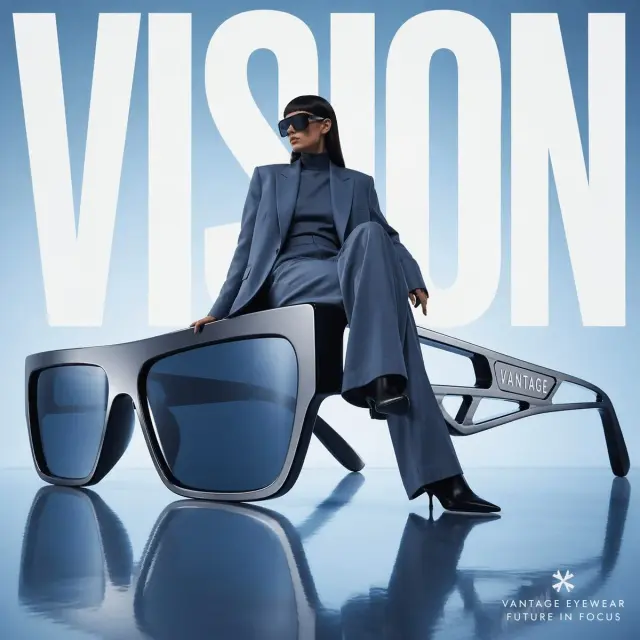

```text
Avant-garde fashion advertisement, oversized futuristic sunglasses positioned like sculpture, model casually seated on the frame as if furniture, giant word "VISION" behind in bold white typography, powder blue studio background, reflective floor, luxury eyewear campaign aesthetic, ultra-clean layout, editorial magazine styling, 1:1
```

[Open in Pixonara →](https://pixonara.com/prompt/215)

## 28. Bright colorful children's shoe brand advertisement for Happy Smile☺️,…

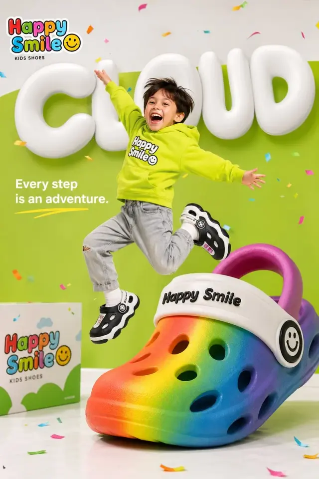

```text
Bright colorful children's shoe brand advertisement for "Happy Smile☺️", happy young child jumping in the air wearing oversized colorful foam  black and white shoes, giant rainbow colored shoe prop in background, bright green and white studio background, playful bubbly bold typography "CLOUD" in background, tagline "Every step 
is an adventure.", confetti falling, fun joyful lighting, 
commercial photography style, ultra HD 8K , Designed with Shamus image 2.
```

[Open in Pixonara →](https://pixonara.com/prompt/216)

## 29. Create a high-resolution vertical character concept poster with a…

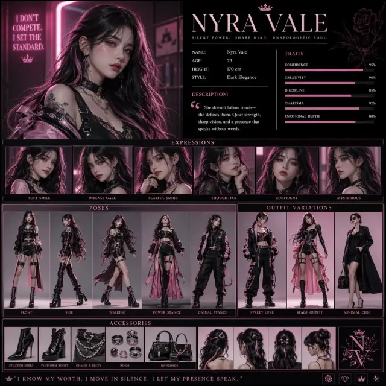

<details>
<summary>Show full prompt</summary>

```text
Create a high-resolution vertical character concept poster with a luxury pink and white  aesthetic, blending elegance with edgy, modern fashion. The layout should feel like a premium magazine profile with clean sections and perfect grid alignment.

Main subject: A unique young woman (not resembling any real person), with long silky dark hair featuring subtle pink highlights. She has a confident, calm expression with a slightly mysterious aura. She wears a black and pink fusion outfit (mix of streetwear and idol fashion) with glossy textures, lace, and metallic accents. Lighting is soft but dramatic, with neon pink glow against dark tones.

Top section:
Large hero portrait on one side. On the other side, include a sleek profile panel with elegant English text:

Name: Nyra Vale
Age: 23
Height: 170 cm
Style: Dark Elegance

Short description:
“She doesn’t follow trends—she defines them. Quiet strength, sharp vision, and a presence that speaks without words.”

Add a Traits section with stylish progress bars:

Confidence
Creativity
Discipline
Charisma
Emotional Depth

Middle section:
Grid of 5–6 small portraits showing different expressions (soft smile, intense gaze, playful smirk, thoughtful, confident).

Lower sections:

Full-body poses (front, side, walking pose, power stance, casual stance).
Outfit variations (street luxe, stage outfit, minimal chic).
Accessories panel (heels, boots, chains, rings, handbags, hairstyles).

Text tone:
Strong, meaningful, and confident—focused on individuality, self-worth, and silent power. Avoid filler text.

Style:
Ultra-detailed, 4K quality, glossy magazine finish, cinematic lighting, sharp focus, balanced contrast, modern editorial layout, perfectly aligned grid.
```

</details>

[Open in Pixonara →](https://pixonara.com/prompt/220)

## 30. Create four connected premium realistic editorial images for OBSIDIAN…

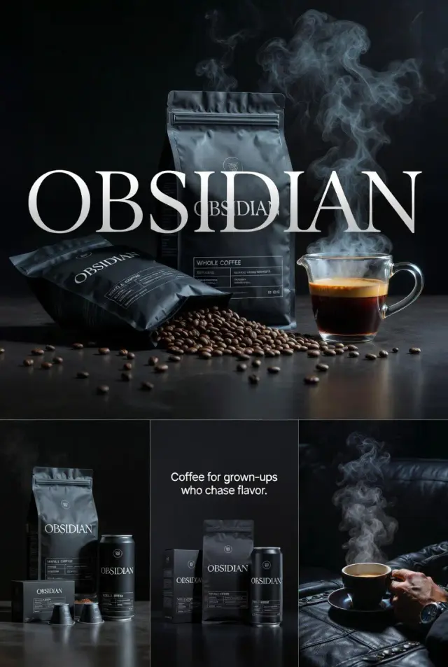

```text
Create four connected premium realistic editorial images for OBSIDIAN coffee. Dark cinematic grown-up vibe like high-end sportswear or coffee campaigns. Dramatic but grounded studio lighting, realistic textures, clean composition. Image 1: Hero poster with ‘OBSIDIAN’ and premium coffee display with steam and beans. Image 2: Product lineup - bags, cans, capsules. Image 3: Packaging close-up + tagline ‘Coffee for grown-ups who chase flavor.’ Image 4: Lifestyle steaming cup shot. Highly polished, sharp, realistic materials, consistent branding, no surreal effects
```

[Open in Pixonara →](https://pixonara.com/prompt/231)

## 31. A clean, refreshing vertical advertising poster design for a…

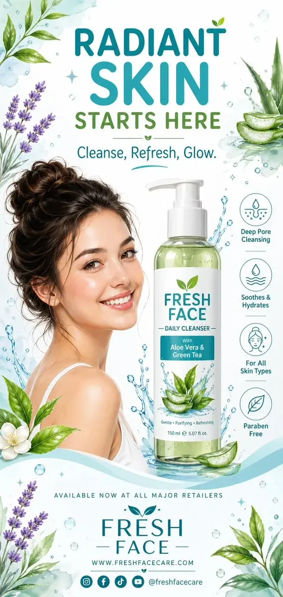

<details>
<summary>Show full prompt</summary>

```text
A clean, refreshing vertical advertising poster design for a face wash product, using a graphic illustration style with soft watercolor and vector elements. The poster is set against a clean white and light teal background. The central figure is a beautiful, smiling young woman with natural, glowing, radiant skin and her hair loosely tied back in a messy bun, looking confidently towards the viewer with fresh-faced appearance. She has a touch of natural makeup.
The overall style is clean, modern, and graphic, with flowing organic shapes, stylized leaves, flowers, and water splashes in shades of aqua, teal, light green, and white. The background features delicate, stylized illustrations of botanical ingredients like aloe vera, green tea leaves, and lavender.
At the top, large, friendly, rounded sans-serif font reads: "RADIANT SKIN STARTS HERE". Below this, a catchy tagline: "Cleanse, Refresh, Glow."
The main product, a stylized bottle of face wash with a white pump and green and blue labeling, is illustrated to the right of the woman. The bottle is labeled "FRESH FACE DAILY CLEANSER" and mentions "With Aloe Vera & Green Tea." There are small graphical icons around the bottle with text: "Deep Pore Cleansing", "Soothes & Hydrates", "For All Skin Types", "Paraben Free".
Small illustrative bubbles, stars, and botanical accents float around the composition, adding a sense of lightness and freshness. At the bottom, in a clean, modern font, it says: "AVAILABLE NOW AT ALL MAJOR RETAILERS" followed by a stylized logo "FRESH FACE" and the website "https://t.co/OUIoDMOWF6" and social media icons (freshfacecare). The poster has a clean layout with ample negative space and soft, natural lighting.
```

</details>

[Open in Pixonara →](https://pixonara.com/prompt/234)

## 32. A vibrant 2000s scrapbook-style collage featuring the same young…

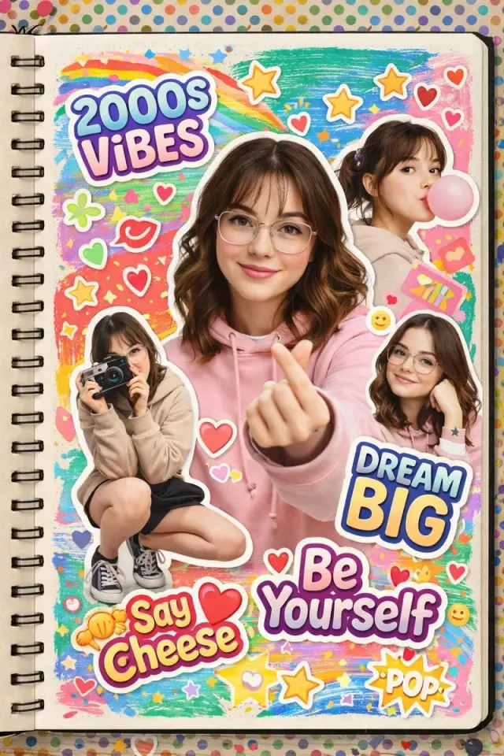

<details>
<summary>Show full prompt</summary>

```text
A vibrant 2000s scrapbook-style collage featuring the same young woman in multiple cutout poses. One portrait is centered and large, showing her wearing round glasses and a beige hoodie, making a finger-heart gesture toward the camera. Other cutouts show her squatting with a vintage instant camera, and another blowing a pink bubblegum bubble.

The background looks like an open sketchbook with textured paper, filled with colorful paint strokes in rainbow tones, playful doodles, arrows, stars, hearts, butterflies, smiley faces, and pop-art stickers. Bold, bubbly typography stickers read phrases like “2000s Vibes,” “Dream Big,” “Be Yourself,” “Cool Dude,” “Say Cheese,” and “Pop!”

The overall aesthetic is nostalgic, cheerful, and youthful — inspired by early 2000s teen magazines and scrapbook journals. High saturation, soft lighting, clean white sticker outlines around each cutout, whimsical and fun mood, creative flat-lay composition, digital collage illustration style.
```

</details>

[Open in Pixonara →](https://pixonara.com/prompt/248)

## 33. A hyperrealistic premium denim advertisement shot in a dark,…

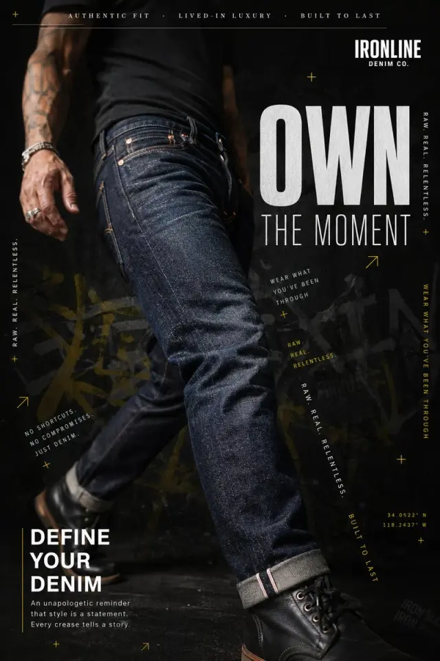

<details>
<summary>Show full prompt</summary>

```text
A hyperrealistic premium denim advertisement shot in a dark, moody editorial style. A male figure wearing raw selvedge denim jeans is captured mid-stride against a near-black charcoal background, body angled diagonally at a bold 45-degree perspective toward the camera. The jeans feature a slim tapered silhouette with deep indigo wash, subtle thigh and knee fading, reinforced copper rivets catching ambient light, and clean off-white contrast stitching, dominating the lower two-thirds of the frame. The composition uses shallow depth of field with sharp focus on the denim texture and soft blur on the upper torso. The background is layered with subtle urban texture — faint graffiti strokes in electric yellow and muted olive, barely visible through a heavy dark vignette. Multiple rows of ultra-small all-caps typographic text orbit the figure at different angles reading phrases like "RAW. REAL. RELENTLESS." and "WEAR WHAT YOU'VE BEEN THROUGH" — some running vertically, some at 30-degree angles, creating a chaotic yet intentional graphic zine energy. At the upper right, a bold brand wordmark appears in clean white against the dark background. At the top center, a thin horizontal navigation-style text bar reads "AUTHENTIC FIT · LIVED-IN LUXURY · BUILT TO LAST" in spaced all-caps serif font. A large commanding headline is placed center-right — "OWN" in massive ultra-bold white letters followed by "THE MOMENT" in lighter weight creating dramatic type hierarchy. Small yellow plus (+) symbols and diagonal arrows (↗) are scattered throughout as accent details. Bottom left features a bold slogan lockup: "DEFINE YOUR DENIM" in large bold sans-serif white text with a thin subline reading "An unapologetic reminder that style is a statement. Every crease tells a story." The overall lighting is dramatic and directional — a single cold key light from the left causing copper rivets to shimmer and deep indigo denim to glow with subtle sheen against the darkness. Close macro detail visible on the fabric weave texture near the knee fade. Photorealistic. Commercial photography quality. High contrast. 4K resolution. 3:4 vertical format optimized for social media.
```

</details>

[Open in Pixonara →](https://pixonara.com/prompt/264)

## 34. 虞姬试穿高定礼服，红色拖尾长裙佩剑，巴黎秀场聚光灯下

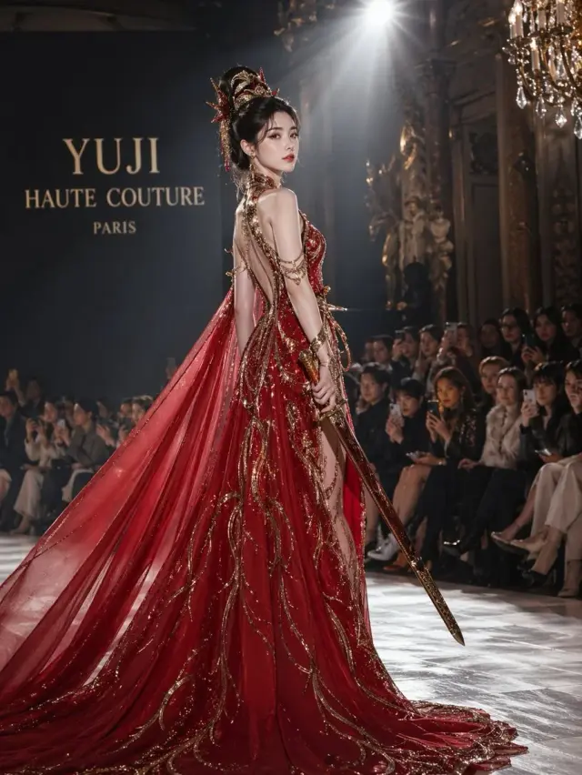

```text
虞姬试穿高定礼服，红色拖尾长裙佩剑，巴黎秀场聚光灯下
```

[Open in Pixonara →](https://pixonara.com/prompt/266)

## 35. A cinematic luxury fashion editorial set inside a grand…

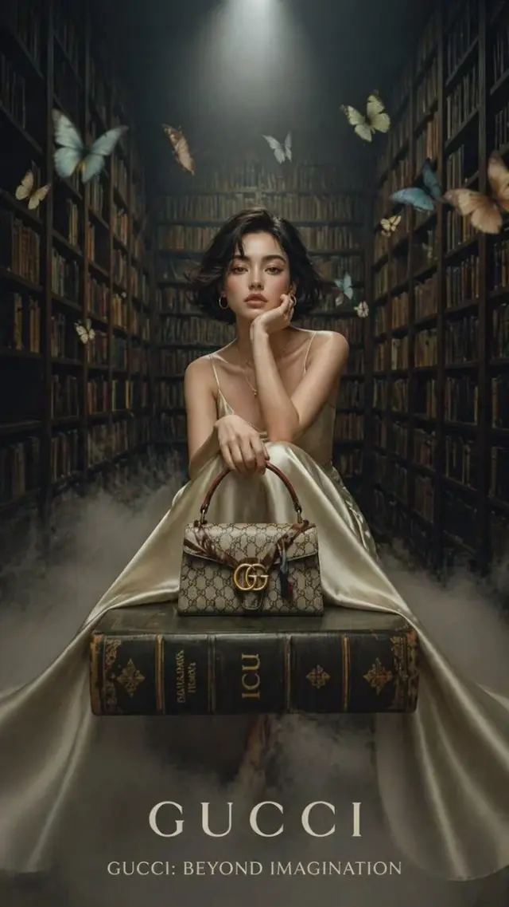

```text
A cinematic luxury fashion editorial set inside a grand vintage library with tall wooden bookshelves, soft fog covering the floor, and glowing butterflies floating in the air. A beautiful young woman with short wavy bob hair and soft natural makeup sits centered on a stack of antique books. She wears an elegant flowing satin gown in champagne color, posed gracefully with one hand resting on her face. A luxury designer handbag is placed prominently in front. Dramatic spotlight from above, symmetrical composition, moody atmosphere, shallow depth of field, ultra-realistic, high detail, 8K, fashion magazine style, premium aesthetic, soft shadows, rich tones.
```

[Open in Pixonara →](https://pixonara.com/prompt/272)

## 36. Create a visually rich infographic in Chinese about an…

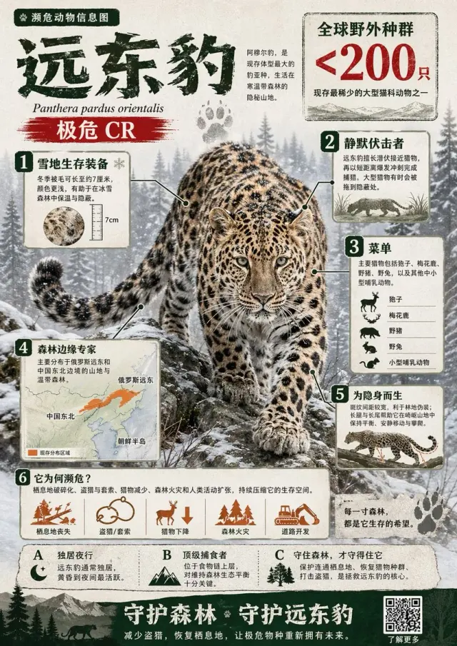

```text
Create a visually rich infographic in Chinese about an endangered animal. Start by finding one online, research its habitat, diet, and unique traits. Present information through annotated visuals and structured callouts, not generic sections. Style it like a bold graphic illustration: a detailed, photorealistic central animal as the focal point, supported by diagrams, callouts, and concise text elements. Use clean backgrounds and a mix of photorealism with strong graphic elements (shapes, icons, color blocking) in a layered composition. Make it dense, tactile, and professionally authored.

猜猜哪个是哪个？
```

[Open in Pixonara →](https://pixonara.com/prompt/278)

## 37. Full-body fashion editorial shot of a confident young woman…

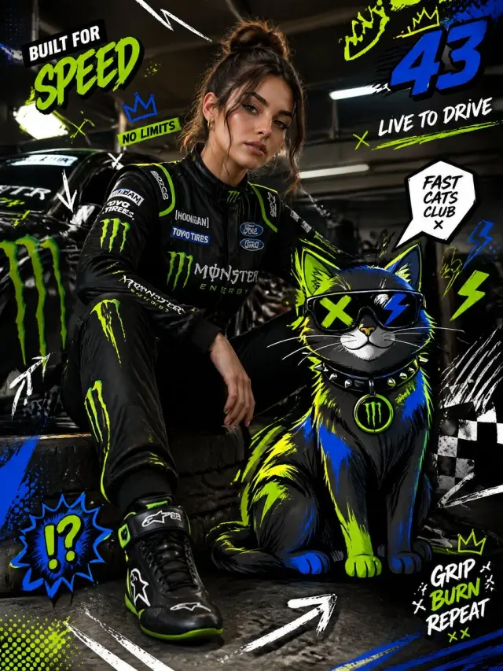

<details>
<summary>Show full prompt</summary>

```text
Full-body fashion editorial shot of a confident young woman with long wavy dark brown hair, striking sharp facial features, defined cheekbones, deep-set eyes with a calm dominant gaze, sunglasses perched on top of her head, standing in a powerful pose — one hand resting on an open scissor door, body slightly turned, looking straight at camera with a composed, fierce expression.
Wearing a fitted black long-sleeve racing jersey with gold sponsor logos (Alpinestars collar detail), black racing gloves, with a white, black, and red Sparco racing suit draped and hanging off her body, and black racing shoes. Clean editorial styling, natural confident stance, wind slightly moving her dark wavy hair.
Beside and partially interacting with a stylized cartoon Cat, positioned naturally as if sharing the same space. The Cat is illustrated in bold cartoon style with thick black outlines, vibrant neon color palette (neon green, blue, yellow accents), exaggerated proportions, expressive features, playful yet powerful presence.
Background: bright indoor motorsport garage pit lane setting with large industrial windows flooding soft diffused daylight, glossy reflective concrete floor, a neon green Lamborghini Huracán with open scissor door partially visible.
Fusion of hyper-realistic photography and graphic illustration, seamless integration between subject and cartoon. Add graphic overlay elements: doodle Gugu arrows, scribbles, racing-themed abstract shapes, speed lines, comic-style symbols, dynamic motion lines, checkered flag doodles.
High contrast, HDR lighting, sharp focus, fashion editorial motorsport composition, surreal mixed-media aesthetic, ultra-detailed, 8K resolution.
```

</details>

[Open in Pixonara →](https://pixonara.com/prompt/279)

## 38. Minimalist luxury watch campaign, oversized wristwatch positioned like modern…

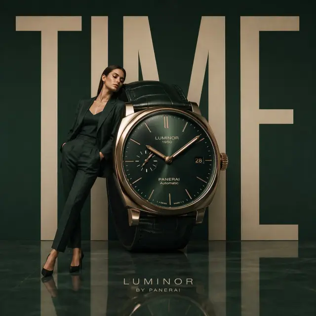

```text
Minimalist luxury watch campaign, oversized wristwatch positioned like modern sculpture, model leaning against the dial, giant word “TIME” in bold typography behind, deep emerald studio background, reflective polished floor, Swiss luxury advertising aesthetic, cinematic editorial styling, ultra-clean composition, 1:1
```

[Open in Pixonara →](https://pixonara.com/prompt/284)

## 39. Minimalist conceptual fashion editorial poster, studio shot on a…

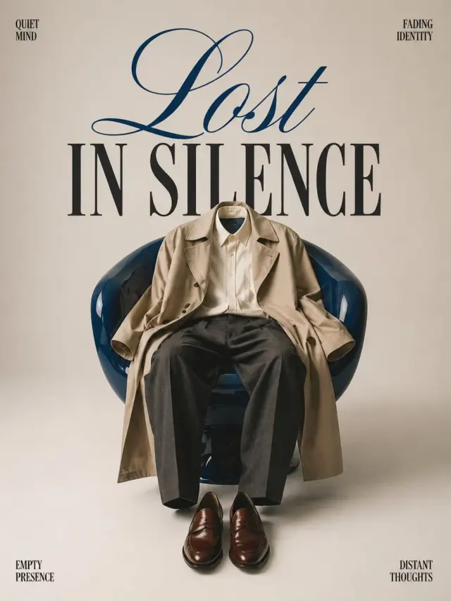

<details>
<summary>Show full prompt</summary>

```text
Minimalist conceptual fashion editorial poster, studio shot on a clean off-white seamless background. A glossy deep blue modern lounge chair placed in the center, with an oversized beige trench coat and tailored charcoal trousers draped naturally over it, creating the illusion of an invisible person sitting there. Polished brown leather loafers placed neatly on the floor in front of the chair. Large elegant typography behind the chair reading “LOST IN SILENCE” — “Lost” in flowing luxury cursive script, “IN SILENCE” in bold serif uppercase. Small subtle text in the corners like “quiet mind,” “fading identity,” “empty presence,” and “distant thoughts.” High-fashion magazine cover aesthetic, cinematic soft lighting, muted tones, surreal emotional atmosphere, clean composition, luxury editorial styling, premium fashion campaign look, artistic and symbolic.
```

</details>

[Open in Pixonara →](https://pixonara.com/prompt/291)

## 40. A cinematic, high-end sneaker advertisement poster featuring a young…

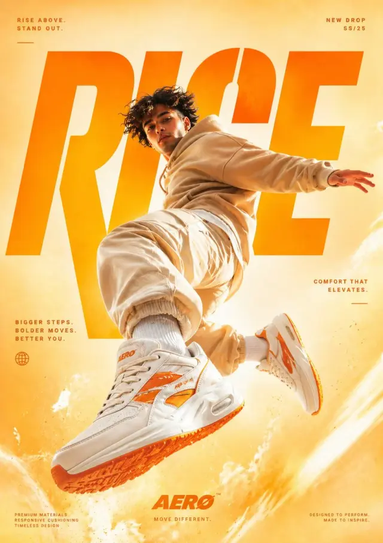

<details>
<summary>Show full prompt</summary>

```text
A cinematic, high-end sneaker advertisement poster featuring a young male model mid-air in a dynamic jumping pose, captured from a low-angle perspective to emphasize power and motion. The model is wearing a coordinated beige streetwear outfit (hoodie and joggers), with oversized chunky white sneakers that have bold orange accents on the sole and side stripes.

The background is a smooth studio gradient in warm tones, blending light yellow and vibrant orange for an eye-catching, energetic feel. Dramatic soft studio lighting enhances the subject, with glowing highlights and subtle shadows that complement the outfit and colour palette.

Behind the model, large bold typography is seamlessly integrated into the composition, reading “RISE” in oversized modern sans-serif font, partially obscured by the subject for depth. Additional small promotional text is placed around the layout in a clean editorial style, such as:

“RISE ABOVE. STAND OUT.”
“BIGGER STEPS. BOLDER MOVES. BETTER YOU.”
“COMFORT THAT ELEVATES.”
“PREMIUM MATERIALS. RESPONSIVE CUSHIONING. TIMELESS DESIGN.”

At the bottom, a modern sneaker brand logo “AERO” appears with the tagline “MOVE DIFFERENT.”

Add subtle motion effects like dust particles or energy trails beneath the jumping foot to enhance impact. Ultra-realistic detail, sharp focus, high contrast, commercial fashion photography style, magazine-quality composition, 4K resolution.
```

</details>

[Open in Pixonara →](https://pixonara.com/prompt/293)
