# Product & Brand Photography Prompts

Studio packshots, cosmetic and skincare shots, beverage cans, luxury scenes — all with fictional branding.

Every image was generated with the exact prompt shown. Click "Open in Pixonara" to see the full-size result and try the prompt directly.

[← Back to main list](../README.md)

## 1. 3×3 storyboard grid, nine panels, same subject and outfit,…

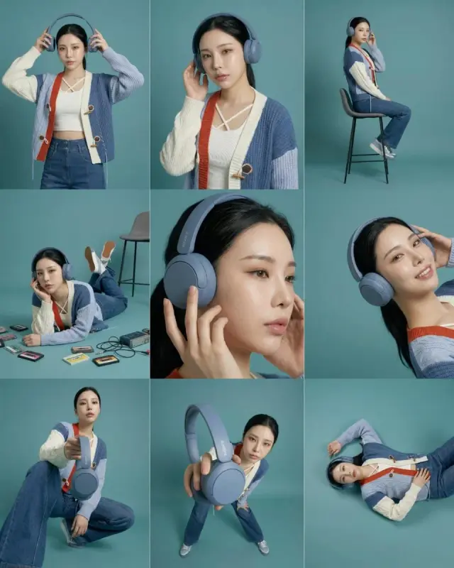

<details>
<summary>Show full prompt</summary>

```text
3×3 storyboard grid, nine panels, same subject and outfit, consistent teal studio background, soft diffused lighting, clean editorial lifestyle photography
young East Asian woman, natural makeup, black hair tied back, wearing white fitted top, blue/cream color-block cardigan with red strap, blue jeans, sneakers, pastel blue over-ear wireless headphones
panel sequence (left→right, top→bottom): 1 standing adjusting headphones, front view
2 close-up portrait touching earcup
3 side profile sitting on tall stool
4 lying on stomach with cassette tapes + retro player
5 extreme close-up headphones + face detail
6 tilted head smiling portrait
7 low-angle crouch reaching headphones toward camera
8 forced perspective product shot, headphones close to lens
9 lying on back relaxed pose
style: minimal, pastel tones, soft shadows, sharp focus, commercial product photography, consistent framing, balanced grid layout, mix of wide/medium/close shots
```

</details>

[Open in Pixonara →](https://pixonara.com/prompt/407)

## 2. Premium minimalist skincare product photography. A translucent pink liquid…

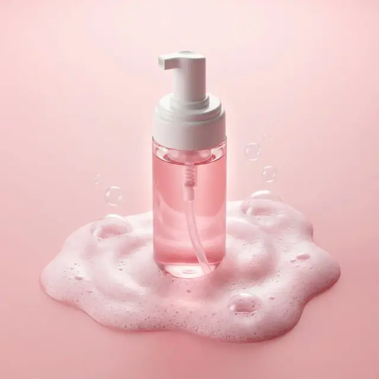

<details>
<summary>Show full prompt</summary>

```text
Premium minimalist skincare product photography. A translucent pink liquid cleanser bottle with a white pump dispenser placed vertically at the center of the frame. The bottle rests inside an organic pool of soft pink foamy bubbles, with airy soap lather spreading outward in smooth, rounded shapes. Small transparent bubbles float around the foam surface. Clean matte pastel pink background with subtle gradient. Soft diffused top lighting with gentle rim light creates a luminous glow through the liquid, highlighting the pump tube inside the bottle. Sharp focus, high clarity, realistic liquid refraction, smooth plastic and glass textures, luxury beauty advertising style, modern cosmetic branding, ultra-realistic, 8K detail, high dynamic range.

Negative Prompt:

hands, people, faces, clutter, harsh reflections, label distortion, unreadable text, warped pump, hard shadows, grain, noise, low resolution, CGI look, cartoon style, messy foam, uneven lighting, watermark
```

</details>

[Open in Pixonara →](https://pixonara.com/prompt/433)

## 3. A hyperrealistic premium product photography scene of a transparent…

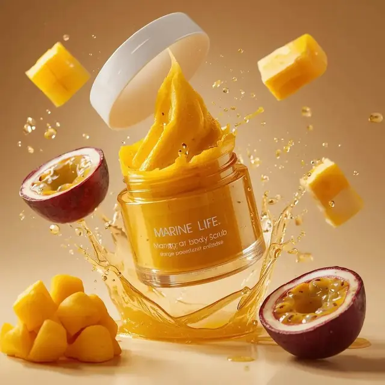

<details>
<summary>Show full prompt</summary>

```text
A hyperrealistic premium product photography scene of a transparent cosmetic jar labeled “MARINE LIFE” mango and passionfruit body scrub exploding open mid-air, with the white lid floating slightly above the jar and a thick, whipped, golden-yellow scrub bursting upward in a dramatic splash, glossy and textured with visible black passionfruit seeds, surrounded by suspended mango cubes, scored mango halves, and halved passionfruits with glistening pulp, golden liquid droplets and splashes frozen in motion around the jar, the container tilted slightly to the right and centered in frame, shot from a straight-on macro perspective, illuminated by soft yet high-contrast studio lighting from above and slightly behind to create glowing highlights on the wet textures and translucent splashes, subtle shadows beneath the floating elements, a smooth warm beige gradient background enhancing the tropical color palette of saturated yellows, oranges, and deep purple fruit tones, ultra-sharp focus on the jar and scrub with shallow depth of field for the outer fruit, cinematic realism, luxury skincare advertising aesthetic, crisp reflections, 8K photorealistic detail, energetic and fresh mood.
```

</details>

[Open in Pixonara →](https://pixonara.com/prompt/487)

## 4. Luxurious tropical body scrub product photography, open jar of…

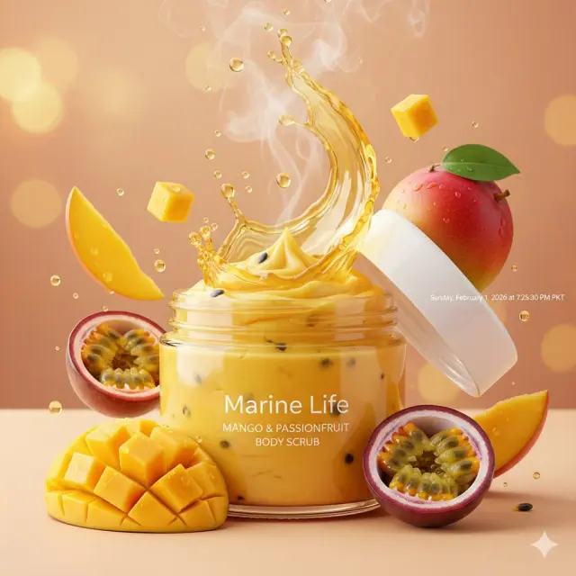

<details>
<summary>Show full prompt</summary>

```text
Luxurious tropical body scrub product photography, open jar of bright vibrant yellow-orange Mango & Passionfruit body scrub, creamy whipped texture with visible fruit particles, Marine Life brand, elegant minimal packaging, white lid slightly lifted, juicy mango cubes and halved passionfruit floating around, dynamic splash of golden-yellow liquid and fruit juice in the air, fresh exotic fruit pieces mid-air, glossy wet droplets, vibrant juicy colors, appetizing and premium aesthetic, warm golden hour lighting, soft bokeh background in warm peach tones, highly detailed, cinematic product shot, commercial advertising style, 8k, ultra realistic

Video prompt

Ultra-luxurious tropical body scrub commercial video. Open jar of Marine Life Mango & Passionfruit Body Scrub with creamy whipped texture and visible fruit particles. White lid slightly lifted. Juicy mango cubes and halved passionfruit floating dynamically around the jar. Golden-yellow liquid and fruit juice splash dramatically in mid-air. Fresh exotic fruit pieces hover and rotate around the product. Glossy wet droplets on jar and fruit, emphasizing freshness and luxury. Warm golden hour lighting with soft bokeh background in peach tones. Camera slowly circling the product, capturing texture, shine, and vibrant colors in ultra-realistic 8K detail. Cinematic close-ups, smooth slow motion for splashes and floating fruits, commercial advertising style. Background minimalistic to enhance premium aesthetic.
Optional camera directions / effects:
Start with extreme close-up on whipped texture, then pull out to reveal floating fruits.
Slow-motion splash of fruit juice with backlighting to highlight droplets.
Gentle rotating 360° pan around the jar for product showcase.
Focus pull from foreground fruit to product label.
Subtle lens flare from warm golden light for cinematic luxury feel.
```

</details>

[Open in Pixonara →](https://pixonara.com/prompt/518)

## 5. - Ultra-cinematic luxury skincare product photography of a translucent…

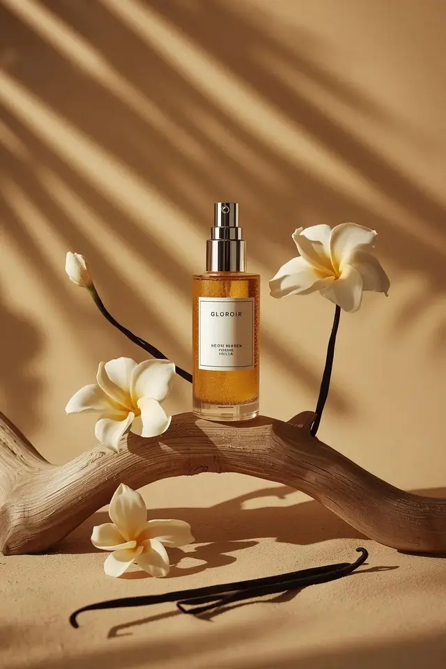

<details>
<summary>Show full prompt</summary>

```text
- Ultra-cinematic luxury skincare product photography of a translucent amber serum pump bottle standing upright at the center of the frame, perched on a curved piece of textured driftwood, featuring a minimalist label with crisp black typography and fine condensation droplets on the glass; the bottle is framed by creamy white tropical flowers in full bloom and a single unopened bud, arranged symmetrically along the wood for sculptural balance, with slender vanilla pods resting in the foreground; background is a warm, desert-toned studio environment with sweeping shadow patterns cast across a soft sand-colored backdrop, creating a dramatic play of light and depth; lighting is high-contrast cinematic lighting with a strong directional key light from the left producing glowing highlights through the amber liquid, sharp rim lighting along the glass edges, and deep shadow falloff for a moody, editorial look;

color palette is rich and sensual with golden ambers, warm caramel, soft ivory, and deep earthy browns; composition is a centered hero shot with a slight low-angle perspective and shallow depth of field, keeping the bottle razor-sharp while background elements dissolve into creamy bokeh; mood is elegant, mysterious, and high-fashion, evoking premium fragrance-inspired skincare advertising with hyper-realistic textures, dramatic contrast, cinematic atmosphere, and 8K

ultra-high-definition realism.
```

</details>

[Open in Pixonara →](https://pixonara.com/prompt/557)

## 6. Conceptual transformation, bird nest construction techniques shaping a sculptura…

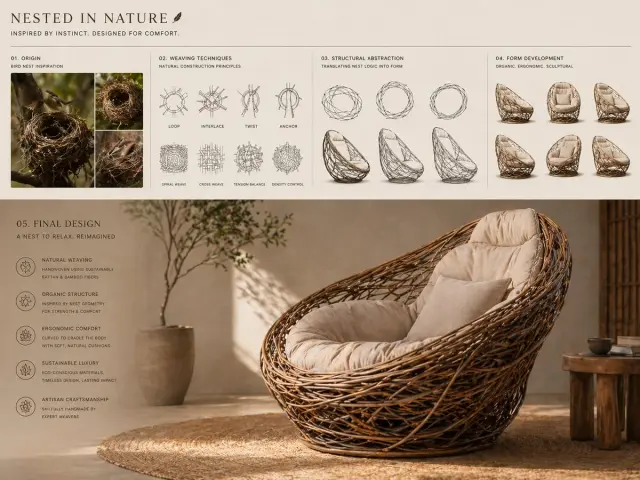

```text
Conceptual transformation, bird nest construction techniques shaping a sculptural lounge chair, sequence from nest-building photography to weaving diagrams to organic structural abstraction to final product, interwoven frame forming seat and backrest, natural fibers with soft cushioning, earthy tones with refined finish, sustainable luxury aesthetic, presentation layout, sketches above, render below, warm natural lighting.

AR – 4:3
```

[Open in Pixonara →](https://pixonara.com/prompt/52)

## 7. Ultra-high-end photorealistic commercial skincare product photography featuring …

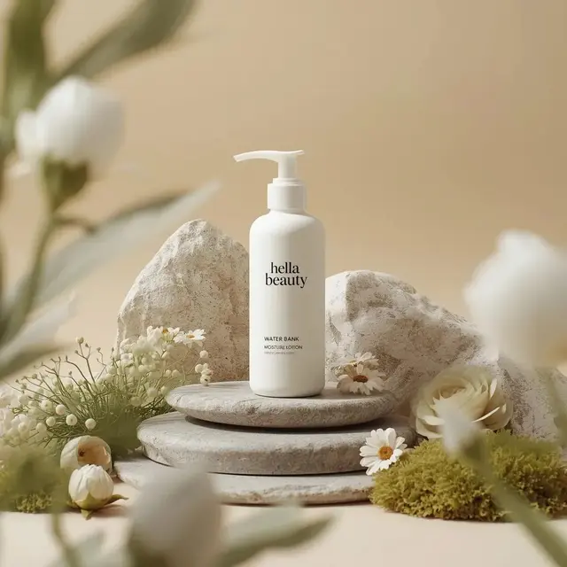

<details>
<summary>Show full prompt</summary>

```text
Ultra-high-end photorealistic commercial skincare product photography featuring a matte white plastic pump bottle centered and upright, labeled “hella beauty” in clean black minimalist typography with smaller text reading “water bank moisture lotion” and subtle product details beneath, the bottle placed on a layered natural stone surface surrounded by carefully arranged organic props including smooth gray river stones, pale beige textured rock formations, soft green moss clusters,delicate white pom-pom flowers, cream-colored
daisy-like blossoms, light green fern leaves, and a
muted sage rose, all arranged in a balanced
symmetrical composition, background a soft warm
beige studio backdrop with gentle gradient and no
visible edges, foreground partially framed by softly
blurred out-of-focus white flowers creating depth,
lighting soft diffused daylight-style studio lighting
from upper left producing gentle shadows, natural
highlights on the bottle and petals, and a calm airymood, color palette dominated by warm neutrals, soft
whites, sage greens, and muted earth tones, textures
highly detailed including matte plastic, porous stone,
velvety petals, and moist moss, shallow depth of field
with sharp focus on the product label and midground
elements and smooth bokeh in foreground and
background, premium botanical skincare advertising aesthetic,
clean minimal luxury composition, cinematic realism,
ultra-detailed 8K, studio-grade hyperrealism, no extra
text, no borders, no stylization beyond natural
photorealism.
```

</details>

[Open in Pixonara →](https://pixonara.com/prompt/577)

## 8. Luxury product photography of a green translucent bath and…

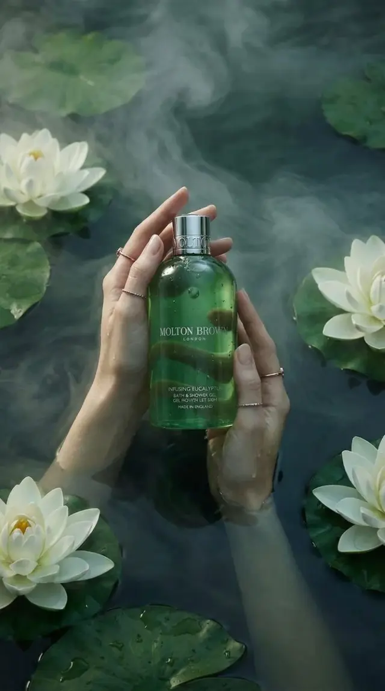

```text
Luxury product photography of a green translucent bath and shower gel bottle held gently by two feminine hands submerged in calm water. The bottle is centered, glossy, with water droplets on the surface, silver metallic cap, elegant minimal label design. The water is deep teal-green with soft mist swirling across the surface. White lotus flowers and large green lily pads float around the hands. The hands wear delicate thin gold rings. Soft, diffused natural lighting, moody spa atmosphere, high-end skincare advertisement style, ultra-realistic, cinematic composition, shallow depth of field, 85mm lens, high resolution, editorial beauty shot, serene and calming aesthetic.
```

[Open in Pixonara →](https://pixonara.com/prompt/588)

## 9. Ultra-realistic minimalist studio product photography of a small transparent…

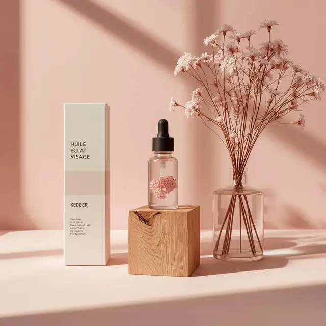

<details>
<summary>Show full prompt</summary>

```text
Ultra-realistic minimalist studio product photography of a small transparent glass facial oil dropper bottle with a black rubber pipette cap, containing pale pink serum with dried pink floral elements suspended inside, placed centered on top of a natural raw wooden cube block with visible grain and split texture. To the left of the cube stands a tall matte white rectangular skincare box with minimal black typography reading “HUILE ÉCLAT VISAGE,” clean modern branding, and subtle logo near the bottom. To the right of the cube is a clear cylindrical glass vase filled with water and thin stems of dried pink gypsophila flowers extending upward and outward. The entire composition is arranged on a smooth matte pastel pink surface with a matching soft pink seamless studio background. Strong directional soft light comes from the left side, casting long, soft-edged realistic shadows of the flowers and objects onto the pink background. Lighting is natural-style, -det diffused, and warm, creating gentle highlights on the glass, subtle reflections on the serum bottle, and soft texture on the wooden block. Camera angle is straight-on at tabletop height, medium framing, all main objects in sharp focus with minimal depth of field blur. Color palette is dominated by blush pink, soft rose tones, warm light wood, clean white, and transparent glass. Mood is clean, airy, feminine, elegant, Scandinavian minimal aesthetic, premium skincare branding style, photorealistic, studio-grade realism, ultra
```

</details>

[Open in Pixonara →](https://pixonara.com/prompt/600)

## 10. Ultra-cinematic premium coffee bottle labeled NOIR BREW, matte black…

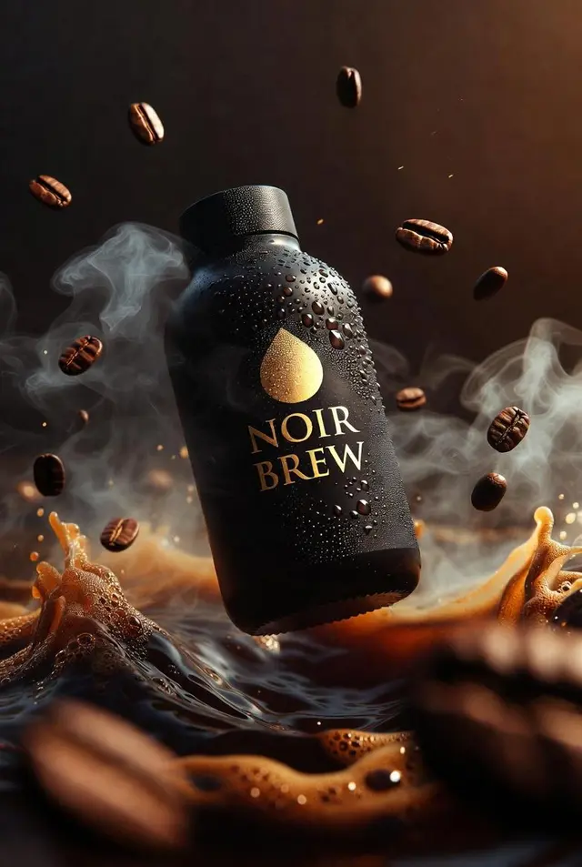

```text
Ultra-cinematic premium coffee bottle labeled “NOIR BREW”, matte black glass with gold typography, floating upright amid swirling espresso waves and roasted coffee beans. Steam and mist curling around the bottle, dramatic low-key lighting with warm highlights and deep shadows, rich brown color grading, macro condensation details, cinematic depth of field, photorealistic, 8K, luxury branding aesthetic.
```

[Open in Pixonara →](https://pixonara.com/prompt/613)

## 11. Commercial luxury product photography, photorealistic, ultra high detail, 8K…

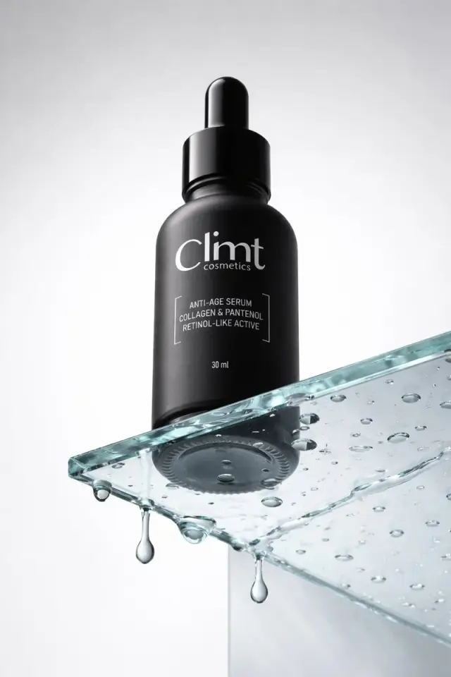

```text
Commercial luxury product photography, photorealistic, ultra high detail, 8K quality. A minimalist matte black cosmetic dropper bottle placed on a clear glass podium. Low angle camera view to make the bottle feel tall and powerful. The bottom of the bottle is clearly visible through the transparent glass. The glass surface is wet with realistic water droplets, with a few drops hanging underneath the glass, frozen mid drip for a time stopped effect. Matte light gray background with no texture or gradient. Soft, even studio lighting with clean reflections, premium skincare advertising look, sharp focus, realistic materials, no distractions.
```

[Open in Pixonara →](https://pixonara.com/prompt/64)

## 12. A wide-angle, studio fashion advertisement with a sophisticated retro-modern…

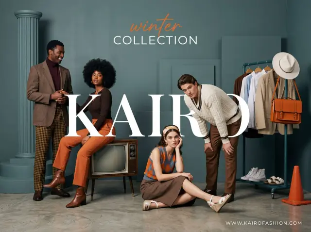

<details>
<summary>Show full prompt</summary>

```text
A wide-angle, studio fashion advertisement with a sophisticated retro-modern aesthetic. The scene is set against a monochromatic teal-grey (#506D6D) architectural backdrop featuring minimalist geometric props, including a fluted column and stepped circular platforms. The lighting is professionally diffused studio light, creating soft, graduated shadows that provide depth without harshness.

The Subjects:
Four models are posed in a cohesive, stylish group dynamic:

A Black man on the far left, standing tall in a brown tweed blazer, a deep burgundy turtleneck, and dark yellow-and-brown checkered trousers. He is smiling and warmly holding the hand of the woman next to him.

A Black woman with a voluminous afro, sitting sideways on a vintage 1950s wooden television set. She wears a dark brown knit top and vibrant burnt orange (#E88D4D) trousers with sleek brown leather boots.

A White woman sitting on the floor in the center, leaning forward with her hand to her face. she wears a vintage-style headband, an argyle-patterned sleeveless top in orange and slate blue, a brown wool skirt, and white wedge sandals.

A White man leaning into the frame from the center-right, hands on his knees. He wears a heavy cream-colored cable-knit sweater with dark trim and tailored brown trousers.
Furniture & Props:
To the right stands a minimalist dark teal industrial clothing rack. It displays curated garments including hanging shirts, a wide-brimmed white fedora, and a prominent structured orange leather messenger bag. At the base of the rack are white high-top sneakers and sandals. A single, truncated orange cone prop sits in the foreground.
Primary Text: A massive, high-contrast white serif font (Bodoni-style) reading "KAIRO" is overlaid across the center-left, partially occluding the models to create a layered, 3D effect.
Header: At the top center, the words "winter" (in orange cursive script) and "COLLECTION" (in white clean sans-serif) are centered.
Footer: The URL "http://KAIROFASHION.COM" is printed in small, wide-tracked white sans-serif in the bottom right corner.
Color Palette:
A sophisticated mix of Teal-Grey, Burnt Orange, Chocolate Brown, and Crisp White, creating a warm yet muted autumnal atmosphere.
```

</details>

[Open in Pixonara →](https://pixonara.com/prompt/641)

## 13. Ultra-realistic summer skincare product photography of a bronzing drop…

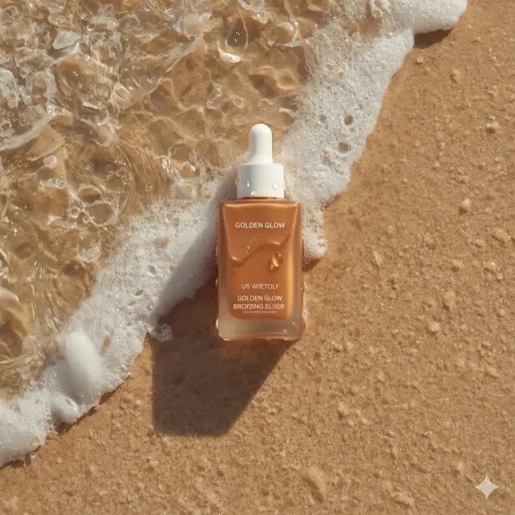

<details>
<summary>Show full prompt</summary>

```text
Ultra-realistic summer skincare product photography of a bronzing drop bottle named "Golden Glow - Bronzing Elixir", rectangular matte bottle in warm sun-kissed bronze tone with a clean white cap, placed diagonally on wet beach sand as a gentle ocean wave washes over it, delicate sea foam and tiny bubbles surrounding the base, water partially flowing across the label, fine sand texture visible beneath shallow clear water, golden sunlight casting natural highlights and soft shadows, high-detail water ripples and realistic foam patterns, fresh summer aesthetic, minimal clean branding centered and sharp, warm golden-hour beach lighting, cinematic top-down flat lay composition, natural reflections on wet surface, editorial beauty campaign style, ultra-detailed, photorealistic 8K, soft warm color grading, luxury skincare advertisement Aspect ratio 4.5
```

</details>

[Open in Pixonara →](https://pixonara.com/prompt/652)

## 14. A hyperrealistic premium product photography scene of a smooth…

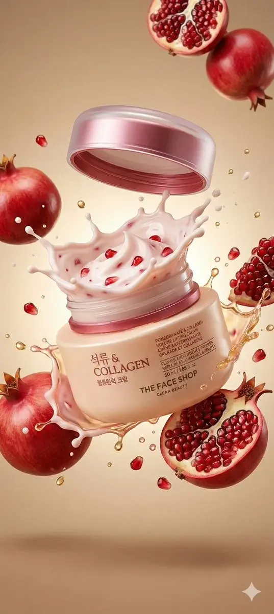

<details>
<summary>Show full prompt</summary>

```text
"A hyperrealistic premium product photography scene of a smooth beige cosmetic jar labeled “Collagen" Pomegranate & Collagen Volume Lifting Cream” exploding open mid-air, with the metallic rose-gold lid floating slightly above the jar and a thick, whipped, pale pink cream bursting upward in a dramatic splash, glossy and textured with visible red pomegranate seeds, surrounded by suspended whole red pomegranates and halved pomegranates with glistening ruby-red arils, golden liquid droplets and creamy splashes frozen in motion around the jar, the container tilted slightly to the right and centered in frame, shot from a straight-on macro perspective, illuminated by soft yet high-contrast studio lighting from above and slightly behind to create glowing highlights on the wet textures and translucent splashes, subtle shadows beneath the floating elements, a smooth warm beige gradient background enhancing the color palette of soft pinks, creams, and deep red fruit tones, ultra-sharp focus on the jar and cream with shallow depth of field for the outer fruit, cinematic realism, luxury skincare advertising aesthetic, crisp reflections, 8K photorealistic detail, energetic and fresh mood."
```

</details>

[Open in Pixonara →](https://pixonara.com/prompt/76)

## 15. A premium studio product photograph of a tall, slim…

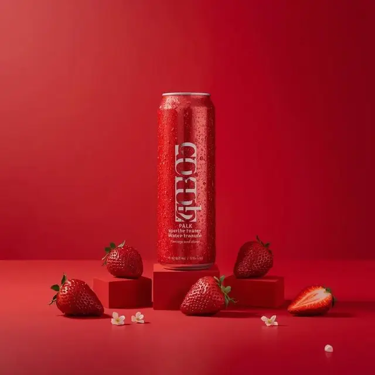

<details>
<summary>Show full prompt</summary>

```text
A premium studio product photograph of a tall, slim red aluminum sparkling water can standing upright and centered against a seamless vivid red background, the can covered in fine condensation droplets with crisp white typography reading “GOOD IDEA” and smaller flavor text beneath, positioned on a matte red surface with subtle reflections, surrounded symmetrically by fresh ripe strawberries with glossy seeds and deep red flesh, some resting directly on the surface and others placed on small red rectangular blocks to the left and right, delicate white elderflower blossoms scattered between the fruit for contrast, the lighting soft yet directional from the upper left creating gentle highlights on the can's metallic texture and soft shadows beneath the fruit, the color palette dominated by saturated reds with clean white accents and natural green stems, the composition minimal and perfectly balanced with generous negative space above the product, shallow depth of field, ultra-sharp focus on the can, high-end commercial aesthetic, photorealistic, studio-grade, cinematic realism.
```

</details>

[Open in Pixonara →](https://pixonara.com/prompt/663)

## 16. A hyper-realistic commercial product photography shot of a condensation-covered…

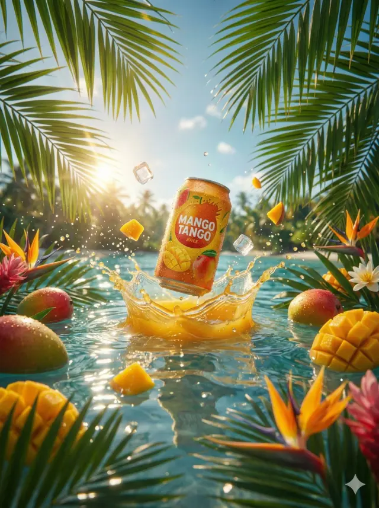

```text
A hyper-realistic commercial product photography shot of a condensation-covered beverage can labeled "MANGO TANGO JUICE" bursting dynamically out of crystal clear turquoise ocean water. The can is surrounded by a splash of golden mango juice and water. Levitating around the can are fresh whole mangoes, diced mango cubes, and crystal clear ice cubes. The foreground includes vibrant tropical flowers and green palm leaves framing the shot. The background features a blurred sunny tropical beach with palm trees. Bright cinematic backlighting with a sun flare, sparkling water reflections, high contrast, 8k resolution, vibrant colors.
```

[Open in Pixonara →](https://pixonara.com/prompt/674)

## 17. Low angle luxury product photography of a black ribbed…

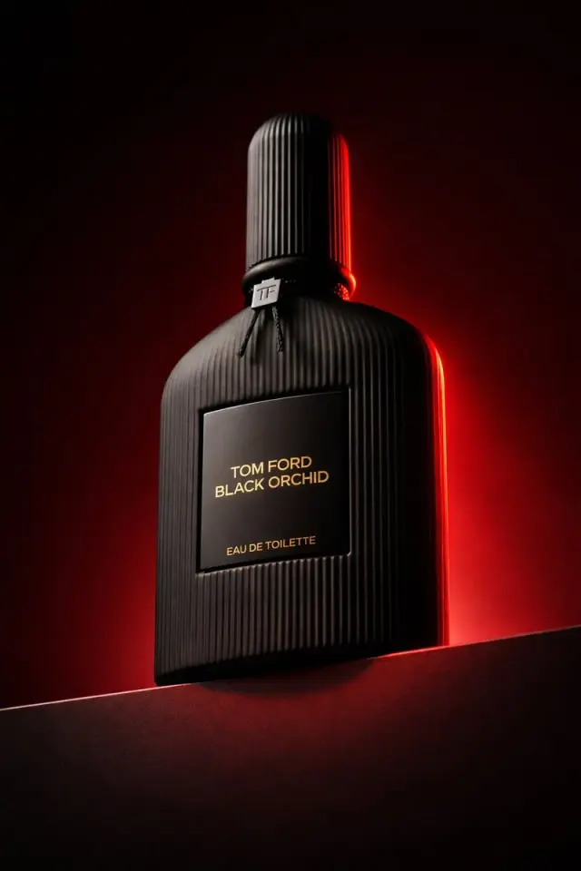

<details>
<summary>Show full prompt</summary>

```text
Low angle luxury product photography of a black ribbed glass perfume bottle placed on a dark horizontal podium, shot from below for a heroic, monumental feel. The bottle is Tom Ford Black Orchid, matte black texture clearly visible.
Dramatic low key studio lighting. Soft diffused key light from above and slightly left, gently lighting the label and top, revealing volume and texture. Strong hard red rim light from behind and right, creating a bold red outline along the edge and cap, with a subtle red glow bleeding into the background.
Deep soft shadows with smooth falloff. Slightly underexposed for drama. High contrast between highlights and shadows while keeping transitions soft.
Color palette limited to deep black and rich burgundy red, warm color balance, black remains neutral and clean.
Matte surface shows soft red reflections, not glossy, giving depth and form.
Minimal background, dark red gradient, cinematic mood, luxury fragrance advertising style, photorealistic, ultra high detail, studio quality.
```

</details>

[Open in Pixonara →](https://pixonara.com/prompt/83)

## 18. Hyper-realistic cinematic product photograph of a luxury sports car…

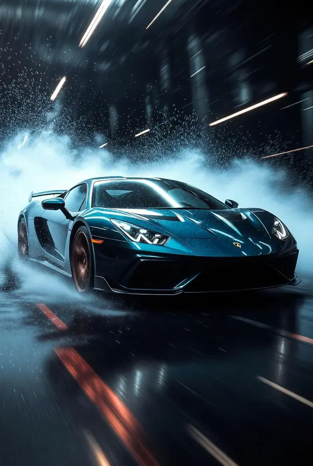

```text
Hyper-realistic cinematic product photograph of a luxury sports car front three-quarter view, glossy paint reflecting sharp highlights. Water mist and rain droplets explode around the car in frozen motion, light streaks emphasizing speed. Dramatic studio lighting with strong rim light and soft fill, shallow depth of field, ultra-sharp focus, dark minimal background, premium automotive advertising realism.
```

[Open in Pixonara →](https://pixonara.com/prompt/689)

## 19. A first-person point-of-view (POV) shot inside a modern supermarket…

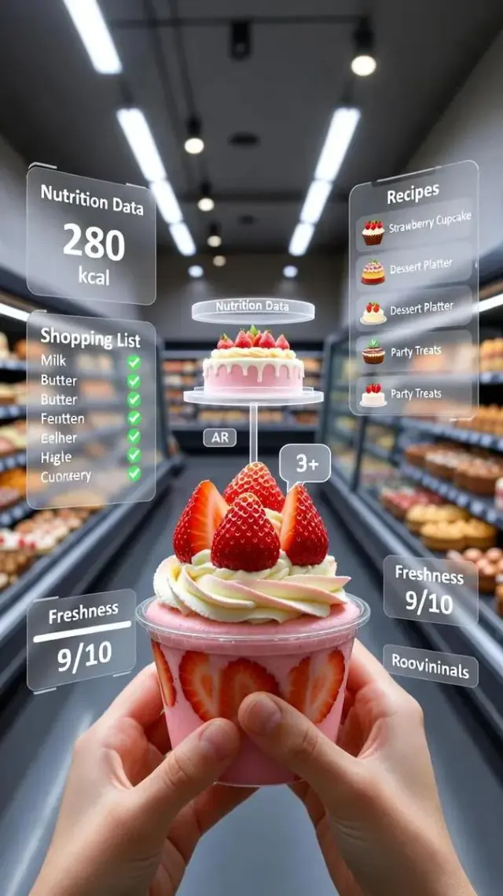

<details>
<summary>Show full prompt</summary>

```text
A first-person point-of-view (POV) shot inside a modern supermarket aisle. The viewer's hands are holding a mixed fruit jam jar with colorful branding, showing a blend of strawberry, blueberry, and orange flavors. Floating around the jar are sleek, semi-transparent Augmented Reality (AR) digital interfaces and holographic HUDs. The overlays display "Flavor Mix" with fruit icons, "Nutrition Info," and a glowing "Freshness Meter" reading 9/10. A digital shopping list with checkmarks for bread and butter appears beside the jar, along with small recipe suggestions like breakfast toast, pancakes, and desserts. The background shelves are slightly blurred with other products and shoppers, creating realistic depth of field. Bright, clean lighting with a futuristic retail atmosphere, ultra-realistic, cinematic look, high-tech AR glasses perspective, vertical composition.
```

</details>

[Open in Pixonara →](https://pixonara.com/prompt/691)

## 20. Ultra-realistic luxury product photography of a black glass reed…

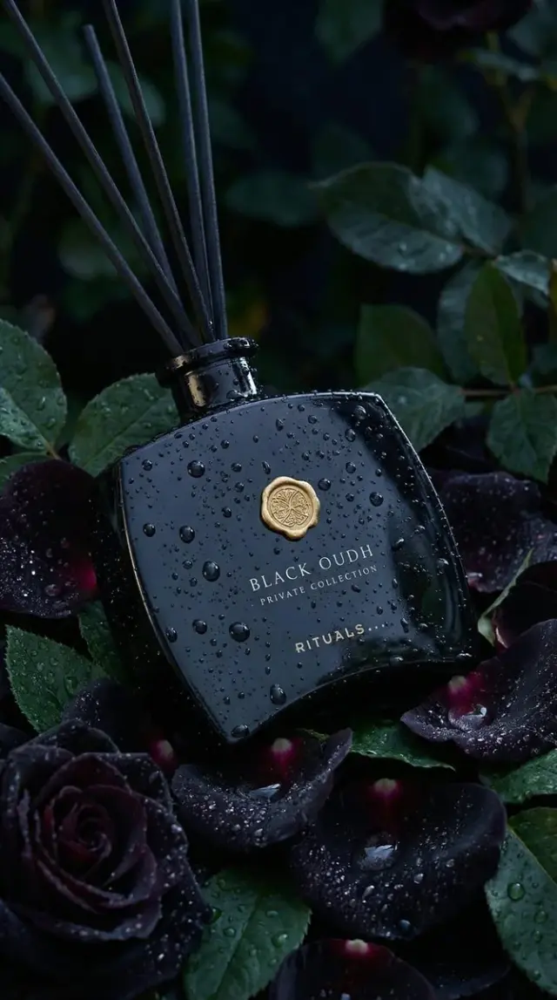

<details>
<summary>Show full prompt</summary>

```text
Ultra-realistic luxury product photography of a black glass reed diffuser bottle labeled “BLACK OUDH – Private Collection – RITUALS” in elegant gold serif typography. The bottle has a curved rectangular shape with soft edges, a glossy reflective surface, and a gold wax-seal style emblem centered near the top. Thin black diffuser reeds extend upward from the bottle neck.

The bottle is covered in realistic water droplets and condensation, as if freshly misted after rain. It is placed among deep black roses and dark burgundy petals with visible water droplets, surrounded by rich green leaves. The scene is moody and dramatic with a dark botanical background, softly blurred (shallow depth of field, bokeh effect).

Lighting is cinematic and low-key, with soft diffused highlights reflecting off the wet glass surface. Cool-toned lighting (deep greens and midnight blues) enhances the dark, luxurious atmosphere. The gold emblem and lettering subtly catch the light, creating a premium, high-end aesthetic.

Composition: vertical portrait orientation (4:5 ratio), centered product placement, slightly angled bottle resting naturally among roses. Foreground roses partially frame the bottom of the bottle. Background is dark foliage fading into shadow.

Texture emphasis: hyper-detailed water droplets, glossy glass reflections, velvety rose petals, matte black reeds.

Style: high-end commercial fragrance advertising, macro lens, 85mm, f/2.0, shallow depth of field, photorealistic, 8K resolution, sharp focus on bottle, dramatic contrast, rich blacks, luxury perfume campaign aesthetic.
```

</details>

[Open in Pixonara →](https://pixonara.com/prompt/744)

## 21. BAGEL LABS.

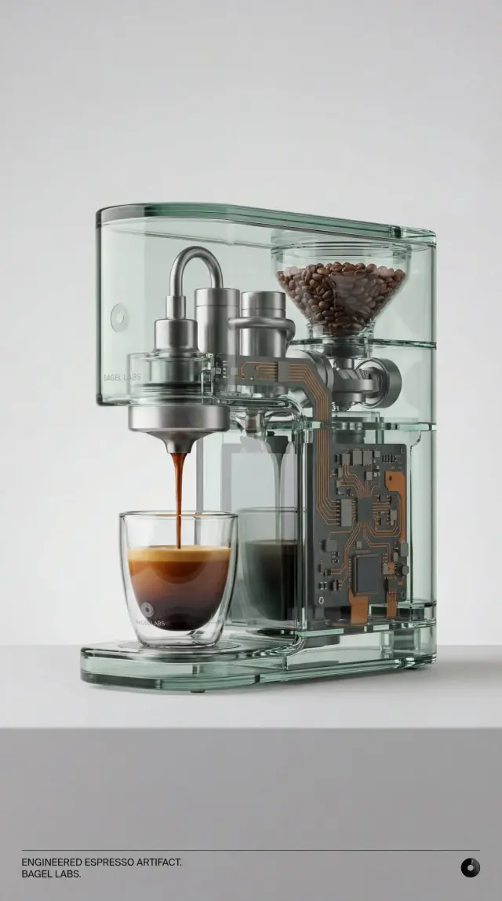

<details>
<summary>Show full prompt</summary>

```text
BAGEL LABS.
Act as a creative director curating a wide-ranging, eclectic collection of “recontextualized everyday objects.”

DIVERSE OBJECT SELECTION (MANDATORY VARIETY):
Randomly select ONE object from these distinct categories to ensure diversity:
Analog Office & Desk:
Sport & Leisure:
Barware & Kitchen:
Utility & Tools:
Grooming:
Travel:

SELECTED CATEGORY:
Barware & Kitchen

CHOSEN OBJECT:
A coffee machine and coffee cup — instantly recognizable, reimagined as a luxury technological artifact.

THE CONCEPT:
Recontextualize the everyday coffee machine as a transparent, high-precision object of engineered beauty.  
A fully glass espresso machine reveals its internal systems: hot water circulation, pressure chambers, coffee bean hopper, grinding mechanism, and extraction pathway. Integrated computer circuitry runs through the machine like a nervous system, visually linking ritual, data, and energy.

Fresh coffee is actively pouring from the machine into a matching glass cup, captured mid-flow. The moment feels frozen, precise, and intentional—ritual meets technology.

MATERIALS & FINISH:
- COFFEE MACHINE BODY:
  Precision-molded optical glass with subtle green-tinted transparency. Internal structure is fully visible and meticulously organized.
- INTERNAL COMPONENTS:
  - Hot water tubes and pressure lines clearly visible, rendered in brushed titanium and warm grey.
  - Coffee bean chamber visible at the top with realistic roasted beans.
  - Grinding and extraction mechanisms exposed, engineered and clean.
- CIRCUITRY:
  Integrated PC-style circuitry embedded within the machine’s internal architecture.
  - Circuit paths in muted industrial orange.
  - Supporting components in graphite and titanium tones.
  Circuits are physical and structural, not glowing or decorative.
- COFFEE CUP:
  Matching optical glass cup with weighted base and refined silhouette.
  Subtle BAGEL LABS logomark engraved near the base.
- BRAND INTEGRATION:
  BAGEL LABS logomark engraved into the glass body of the machine (side or rear plane), and subtly etched on the cup.
  No stickers. No printed logos.

ACTION / MOMENT:
Coffee is visibly flowing from the machine into the glass cup.
Liquid motion is realistic and smooth.
Crema and color gradient are visible through the glass, emphasizing transparency and material depth.

PRESENTATION (NO BOXES):
The coffee machine and cup stand fully exposed on a minimal pedestal or surface.
No packaging, no housing, no covers.
All components are visible by design.

PHOTOGRAPHY & LIGHTING:
Style: High-end product editorial (Wallpaper* / Dezeen).
Lighting: Soft, studio high-key lighting with carefully controlled reflections to highlight glass thickness, liquid motion, and internal depth. No harsh shadows.
Background: Clean, seamless light grey or white cyclorama.

COLOR & GRADING:
Primary tones: transparent glass with subtle green tint, warm greys, titanium neutrals.
Accent: restrained BAGEL LABS orange within the circuitry only.
Overall mood: clean, intelligent, technological luxury.

GRAPHIC OVERLAYS (UI):
- Bottom Left:
  A small, minimalist two-line descriptor identifying the object.
- Bottom Right:
  A small, discreet, monochrome BAGEL LABS logomark.
Do not visualize font names or color codes.

CAMERA & DETAIL:
Full-frame, 50mm equivalent.
Ultra-high realism: accurate glass refraction, liquid physics, micro-detail in circuits and mechanical parts.
Shallow depth of field allowed, but machine and cup must remain fully legible.

NEGATIVE PROMPT:
No people, no hands, no kitchens, no cafes, no clutter, no packaging, no stickers, no printed text on surfaces, no neon colors, no glow effects, no cartoon or CGI look, no fingerprints, no dust, no watermarks.
```

</details>

[Open in Pixonara →](https://pixonara.com/prompt/927)

## 22. A slow, sensual luxury chocolate commercial shot in ultra-high…

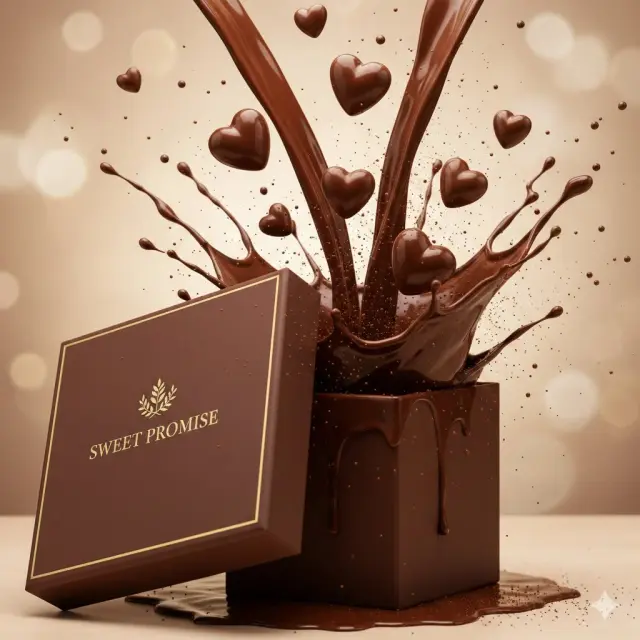

<details>
<summary>Show full prompt</summary>

```text
A slow, sensual luxury chocolate commercial shot in ultra-high definition. The scene opens in near darkness as a premium espresso-brown gift box with soft gold accents slowly rotates on a reflective surface. A warm spotlight reveals the embossed title “SWEET PROMISE” in an elegant serif font, paired with a subtle botanical emblem. As the lid gently lifts in slow motion, molten milk chocolate surges upward in a gravity-defying burst, captured at 120fps for dramatic fluid motion. Glossy heart-shaped chocolates rise and orbit the splash, rotating gracefully at different depths, their surfaces catching highlights like polished jewels. Thick chocolate ribbons stretch, drip, and shatter into silky droplets mid-air while cocoa powder blooms softly like a golden mist. Cinematic mocha-and-gold color grading, shallow depth of field, creamy bokeh background, soft rim lighting outlining every chocolate curve. Macro close-ups transition into wide hero shots, emphasizing texture, gloss, and richness. The motion feels slow, seductive, and indulgent—pure luxury confectionery advertising, premium product film, elegant pacing, emotionally rich, visually irresistible.
```

</details>

[Open in Pixonara →](https://pixonara.com/prompt/930)

## 23. Ultra-realistic luxury cosmetic product photography in a dramatic monochromatic…

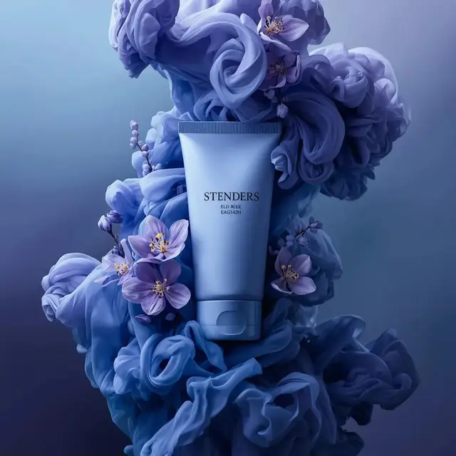

<details>
<summary>Show full prompt</summary>

```text
Ultra-realistic luxury cosmetic product photography in a dramatic monochromatic blue-violet composition. A sleek satin-finish periwinkle-blue squeeze tube labeled “STENDERS” stands vertically centered in the frame, featuring elegant silver typography and a reflective metallic chrome cap. The tube is surrounded by voluminous swirling clouds of ink-like smoke in layered shades of lavender, indigo, and icy blue, creating a soft, billowing texture that wraps around the product. Interwoven throughout the smoke are fresh purple and lilac flowers with intricate petal details and vibrant yellow centers, along with delicate sprigs of tiny violet blossoms for added dimension. Soft directional lighting from the upper left highlights the smooth curvature of the tube, adds subtle sheen to the metallic cap, and creates depth within the smoke plumes. The background seamlessly blends cool blue and purple tones, enhancing the ethereal, floral fragrance aesthetic. Hyper-detailed textures of petals and vapor, cinematic depth, high-end perfumed skincare advertising style, 8K

ultra-high resolution
```

</details>

[Open in Pixonara →](https://pixonara.com/prompt/935)

## 24. Luxury perfume product photography in a dark cinematic studio.…

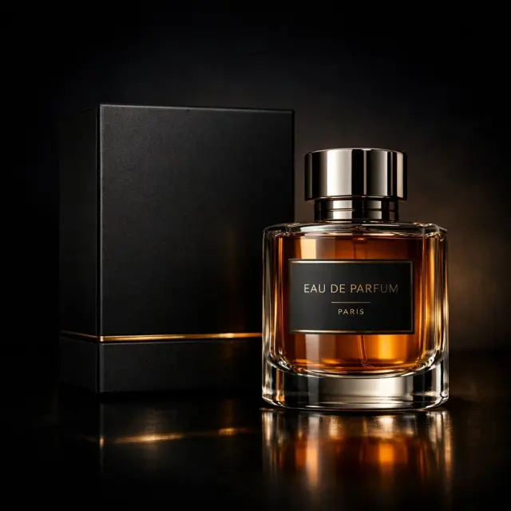

```text
Luxury perfume product photography in a dark cinematic studio. A premium black matte perfume box with sharp edges and subtle gold accents placed slightly behind a transparent glass perfume bottle filled with warm amber liquid. The bottle has a thick clear glass body and a polished metallic cap. Minimal elegant label design with gold typography. Soft low key lighting with a smooth gradient dark background. Gentle reflections on a glossy surface beneath the products. Dramatic shadows for depth and contrast. High fashion fragrance advertisement style. Ultra realistic textures crisp focus shallow depth of field professional studio shot 8k quality.
```

[Open in Pixonara →](https://pixonara.com/prompt/147)

## 25. Ultra-realistic premium skincare serum bottle (dark green glass with…

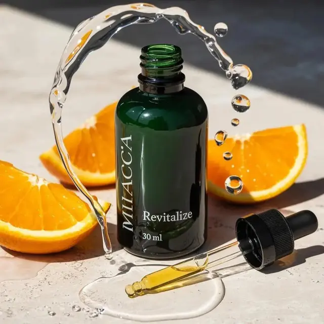

```text
Ultra-realistic premium skincare serum bottle (dark green glass with dropper), golden liquid inside, placed on sunlit marble surface with fresh orange slices around, natural citrus vibe, water splash frozen mid-air, detailed droplets and reflections, soft natural sunlight with sharp shadows, minimal aesthetic, macro photography, high detail textures, glossy glass reflections, fresh and vibrant color tones, luxury skincare advertising, 8K, perfect composition.
```

[Open in Pixonara →](https://pixonara.com/prompt/951)

## 26. A surreal, minimalist luxury advertising scene in a clean…

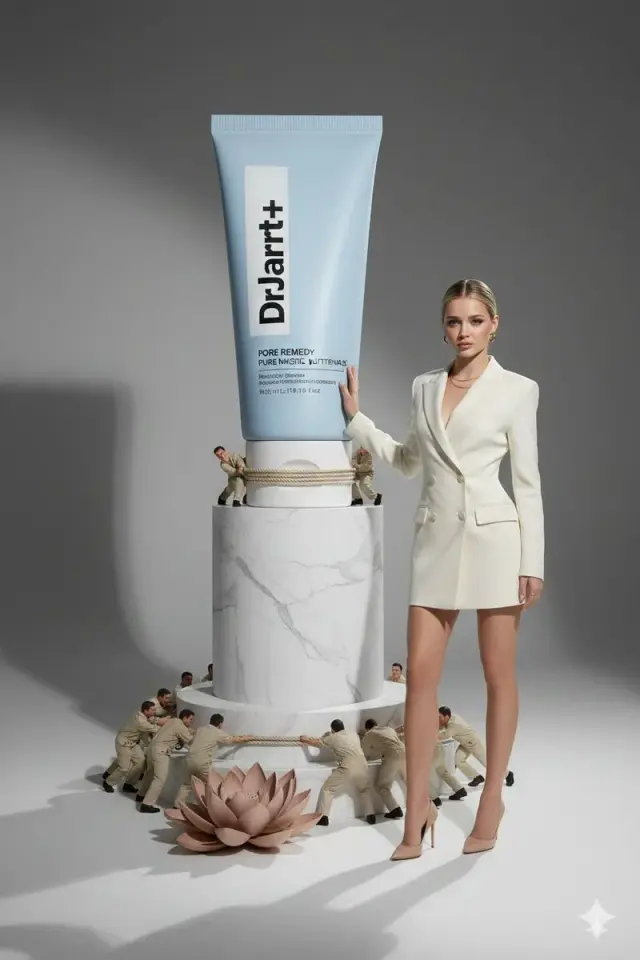

<details>
<summary>Show full prompt</summary>

```text
A surreal, minimalist luxury advertising scene in a clean modern studio with a soft neutral gray background, dramatic directional lighting and subtle cinematic shadows. A gigantic oversized tube of Dr.Jart+ Pore Remedy Pure Mastic Butter Mask (light blue tube, white label, bold black “Dr.Jart+” text clearly visible) stands triumphantly on a tall multi-tiered white marble pedestal like a monument. Around the base, 20–30 tiny realistic miniature male workers in matching beige/off-white uniforms and overalls are pulling thick ropes tied around the massive tube, straining with intense effort, dynamic poses, muscles tense, tugging mostly forward.

Place a tall elegant Western woman in her late 20s in the foreground, positioned much closer to the camera for a stronger ad focus. She stands slightly in front of the pedestal, waist-up to mid-thigh framing, creating a premium beauty campaign feel. She has glowing fair skin, sharp cheekbones, soft natural makeup with luminous skin finish, slick low bun hairstyle, and a confident high-fashion gaze directed toward the camera. She wears a structured ivory tailored blazer dress with minimal gold accessories and nude heels. One hand lightly touches the giant tube while her body subtly angles toward it, creating a powerful hero-product connection.

At the foot of the pedestal lies a large open lotus flower sculpture in soft pinkish-brown tones. High-end commercial skincare photography, hyper-realistic 3D render, ultra-sharp 8K details, cinematic composition, shallow depth of field slightly blurring the miniature workers while keeping the woman and product crisp and dominant, luxury beauty campaign aesthetic, epic scale contrast, clean elegant studio environment, shot by Veo.
```

</details>

[Open in Pixonara →](https://pixonara.com/prompt/981)

## 27. Ultra-high-end photorealistic skincare product photography featuring a clear cyl…

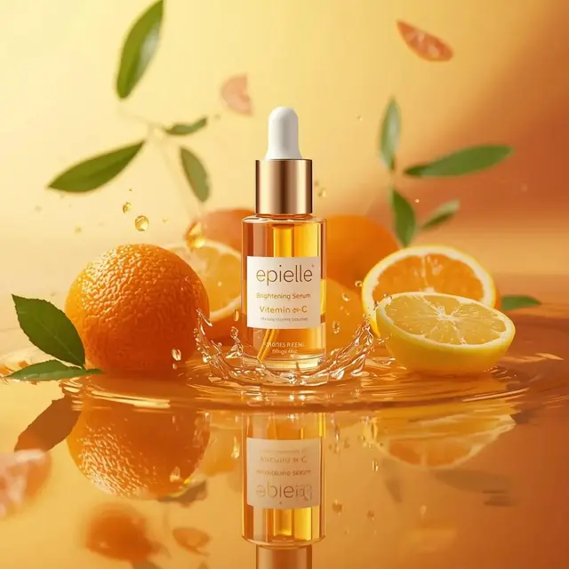

<details>
<summary>Show full prompt</summary>

```text
Ultra-high-end photorealistic skincare product photography featuring a clear cylindrical glass dropper bottle filled with translucent golden serum, centered and slightly tilted backward, with a matte white rubber dropper and metallic gold collar, the front label clearly reading “epielle Brightening Serum Vitamin C” with citrus illustrations, placed on a glossy reflective orange liquid surface creating a sharp mirror reflection beneath the bottle, surrounded by whole and sliced citrus fruits including bright orange oranges, a halved ruby grapefruit with visible pulp, and a sliced yellow lemon positioned symmetrically around the bottle, small golden serum droplets and splashes frozen mid-air around the base, fresh green citrus leaves floating softly in the background, background consisting of a smooth warm gradient transitioning from pale yellow on the left to deep orange on the right, lighting is strong soft studio lighting from upper left creating crisp highlights on glass and liquid, luminous glow through the serum, subtle shadows, and high contrast reflections, color palette dominated by vibrant orange, yellow, gold, and fresh green accents, textures extremely detailed including glossy glass, liquid viscosity, citrus peel pores, juicy pulp, and reflective surface, shallow depth of field with razor-sharp focus on the bottle label and fruit in the midground and gentle bokeh in the background, premium commercial cosmetic advertising style, clean modern composition, cinematic realism, ultra-detailed 8K photorealism, studio-grade quality
```

</details>

[Open in Pixonara →](https://pixonara.com/prompt/985)

## 28. cinematic 8-photo storytelling collage featuring the same girl throughout…

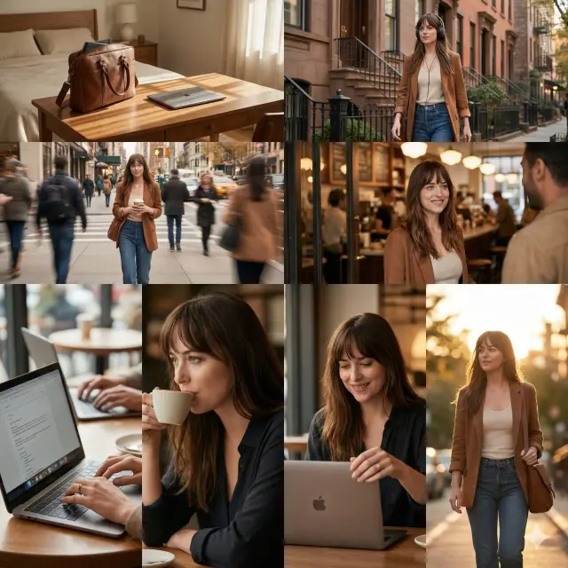

```text
cinematic 8-photo storytelling collage featuring the same girl throughout the journey.
Frame 1: Bedroom desk — laptop bag packed, morning light.
Frame 2: Leaving home — headphones on, confident walk.
Frame 3: City sidewalk — coffee aroma vibes, motion blur.
Frame 4: Entering café — warm interiors, soft smiles.
Frame 5: Laptop open — deep focus, typing.
Frame 6: Coffee sip — thoughtful pause.
Frame 7: Closing laptop — productive satisfaction.
Frame 8: Walking back home — golden hour calm.
Editorial lifestyle mood, natural tones, cinematic depth, ultra-realistic.
```

[Open in Pixonara →](https://pixonara.com/prompt/1000)

## 29. Elegant rose-gold lipstick standing upright on a reflective marble…

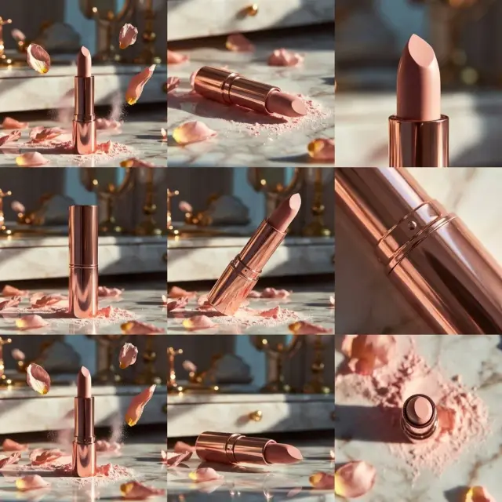

```text
Elegant rose-gold lipstick standing upright on a reflective marble surface, surrounded by flying rose petals and soft powder dust. Warm studio lighting with dramatic shadows, luxury vanity background with blurred mirrors and golden accents, cinematic mood, macro product photography, ultra-sharp details, glossy textures, premium cosmetic brand style.

3×3photo grid with different angles and poses. Same character, consistent look, clean lighting, real photoshoot vibe 2k.
```

[Open in Pixonara →](https://pixonara.com/prompt/1048)

## 30. Ultra-realistic cinematic product shot of a premium honey jar…

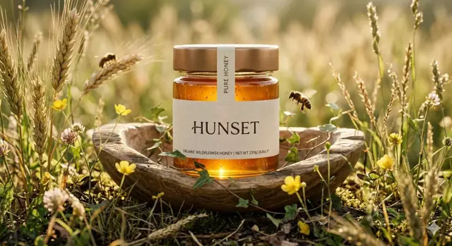

<details>
<summary>Show full prompt</summary>

```text
Ultra-realistic cinematic product shot of a premium honey jar placed inside a shallow wooden hollow surrounded by tall wild wheat and tiny yellow meadow flowers, captured from an intimate low-angle macro perspective with slight cinematic depth, transparent glass jar filled with luminous deep golden honey, topped with a satin bronze metallic lid and a narrow cream seal strip crossing vertically over the cap, minimal luxury label reading “HUNSET”, jar lightly touched by thin climbing ivy strands for a refined organic detail, one realistic honeybee hovering near the front glass surface while another rests on a wheat stem behind the jar, environment set in a quiet countryside field during late afternoon, warm sunlight filtering through wheat stalks from behind creating glowing translucency inside the honey and soft halo edges around the jar, foreground with blurred wheat tips and soft natural bokeh, distant background fading into creamy green and amber tones, shallow depth of field with extreme sharpness on jar textures, visible honey thickness, subtle glass reflections, detailed plant fibers and pollen particles in air, cinematic luxury advertising mood, shot on 90mm macro lens, f/2.2, ultra-detailed natural textures, premium organic brand campaign style, 8k resolution, no text, no watermark.
```

</details>

[Open in Pixonara →](https://pixonara.com/prompt/1141)

## 31. Ultra-realistic luxury cosmetic product photography of a deep red…

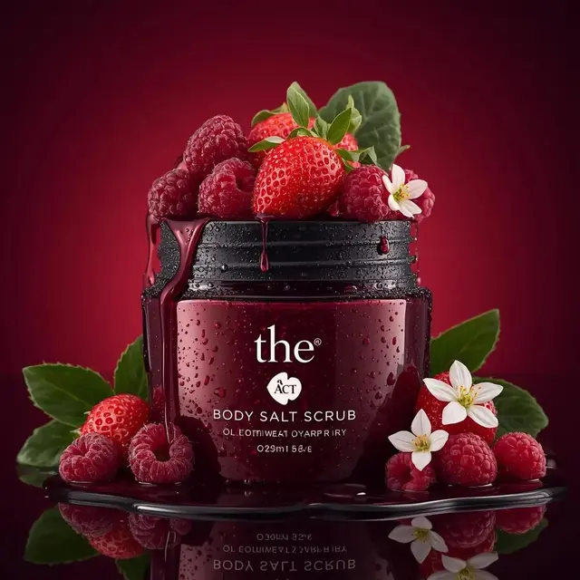

<details>
<summary>Show full prompt</summary>

```text
Ultra-realistic luxury cosmetic product photography of a deep red glass jar labeled “the ACT Body Salt Scrub”, placed on a glossy reflective black surface. The jar is open and overflowing with fresh strawberries and raspberries, with berry juice dripping over the rim. Water droplets cover the jar creating a fresh, dewy look. Around the jar are scattered raspberries, strawberries, green leaves, and small white flowers. Background is a smooth gradient rich crimson red studio backdrop. Dramatic studio lighting, soft highlights, sharp macro detail, commercial beauty product advertisement style, high contrast, extremely detailed textures, 8k resolution, shallow depth of field, photorealistic, luxury skincare branding, centered composition.
```

</details>

[Open in Pixonara →](https://pixonara.com/prompt/1156)

## 32. Ultra-realistic minimalist product photography featuring a cylindrical supplemen…

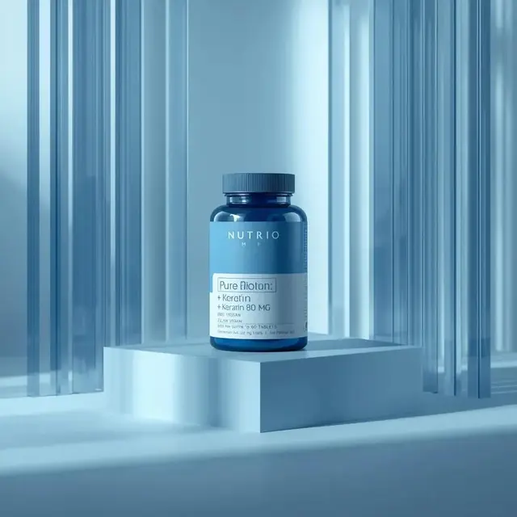

<details>
<summary>Show full prompt</summary>

```text
Ultra-realistic minimalist product photography featuring a cylindrical supplement container labeled “NUTRIO Pure Biotin – + Keratin 80 MG – 7500 mcg per serving – 100% Vegan – 60 Day Supply – 60 Tablets”. The container has a matte blue lid and upper section with a clean white lower label. The product is centered in a monochromatic soft blue studio environment, surrounded by thin vertical transparent acrylic glass panels that create subtle reflections and layered depth. The container sits on a smooth geometric platform with crisp edges, maintaining a balanced modern composition. Lighting is soft premium studio lighting from the upper left, producing gentle shadows, realistic reflections on the acrylic panels, and smooth gradients across the matte packaging surface. The background remains minimal and monochromatic to emphasize the product. Clean pharmaceutical advertising aesthetic, precise geometry, photorealistic textures, shallow depth of field, ultra-detailed 8K commercial product photography
```

</details>

[Open in Pixonara →](https://pixonara.com/prompt/1187)

## 33. Ultra-realistic premium fragrance product shot of a perfume bottle…

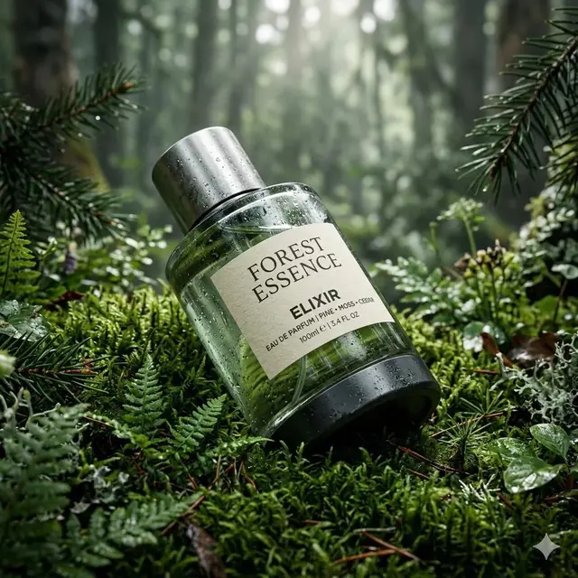

```text
Ultra-realistic premium fragrance product shot of a perfume bottle (Forest Essence Elixir), positioned at a (low macro angled shot) resting diagonally on lush (deep green moss surface in a forest setting), cylindrical design with a transparent glass center revealing green-tinted liquid, textured (matte black base) and brushed (metallic silver cap) with visible condensation droplets, surrounded by dense (forest foliage and pine branches) softly framing the scene, subtle (morning mist
```

[Open in Pixonara →](https://pixonara.com/prompt/1191)

## 34. A rugged, matte-black chronograph watch with bold orange accents…

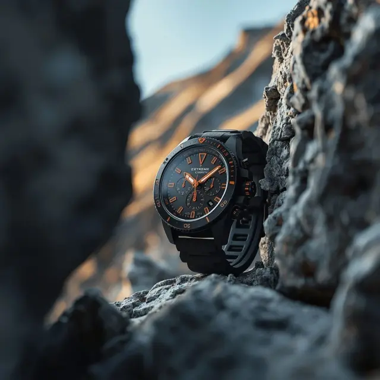

<details>
<summary>Show full prompt</summary>

```text
A rugged, matte-black chronograph watch with bold orange accents is tightly framed between two textured rock formations, creating a natural vignette that directs all focus toward the dial; the scene opens with an ultra-close macro perspective, the camera slowly sliding laterally through the narrow rocky gap, maintaining an intimate, compressed field of view with no zoom-out, as if discovering the watch hidden within a harsh alpine environment. Cold mountain air subtly moves fine dust particles and faint mist across the frame, catching soft, diffused daylight that spills in from above, while a warm, low-angle sunlight grazes the rocks and reflects gently onto the watch face, creating a striking contrast between cool shadows and warm highlights. The camera continues a controlled micro-orbit around the watch at close range, allowing specular highlights to travel across the brushed metal bezel, engraved screws, and slightly textured rubber strap, emphasizing durability and premium craftsmanship. The orange indices and hands glow subtly as light shifts across the sapphire crystal, revealing crisp reflections and slight curvature distortions. In the blurred background, towering mountain peaks remain softly out of focus, adding depth without distraction, while tiny vibrations in the environment cause minuscule pebble shifts near the base, reinforcing realism. As the shot progresses, a faint breeze brushes across the strap, introducing barely perceptible movement, while light intensity fluctuates naturally as if clouds are passing overhead. The sequence ends in a locked, ultra-tight hero composition, perfectly centered within the rock frame, with high contrast, razor-sharp detail on the dial, and a cinematic interplay of shadow, texture, and controlled highlights that reinforce a premium, adventure-driven identity.
```

</details>

[Open in Pixonara →](https://pixonara.com/prompt/1237)

## 35. Ultra-realistic luxury skincare product photography featuring a glass cosmetic…

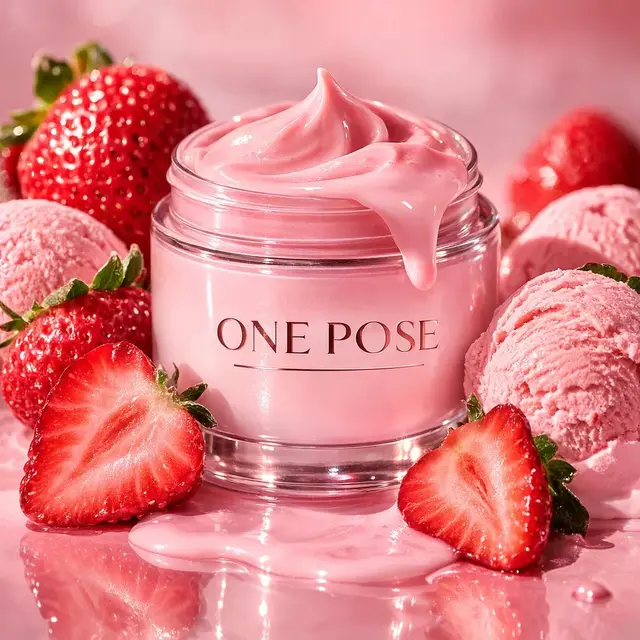

<details>
<summary>Show full prompt</summary>

```text
Ultra-realistic luxury skincare product photography featuring a glass cosmetic jar labeled “ONE POSE” placed at the center of a glossy reflective surface. The jar contains a vibrant strawberry-pink cream with a soft gradient fading into a frosted white lid, and a smooth swirl of creamy pink product melting over the top and dripping down the sides of the jar like glossy dessert glaze. Surrounding the product are fresh ripe strawberries and halved strawberries with visible seeds and juicy texture, arranged naturally around the base. Soft scoops of strawberry ice cream sit beside the fruit, slightly melting and blending into a glossy pink cream puddle that spreads across the surface. The background is a soft pastel pink studio gradient that enhances the strawberry tones. Premium studio lighting from above and the side creates crisp reflections on the glass jar, soft highlights on the melting cream and ice cream texture, and gentle shadows beneath the product. The composition feels indulgent and dessert-inspired while maintaining a clean luxury cosmetic advertising aesthetic, hyper-realistic textures, shallow depth of field, cinematic lighting, ultra-detailed 8K product photography.
```

</details>

[Open in Pixonara →](https://pixonara.com/prompt/1289)

## 36. Ultra-realistic gaming mouse floating above a desk, surrounded by…


```text
Ultra-realistic gaming mouse floating above a desk, surrounded by glowing golden energy rings and flying electronic components, dramatic cinematic lighting, futuristic tech aesthetic, detailed mousepad and cables on wooden desk, sparks and particles in the air, high-speed motion effect, premium product advertising, hyper-detailed textures, depth of field, 8K, studio lighting.
```

[Open in Pixonara →](https://pixonara.com/prompt/1291)

## 37. Ultra-cinematic product photography of a neon-green energy drink can…

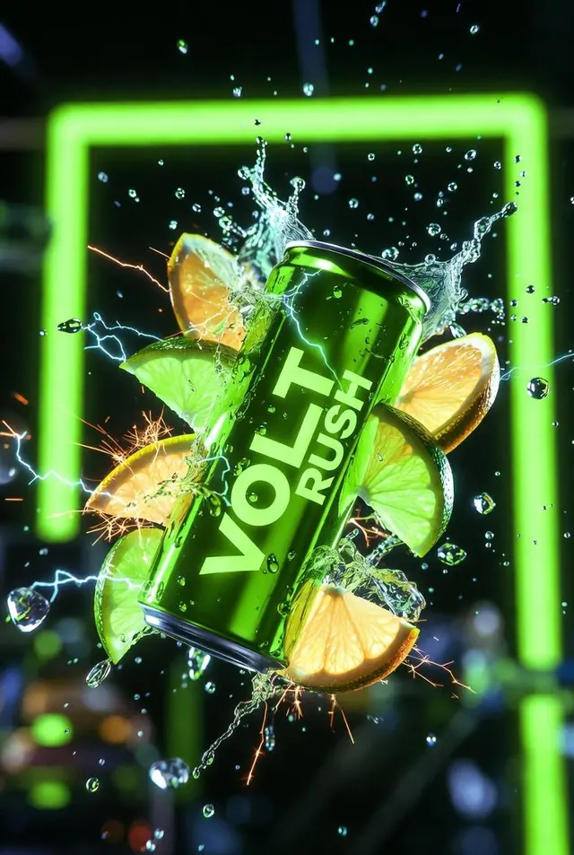

```text
Ultra-cinematic product photography of a neon-green energy drink can labeled “VOLT RUSH”, tilted at a sharp diagonal, bursting through glowing citrus slices and electric sparks. Frozen splashes of lime juice and ice shards suspended mid-air, micro droplets visible. High-contrast studio lighting with green neon rim lights, dark background, glossy aluminum texture, shallow depth of field, photorealistic, 8K, premium ad style.
```

[Open in Pixonara →](https://pixonara.com/prompt/1307)

## 38. Luxury product photography of artisanal vanilla ground coffee packaged…

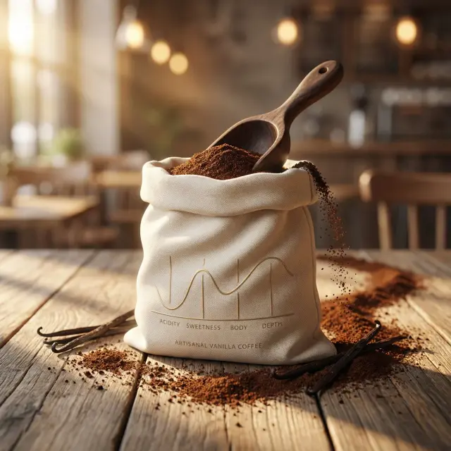

<details>
<summary>Show full prompt</summary>

```text
Luxury product photography of artisanal vanilla ground coffee packaged in a soft sculpted ivory pouch with gentle wave contours, minimal branding embossed into fabric. The pouch rests on a rustic oak tabletop dusted with coffee grounds, accompanied by a hand-carved wooden scoop spilling aromatic powder.
Natural Madagascar vanilla pods curve organically around the base, blending into drifting coffee granules that form a subtle flowing aroma path instead of a spiral.
On the pouch front, a modern sensory chart: thin matte gold lines showing flavor balance — low acidity, rich sweetness, full-bodied depth.
Warm morning sunlight enters from the left at a low angle, creating soft shadows and tactile fabric highlights. Background fades into a cozy café interior with creamy bokeh lights, evoking calm morning rituals.
Ultra-sharp macro texture on vanilla pods and coffee grains, cinematic depth of field, premium lifestyle aesthetic, inviting, warm, handcrafted, high-end brand feel.
```

</details>

[Open in Pixonara →](https://pixonara.com/prompt/1368)

## 39. A hyper-realistic commercial product shot of a refreshing lime…

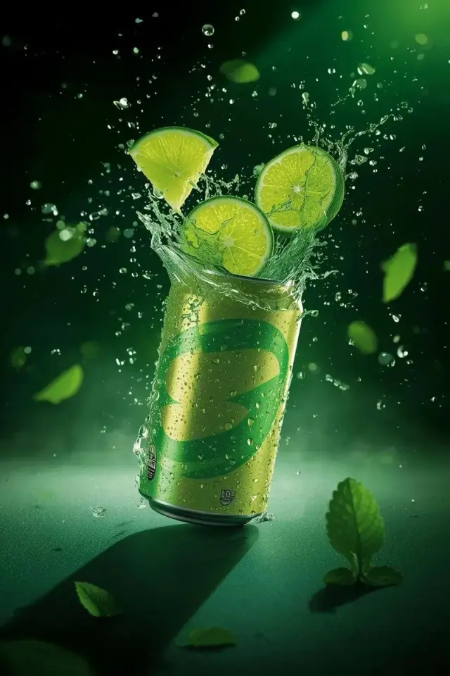

```text
A hyper-realistic commercial product shot of a refreshing lime soda can exploding with energy in mid-air. A vibrant green aluminum can covered in condensation, surrounded by sliced limes, mint leaves, and shards of ice, with a dramatic water splash bursting from the top. Lime wedges collide with the can, frozen in motion, droplets suspended in the air. Deep emerald green gradient background with glowing particles, cinematic studio lighting, high contrast highlights, ultra-sharp focus on the can, macro-level texture detail. Dynamic action composition, refreshing summer mood, premium beverage advertising style, photorealistic, 8k resolution.
```

[Open in Pixonara →](https://pixonara.com/prompt/1399)

## 40. A hyper-realistic commercial product shot of a

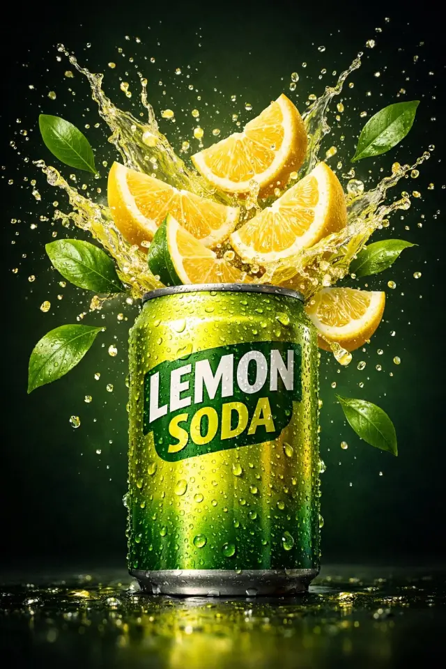

```text
A hyper-realistic commercial product shot of a
lemon soda can, with fresh lemon slices bursting
out of the can in a dynamic splash. The can is
covered in cold condensation droplets, glossy
metallic texture, vibrant yellow-green color palette.
Lemon wedges and citrus juice splashes frozen
mid-air, ultra-detailed lemon pulp visible. Fresh
green leaves floating around, dark green gradient
background, soft studio lighting, dramatic high-
lights, shallow depth of field, cinematic advertising
style, ultra-sharp focus, 8K resolution, photorealis-
tic, premium beverage ad. img
```

[Open in Pixonara →](https://pixonara.com/prompt/1410)
